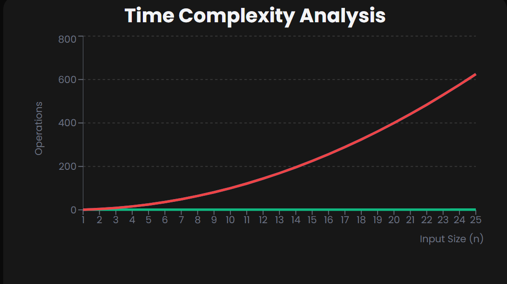

## Bubble Sort

==> What is Bubble Sort

--> Bubble Sort is a simple sorting algorithm that repeatedly steps through the list, compares adjacent elements and swaps them if they are in the wrong order.
--> The pass through the list is repeated until the list is sorted. It gets its name because smaller elements "bubble" to the top of the list.

==> How Does It Work
Imagine you have an unsorted list of numbers: [5, 1, 4, 2, 8]

1. First Pass:
   --> (5, 1) → Swap → [1, 5, 4, 2, 8]
   --> (5, 4) → Swap → [1, 4, 5, 2, 8]
   --> (5, 2) → Swap → [1, 4, 2, 5, 8]
   --> (5, 8) → No swap
2. Second Pass:
   --> (1, 4) → No swap
   --> (4, 2) → Swap → [1, 2, 4, 5, 8]
   --> (4, 5) → No swap
3. Third Pass:
   --> No swaps needed → List is sorted
4. The algorithm stops when a complete pass is made without any swaps.

==> Algorithm Steps

1. Start with an unsorted array
2. Set a flag to track if any swaps occur
3. For each pair of adjacent elements:
   --> Compare the two elements
   --> If they are in the wrong order, swap them
   --> Set the swap flag to true
4. Repeat the process until a complete pass is made without any swaps
5. The array is now sorted

==> Time Complexity
Best Case: Array is already sorted → O(n) (only one pass needed).
Average Case: Randomly ordered array → O(n²).
Worst Case: Array is sorted in reverse order → O(n²).



==> Space Complexity
Bubble Sort is an in-place sorting algorithm, meaning it requires only O(1) additional space (for temporary storage during swaps).

# Note :-

1. Bubble Sort is simple to understand and implement but inefficient for large datasets.
2. It's mainly used for educational purposes to introduce sorting algorithms.
3. In practice, more efficient algorithms like QuickSort or MergeSort are preferred.

# Bubble Sort Implementation

==> JavaScript

```JavaScript
// Bubble Sort in JavaScript
function bubbleSort(arr) {
  let n = arr.length;

  // Outer loop for passes
  for (let i = 0; i < n - 1; i++) {
    // Inner loop for comparisons
    for (let j = 0; j < n - i - 1; j++) {
      // Swap if current element is greater than next
      if (arr[j] > arr[j + 1]) {
        // ES6 destructuring assignment for swap
        [arr[j], arr[j + 1]] = [arr[j + 1], arr[j]];
      }
    }
  }
  return arr;
}

// Usage example
const unsortedArray = [64, 34, 25, 12, 22, 11, 90];
console.log("Unsorted array:", unsortedArray);
const sortedArray = bubbleSort(unsortedArray);
console.log("Sorted array:", sortedArray);
```

==> Python

```python
# Bubble Sort in Python
def bubble_sort(arr):
    n = len(arr)

    # Outer loop for passes
    for i in range(n - 1):
        # Inner loop for comparisons
        for j in range(n - i - 1):
            # Swap if current element is greater than next
            if arr[j] > arr[j + 1]:
                # Python tuple unpacking for swap
                arr[j], arr[j + 1] = arr[j + 1], arr[j]
    return arr

# Usage example
unsorted_array = [64, 34, 25, 12, 22, 11, 90]
print("Unsorted array:", unsorted_array)
sorted_array = bubble_sort(unsorted_array)
print("Sorted array:", sorted_array)
```

