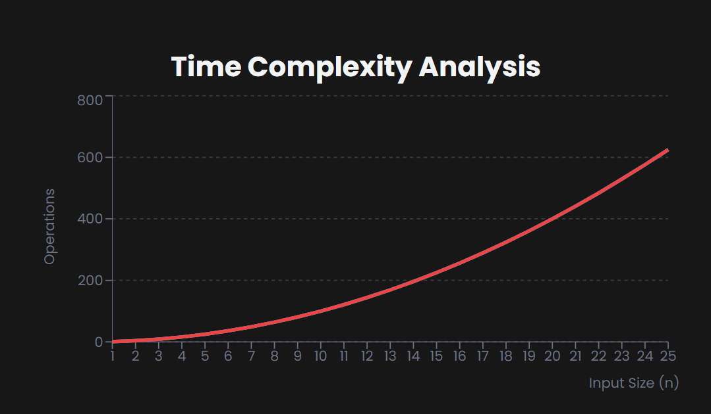

## Selection Sort

==> What is Selection Sort?
--> Selection Sort is an in-place comparison sorting algorithm that divides the input list into two parts: a sorted sublist which is built up from left to right, and a remaining unsorted sublist.
--> It repeatedly selects the smallest (or largest) element from the unsorted portion and moves it to the sorted portion.

==> How Does It Work
--> Consider this unsorted array: [64, 25, 12, 22, 11]

1. First Pass:
   --> Find the minimum in [64, 25, 12, 22, 11] → 11 at index 4
   --> Swap with first element → [11, 25, 12, 22, 64]
2. Second Pass:
   --> Find minimum in [25, 12, 22, 64] → 12 at index 2
   --> Swap with first element → [11, 12, 25, 22, 64]
3. Third Pass:
   --> Find minimum in [25, 22, 64] → 22 at index 2
   --> Swap with first element → [11, 12, 22, 25, 64]
4. Fourth Pass:
   --> Find minimum in [25, 64] → 25 at index 0
   --> No swap needed → [11, 12, 22, 25, 64]
5. Result:
   [11, 12, 22, 25, 64]

==> Algorithm Steps

1. Set the first element as minimum
2. Compare minimum with the second element:
   If second element is smaller, set it as new minimum
3. Continue until last element is reached
4. Swap minimum with first element
5. Repeat for remaining unsorted portion

==> Time Complexity

1. Best Case: O(n²)
2. Average Case: O(n²)
3. Worst Case: O(n²)

--> The quadratic time complexity occurs because it performs O(n) comparisons for each of the O(n) elements.


==> Space Complexity
--> Selection Sort is an in-place algorithm, requiring only O(1) additional space for temporary variables during swaps.

==> Advantages
--> Simple to understand and implement
--> Performs well on small lists
--> Minimal memory usage (in-place sorting)
--> Only O(n) swaps required (better than Bubble Sort)

==> Disadvantages
--> Poor performance on large lists (quadratic time complexity)
--> Not stable (may change relative order of equal elements)
--> Less efficient than Insertion Sort for nearly sorted data
--> Always performs O(n²) comparisons regardless of input

# Note:-

--> Selection Sort is primarily used for educational purposes to introduce sorting concepts.
--> In practice, it's outperformed by more advanced algorithms like QuickSort and MergeSort, but can be useful when memory writes are expensive (since it makes only O(n) swaps).

# Selection Sort Implementation

==> JavaScript

```JavaScript
// Selection Sort in JavaScript
function selectionSort(arr) {
  const n = arr.length;

  for (let i = 0; i < n - 1; i++) {
    // Find the minimum element in unsorted array
    let minIdx = i;
    for (let j = i + 1; j < n; j++) {
      if (arr[j] < arr[minIdx]) {
        minIdx = j;
      }
    }

    // Swap the found minimum with the first element
    [arr[i], arr[minIdx]] = [arr[minIdx], arr[i]];
  }
  return arr;
}

// Usage
const arr = [64, 25, 12, 22, 11];
console.log("Original:", arr);
console.log("Sorted:", selectionSort([...arr]));
```

==> Python

```python
# Selection Sort in Python
def selection_sort(arr):
    n = len(arr)

    for i in range(n - 1):
        # Find the minimum element in unsorted array
        min_idx = i
        for j in range(i + 1, n):
            if arr[j] < arr[min_idx]:
                min_idx = j

        # Swap the found minimum with the first element
        arr[i], arr[min_idx] = arr[min_idx], arr[i]
    return arr

# Usage
arr = [64, 25, 12, 22, 11]
print("Original:", arr)
print("Sorted:", selection_sort(arr.copy()))
```
