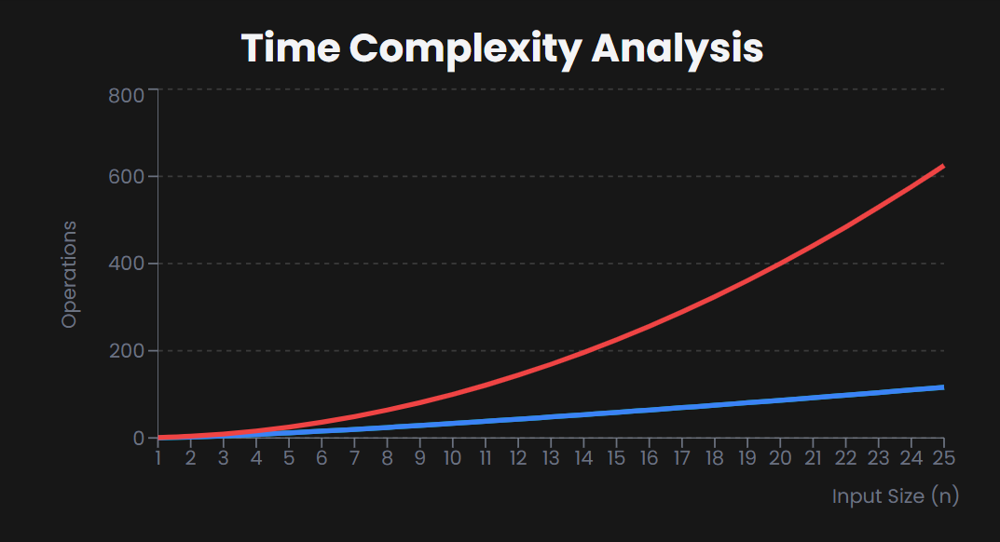

# Quick Sort

==> What is Quick Sort
--> Quick Sort is an efficient, comparison-based sorting algorithm that follows the **divide-and-conquer approach**.
--> It works by selecting a 'pivot' element from the array and partitioning the other elements into two sub-arrays according to whether they are less than or greater than the pivot.
--> The sub-arrays are then recursively sorted.

==> How Does It Work?

--> Consider this unsorted array: [10, 80, 30, 90, 40, 50, 70]

--> Partitioning Phase:

1. Choose last element as pivot (70)
2. Rearrange: elements < pivot on left, > pivot on right → [10, 30, 40, 50] [70] [80, 90]

--> Recursive Phase:

1. Apply same process to left sub-array [10, 30, 40, 50]
2. Apply same process to right sub-array [80, 90]
3. Combine results: [10, 30, 40, 50, 70, 80, 90]

==> Algorithm Steps

1. Choose Pivot:
   Select an element as pivot (commonly last/first/random element)
2. Partition:
   Reorder array so elements < pivot come before it
   Elements > pivot come after it
   Pivot is now in its final sorted position
3. Recurse:
   Apply quick sort to left sub-array (elements < pivot)
   Apply quick sort to right sub-array (elements > pivot)

==> Time Complexity

1. Best Case: O(n log n) (balanced partitions)
2. Average Case: O(n log n)
3. Worst Case: O(n²) (unbalanced partitions)

--> The log n factor comes from the division steps when partitions are balanced. The n² occurs when the pivot selection consistently creates unbalanced partitions.



==> Space Complexity
--> Quick Sort is O(log n) space complexity for the call stack in the average case, but can degrade to O(n) in the worst case with unbalanced partitions.
--> It is generally considered an in-place algorithm as it doesn't require significant additional space.

==> Advantages
--> Fastest general-purpose in-memory sorting algorithm in practice
--> In-place algorithm (requires minimal additional memory)
--> Cache-efficient due to sequential memory access
--> Can be easily parallelized for better performance

==> Disadvantages
--> Not stable (relative order of equal elements may change)
--> Worst-case O(n²) performance (though rare with proper pivot selection)
--> Performance depends heavily on pivot selection strategy
--> Not ideal for linked lists (works best with arrays)

# Note :-

--> Quick Sort is the algorithm of choice for most standard library sorting implementations (like C's qsort, Java's Arrays.sort for primitives) due to its excellent average-case performance.
--> It's particularly effective for large datasets that fit in memory.

# Quick Sort Implementation

1. JavaScript

```JavaScript
// Quick Sort in JavaScript
function quickSort(arr, left = 0, right = arr.length - 1) {
  if (left < right) {
    const pivotIndex = partition(arr, left, right);
    quickSort(arr, left, pivotIndex - 1);
    quickSort(arr, pivotIndex + 1, right);
  }
  return arr;
}

function partition(arr, left, right) {
  const pivot = arr[right];
  let i = left;

  for (let j = left; j < right; j++) {
    if (arr[j] < pivot) {
      [arr[i], arr[j]] = [arr[j], arr[i]];
      i++;
    }
  }

  [arr[i], arr[right]] = [arr[right], arr[i]];
  return i;
}

// Usage
const arr = [10, 7, 8, 9, 1, 5];
console.log("Original:", arr);
console.log("Sorted:", quickSort([...arr]));
```

2. Python

```python
# Quick Sort in Python
def quick_sort(arr, low=0, high=None):
    if high is None:
        high = len(arr) - 1

    if low < high:
        pivot_index = partition(arr, low, high)
        quick_sort(arr, low, pivot_index - 1)
        quick_sort(arr, pivot_index + 1, high)
    return arr

def partition(arr, low, high):
    pivot = arr[high]
    i = low

    for j in range(low, high):
        if arr[j] < pivot:
            arr[i], arr[j] = arr[j], arr[i]
            i += 1

    arr[i], arr[high] = arr[high], arr[i]
    return i

# Usage
arr = [10, 7, 8, 9, 1, 5]
print("Original:", arr)
print("Sorted:", quick_sort(arr.copy()))
```
