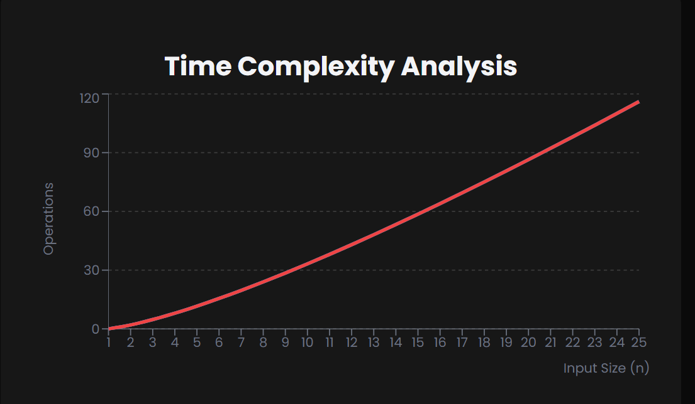

## Merge Sort

What is Merge Sort?
Merge Sort is an efficient, stable, comparison-based sorting algorithm that follows the divide-and-conquer approach.
It works by recursively dividing the unsorted list into sublists until each sublist contains a single element, then repeatedly merges these sublists to produce new sorted sublists until there is only one sorted list remaining.

==> Algorithm Steps

1. Divide:
   Find the middle point to divide the array into two halves
   Recursively call merge sort on the first half
   Recursively call merge sort on the second half
2. Merge:
   Create temporary arrays for both halves
   Compare elements from each half and merge them in order
   Copy any remaining elements from either half

==> Time Complexity

1. Best Case: O(n log n) (already sorted, but still needs all comparisons)
2. Average Case: O(n log n)
3. Worst Case: O(n log n) (consistent performance)

--> The log n factor comes from the division steps, while the n factor comes from the merge steps.



==> Space Complexity
--> Merge Sort requires O(n) additional space for the temporary arrays during merging.
--> It makes it not an in-place sorting algorithm, unlike Insertion Sort or Bubble Sort.

==> Advantages
--> Stable sorting (maintains relative order of equal elements)
--> Excellent for large datasets (consistent O(n log n) performance)
--> Well-suited for external sorting (sorting data too large for RAM)
--> Easily parallelizable (divide steps can be done concurrently)

==> Disadvantages
--> Requires O(n) additional space (not in-place)
--> Slower than O(n²) algorithms for very small datasets due to recursion overhead
--> Not as cache-efficient as some other algorithms (e.g., QuickSort)

# Note :-

Merge Sort is particularly useful when sorting linked lists (where random access is expensive) and is the algorithm of choice for many standard library sorting implementations when stability is required.
It's also commonly used in external sorting where data doesn't fit in memory.

# Merge Sort Implementation

==> JavaScript

```JavaScript
// Merge Sort in JavaScript
function mergeSort(arr) {
  if (arr.length <= 1) return arr;

  const mid = Math.floor(arr.length / 2);
  const left = mergeSort(arr.slice(0, mid));
  const right = mergeSort(arr.slice(mid));

  return merge(left, right);
}

function merge(left, right) {
  let result = [];
  let leftIndex = 0;
  let rightIndex = 0;

  while (leftIndex < left.length && rightIndex < right.length) {
    if (left[leftIndex] < right[rightIndex]) {
      result.push(left[leftIndex++]);
    } else {
      result.push(right[rightIndex++]);
    }
  }

  return result.concat(left.slice(leftIndex)).concat(right.slice(rightIndex));
}

// Usage
const arr = [38, 27, 43, 3, 9, 82, 10];
console.log("Original:", arr);
console.log("Sorted:", mergeSort(arr));
```

==> Python

```Python
# Merge Sort in Python
def merge_sort(arr):
    if len(arr) <= 1:
        return arr

    mid = len(arr) // 2
    left = merge_sort(arr[:mid])
    right = merge_sort(arr[mid:])

    return merge(left, right)

def merge(left, right):
    result = []
    left_idx, right_idx = 0, 0

    while left_idx < len(left) and right_idx < len(right):
        if left[left_idx] < right[right_idx]:
            result.append(left[left_idx])
            left_idx += 1
        else:
            result.append(right[right_idx])
            right_idx += 1

    result.extend(left[left_idx:])
    result.extend(right[right_idx:])
    return result

# Usage
arr = [38, 27, 43, 3, 9, 82, 10]
print("Original:", arr)
print("Sorted:", merge_sort(arr))
```
