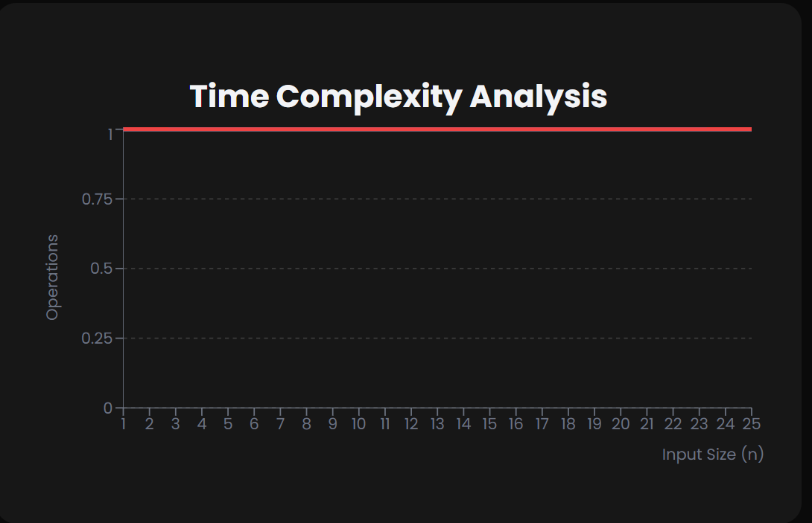

# Push & Pop

==> What is Stack Push & Pop?
--> Push and Pop are the two fundamental operations in stack data structure.
--> Stack follows LIFO (Last In First Out) principle - the last element added is the first one to be removed.

# Push Operation

--> Adds an element to the top of the stack.
--> Example: Pushing elements onto a stack

1. Start with empty stack: [ ]
2. Push 5: [5]
3. Push 3: [3, 5]
4. Push 7: [7, 3, 5]

-->Time Complexity: O(1)
-->Space Complexity: O(1)

# Pop Operation

--> Removes and returns the topmost element from the stack.

--> Example: Popping elements from a stack

1. Current stack: [7, 3, 5]
2. Pop → returns 7: [3, 5]
3. Pop → returns 3: [5]
4. Pop → returns 5: [ ]

--> Time Complexity: O(1)
--> Space Complexity: O(1)



==> Stack Underflow & Overflow
--> Stack Underflow: Trying to pop from an empty stack
--> Stack Overflow: Trying to push to a full stack (in fixed-size implementations)

==> Real-world Applications
--> Function call management in programming languages (call stack)
--> Undo/Redo operations in text editors
--> Back/Forward navigation in web browsers
--> Expression evaluation and syntax parsing
--> Memory management

# Note

Push and Pop operations are fundamental to stack functionality. While simple to implement, stacks are powerful data structures used in many algorithms and system designs.

# Stack Push & Pop Implementation

# JavaScript

```javascript
// Stack Implementation with Push/Pop in JavaScript
class Stack {
  constructor() {
    this.items = [];
    this.top = -1;
    this.MAX_SIZE = 10;
  }

  // Push operation
  push(element) {
    if (this.top >= this.MAX_SIZE - 1) {
      console.log("Stack Overflow");
      return;
    }
    this.items[++this.top] = element;
    console.log(`Pushed: ${element}`);
  }

  // Pop operation
  pop() {
    if (this.top < 0) {
      console.log("Stack Underflow");
      return -1;
    }
    const element = this.items[this.top--];
    console.log(`Popped: ${element}`);
    return element;
  }

  // Display stack
  display() {
    console.log("Current Stack:", this.items.slice(0, this.top + 1));
  }
}

// Usage
const stack = new Stack();
stack.push(10);
stack.push(20);
stack.push(30);
stack.display();
stack.pop();
stack.display();
```

# Python

```python
# Stack Implementation with Push/Pop in Python
class Stack:
    def __init__(self):
        self.items = []
        self.top = -1
        self.MAX_SIZE = 10

    # Push operation
    def push(self, element):
        if self.top >= self.MAX_SIZE - 1:
            print("Stack Overflow")
            return
        self.top += 1
        self.items.append(element)
        print(f"Pushed: {element}")

    # Pop operation
    def pop(self):
        if self.top < 0:
            print("Stack Underflow")
            return -1
        element = self.items.pop()
        self.top -= 1
        print(f"Popped: {element}")
        return element

    # Display stack
    def display(self):
        print("Current Stack:", self.items)

# Usage
stack = Stack()
stack.push(10)
stack.push(20)
stack.push(30)
stack.display()
stack.pop()
stack.display()
```
