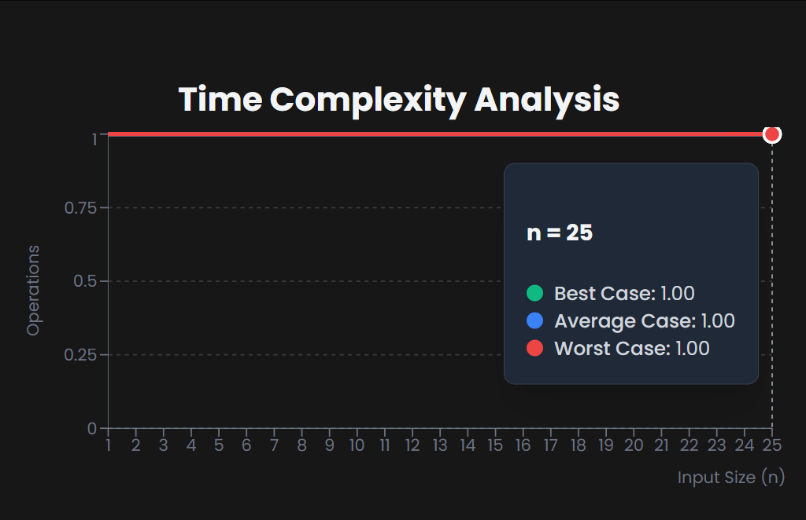

# Peek Operation

==> Peek Operation
--> Returns the topmost element from the stack without removing it.
Example: Peeking at a stack

1. Current stack: [7, 3, 5]
2. Peek → returns 7: [7, 3, 5] (stack remains unchanged)
3. After pop: [3, 5]
4. Peek → returns 3: [3, 5]

--> Time Complexity: O(1)
--> Space Complexity: O(1)


\*\* The peek operation is useful when you need to inspect the top element before deciding whether to pop it or push another element onto the stack.

# Stack Push & Pop Implementation

# JavaScript

```javascript
// Stack Implementation with Peek Operation in JavaScript
class Stack {
  constructor() {
    this.items = [];
    this.top = -1;
  }

  // Push operation
  push(element) {
    this.items[++this.top] = element;
    console.log(`Pushed: ${element}`);
  }

  // Pop operation
  pop() {
    if (this.isEmpty()) {
      console.log("Stack Underflow");
      return -1;
    }
    return this.items[this.top--];
  }

  // Peek operation
  peek() {
    if (this.isEmpty()) {
      console.log("Stack is empty");
      return -1;
    }
    console.log(`Top element: ${this.items[this.top]}`);
    return this.items[this.top];
  }

  // Check if stack is empty
  isEmpty() {
    return this.top === -1;
  }

  // Display stack
  display() {
    console.log("Current Stack:", this.items.slice(0, this.top + 1));
  }
}

// Usage
const stack = new Stack();
stack.push(10);
stack.push(20);
stack.push(30);
stack.display();
stack.peek();
stack.pop();
stack.peek();
```

# Python

```python
# Stack Implementation with Peek Operation in Python
class Stack:
    def __init__(self):
        self.items = []
        self.top = -1

    # Push operation
    def push(self, element):
        self.top += 1
        self.items.append(element)
        print(f"Pushed: {element}")

    # Pop operation
    def pop(self):
        if self.is_empty():
            print("Stack Underflow")
            return -1
        return self.items.pop()

    # Peek operation
    def peek(self):
        if self.is_empty():
            print("Stack is empty")
            return -1
        print(f"Top element: {self.items[-1]}")
        return self.items[-1]

    # Check if stack is empty
    def is_empty(self):
        return self.top == -1

    # Display stack
    def display(self):
        print("Current Stack:", self.items)

# Usage
stack = Stack()
stack.push(10)
stack.push(20)
stack.push(30)
stack.display()
stack.peek()
stack.pop()
stack.peek()
```
