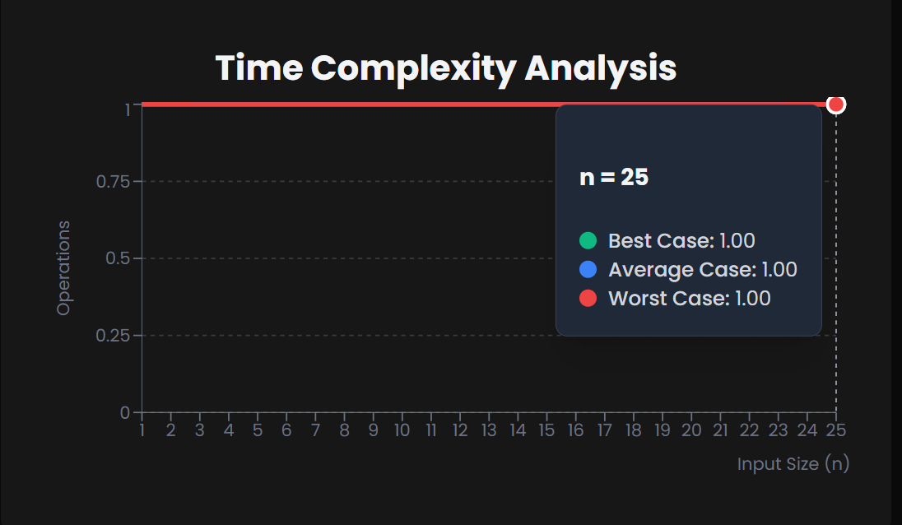

# IsEmpty Operation

# What is the isEmpty Operation in Stack?

--> The isEmpty operation checks whether a stack contains any elements or not.
--> It's a fundamental operation that helps prevent errors when trying to perform operations like pop() or peek() on an empty stack.

# How Does It Work?

Consider a stack represented as an array: [ ] (empty) or [5, 3, 8] (with elements).

1. For an empty stack [ ],isEmpty() returns true.
2. For a non-empty stack [5, 3, 8],isEmpty() returns false.

The operation simply checks if the stack's size/length is zero.

# Algorithm Implementation

1. Check the current size/length of the stack
2. Return the result :
   --> true if size equals 0.
   --> false otherwise.

# Time Complexity

--> O(1) constant time complexity.:
--> The operation only needs to check one value (size/length) regardless of stack size.:



# Practical Usage

1. Prevent stack underflow errors before pop() operations.
2. Check if there are elements to process.
3. Validate stack state in algorithms.
4. Terminate processing loops when stack becomes empty.

# Note

The isEmpty operation is a simple but crucial part of stack implementation, ensuring safe stack manipulation and preventing runtime errors.

# Stack Push & Pop Implementation

# JavaScript

```javascript
// Stack Implementation with isEmpty Operation in JavaScript
class Stack {
  constructor() {
    this.items = [];
    this.top = -1;
  }

  // Push operation
  push(element) {
    this.items[++this.top] = element;
    console.log(`Pushed: ${element}`);
  }

  // Pop operation
  pop() {
    if (this.isEmpty()) {
      console.log("Stack Underflow - Cannot pop from empty stack");
      return -1;
    }
    return this.items[this.top--];
  }

  // Check if stack is empty
  isEmpty() {
    const empty = this.top === -1;
    console.log(`Stack is ${empty ? "empty" : "not empty"}`);
    return empty;
  }

  // Display stack
  display() {
    console.log("Current Stack:", this.items.slice(0, this.top + 1));
  }
}

// Usage
const stack = new Stack();
console.log("Initial stack check:");
stack.isEmpty(); // true

stack.push(10);
stack.push(20);
stack.display();
stack.isEmpty(); // false

stack.pop();
stack.pop();
stack.isEmpty(); // true
```

# Python

```python
# Stack Implementation with isEmpty Operation in Python
class Stack:
def **init**(self):
self.items = []
self.top = -1

    # Push operation
    def push(self, element):
        self.top += 1
        self.items.append(element)
        print(f"Pushed: {element}")

    # Pop operation
    def pop(self):
        if self.is_empty():
            print("Stack Underflow - Cannot pop from empty stack")
            return -1
        return self.items.pop()

    # Check if stack is empty
    def is_empty(self):
        empty = self.top == -1
        print(f"Stack is {'empty' if empty else 'not empty'}")
        return empty

    # Display stack
    def display(self):
        print("Current Stack:", self.items)

# Usage

stack = Stack()
print("Initial stack check:")
stack.is_empty() # True

stack.push(10)
stack.push(20)
stack.display()
stack.is_empty() # False

stack.pop()
stack.pop()
stack.is_empty() # True

```