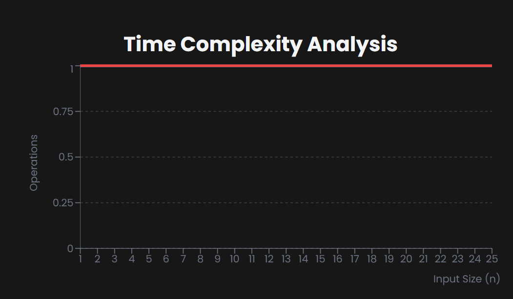

## IsFull Operation

# What is the "Is Full" Operation?

--> The Is Full operation checks whether a stack has reached its maximum capacity.
--> It is particularly relevant for fixed-size stack implementations (arrays) rather than dynamic implementations (linked lists).

# How It Works

--> Returns true if the stack cannot accept more elements.
--> Returns false if the stack can accept more elements.
--> For dynamic stacks (no fixed size), this operation typically always returns false.
--> Often used with Push operations to prevent stack overflow.

# Time and Space Complexity

Here's the time and space complexity analysis for stack operations:

==> Fixed-size Stack:
--> Time Complexity: O(1)
--> Space Complexity: O(1)
==> Dynamic Stack:
--> Time Complexity: O(1)
--> Space Complexity: O(1)



# Practical Example

==> Consider a stack with maximum capacity of 3 elements:

Stack: [ ] isFull() → false
Stack: [5, 3] isFull() → false
Stack: [7, 3, 5] isFull() → true

# Common Use Cases

--> Preventing stack overflow in memory-constrained systems.
--> Implementing bounded buffers or fixed-size caches.
--> Memory management in embedded systems.
--> Validating stack capacity before push operations

# Notes :-

The Is Full operation is crucial when working with fixed-size stacks to prevent overflow errors.
While not needed for dynamically-sized stacks, it's an essential safety check in many system-level implementations.

# Stack Push & Pop Implementation

JavaScript

```JavaScript
// Stack Implementation with isFull Operation in JavaScript
class Stack {
  constructor(maxSize = 5) {
    this.items = [];
    this.top = -1;
    this.MAX_SIZE = maxSize;
  }

  // Push operation with isFull check
  push(element) {
    if (this.isFull()) {
      console.log("Stack Overflow - Cannot push to full stack");
      return;
    }
    this.items[++this.top] = element;
    console.log(`Pushed: ${element}`);
  }

  // Pop operation
  pop() {
    if (this.isEmpty()) {
      console.log("Stack Underflow - Cannot pop from empty stack");
      return -1;
    }
    return this.items[this.top--];
  }

  // Check if stack is full
  isFull() {
    const full = this.top === this.MAX_SIZE - 1;
    console.log(`Stack is ${full ? "full" : "not full"}`);
    return full;
  }

  // Check if stack is empty
  isEmpty() {
    return this.top === -1;
  }

  // Display stack
  display() {
    console.log("Current Stack:", this.items.slice(0, this.top + 1));
  }
}

// Usage
const stack = new Stack(3); // Small stack for demonstration

console.log("Initial checks:");
stack.isFull();  // false
stack.isEmpty(); // true

stack.push(10);
stack.push(20);
stack.push(30);
stack.display();
stack.isFull();  // true

// Try to push to full stack
stack.push(40);  // Will show overflow message
```

Python

```Python
# Stack Implementation with isFull Operation in Python
class Stack:
    def __init__(self, max_size=5):
        self.items = []
        self.top = -1
        self.MAX_SIZE = max_size

    # Push operation with is_full check
    def push(self, element):
        if self.is_full():
            print("Stack Overflow - Cannot push to full stack")
            return
        self.top += 1
        self.items.append(element)
        print(f"Pushed: {element}")

    # Pop operation
    def pop(self):
        if self.is_empty():
            print("Stack Underflow - Cannot pop from empty stack")
            return -1
        return self.items.pop()

    # Check if stack is full
    def is_full(self):
        full = self.top == self.MAX_SIZE - 1
        print(f"Stack is {'full' if full else 'not full'}")
        return full

    # Check if stack is empty
    def is_empty(self):
        return self.top == -1

    # Display stack
    def display(self):
        print("Current Stack:", self.items)

# Usage
stack = Stack(3)  # Small stack for demonstration

print("Initial checks:")
stack.is_full()   # False
stack.is_empty()  # True

stack.push(10)
stack.push(20)
stack.push(30)
stack.display()
stack.is_full()   # True

# Try to push to full stack
stack.push(40)    # Will show overflow message
```

