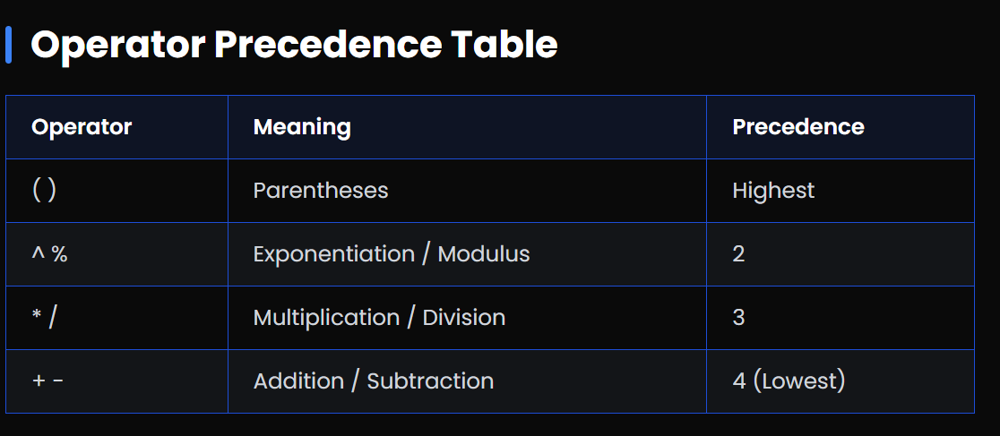

## Infix to Postfix

# What is Postfix Notation?

==> Postfix notation (also called Reverse Polish Notation) is a way of writing expressions where the operator comes after the operands.
==> For example, the infix expression 3 + 4 becomes 3 4 + in postfix. --> It removes the need for parentheses by making operator precedence explicit through position.
==> Note: Higher precedence means the operation will happen first. --> When operators have equal precedence, they are evaluated left-to-right (except for exponentiation which is right-to-left).

# Infix to Postfix Conversion Steps

1. Initialize an empty stack and an empty output string.
2. Scan the infix expression from left to right.
3. If the element is an operand, add it to the output.
4. If the element is a '(', push it onto the stack.
5. If the element is a ')', pop from the stack and add to output until '(' is encountered.
6. If the element is an operator, pop from the stack all operators with higher or equal precedence, then push the current operator.
7. After scanning, pop all remaining operators from the stack.

==> Example:
--> Infix: (A + B) _ (C - D)
Step 1: Push '(' → Stack: [ '(' ], Output: ''
Step 2: Add 'A' → Output: 'A'
Step 3: Push '+' → Stack: [ '(', '+' ]
Step 4: Add 'B' → Output: 'A B'
Step 5: Pop until '(' → Stack: [ ], Output: 'A B +'
Step 6: Continue similarly for the rest → Final Postfix: A B + C D - _



# Note:

--> Higher precedence means the operation will happen first.
--> When operators have equal precedence, they are evaluated left-to-right (except for exponentiation which is right-to-left).

# PostFix implementation using Stack

JavaScript

```JavaScript
// Postfix Evaluation using Stack (JavaScript)
function evaluatePostfix(expression) {
  let stack = [];

  for (let char of expression) {
    if (!isNaN(char)) {
      stack.push(parseInt(char));
    } else {
      const b = stack.pop();
      const a = stack.pop();

      switch(char) {
        case '+': stack.push(a + b); break;
        case '-': stack.push(a - b); break;
        case '*': stack.push(a * b); break;
        case '/': stack.push(Math.floor(a / b)); break;
      }
    }
  }
  return stack.pop();
}

// Example: "23*5+" becomes (2*3)+5 = 11
console.log(evaluatePostfix("23*5+")); // Output: 11
```

Python

```Python
# Postfix Evaluation using Stack (Python)
def evaluate_postfix(expression):
    stack = []

    for char in expression:
        if char.isdigit():
            stack.append(int(char))
        else:
            b = stack.pop()
            a = stack.pop()

            if char == '+': stack.append(a + b)
            elif char == '-': stack.append(a - b)
            elif char == '*': stack.append(a * b)
            elif char == '/': stack.append(a // b)

    return stack.pop()

# Example: "23*5+" becomes (2*3)+5 = 11
print(evaluate_postfix("23*5+"))  # Output: 11
```
