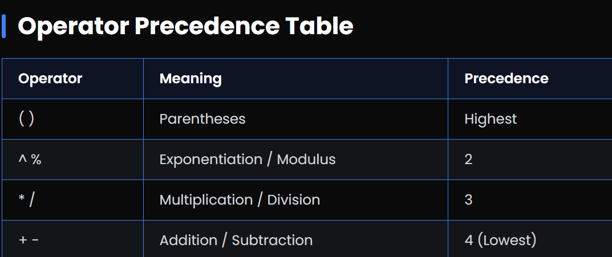

## Infix to Prefix

# What is Prefix Notation?

--> Prefix notation (also called Polish Notation) is a way of writing expressions where the operator comes before the operands.
--> For example, the infix expression 3 + 4 becomes + 3 4 in prefix. It removes the need for parentheses by using operator order directly.

# Infix to Prefix Conversion Steps

1. Reverse the infix expression, while keeping the positions of parentheses correct.
2. Replace ( with ) and vice-versa.
3. Convert the reversed expression to postfix using a stack.
4. Finally, reverse the postfix expression to get the prefix expression.

==>Example:
==> Infix: (A + B) _ (C - D)
Step 1: Reverse → (D - C) _ (B + A)
Step 2: Convert to postfix → D C - B A + _
Step 3: Reverse → _ + A B - C D



# Note

Higher precedence means the operation will happen first. Exponentiation (^) is evaluated right-to-left, while others are left-to-right.

# PreFix implementation using Stack

JavaScript

```JavaScript
// Prefix Evaluation using Stack (JavaScript)
function evaluatePrefix(expression) {
  let stack = [];
  // Process expression in reverse order
  for (let i = expression.length - 1; i >= 0; i--) {
    const char = expression[i];
    if (!isNaN(char)) {
      stack.push(parseInt(char));
    } else {
      const a = stack.pop();
      const b = stack.pop();

      switch(char) {
        case '+': stack.push(a + b); break;
        case '-': stack.push(a - b); break;
        case '*': stack.push(a * b); break;
        case '/': stack.push(Math.floor(a / b)); break;
      }
    }
  }
  return stack.pop();
}

// Example: "+*235" becomes (2*3)+5 = 11
console.log(evaluatePrefix("+*235")); // Output: 11
```

Python

```Python
# Prefix Evaluation using Stack (Python)
def evaluate_prefix(expression):
    stack = []
    # Process expression in reverse order
    for char in reversed(expression):
        if char.isdigit():
            stack.append(int(char))
        else:
            a = stack.pop()
            b = stack.pop()

            if char == '+': stack.append(a + b)
            elif char == '-': stack.append(a - b)
            elif char == '*': stack.append(a * b)
            elif char == '/': stack.append(a // b)

    return stack.pop()

# Example: "+*235" becomes (2*3)+5 = 11
print(evaluate_prefix("+*235"))  # Output: 11
```
