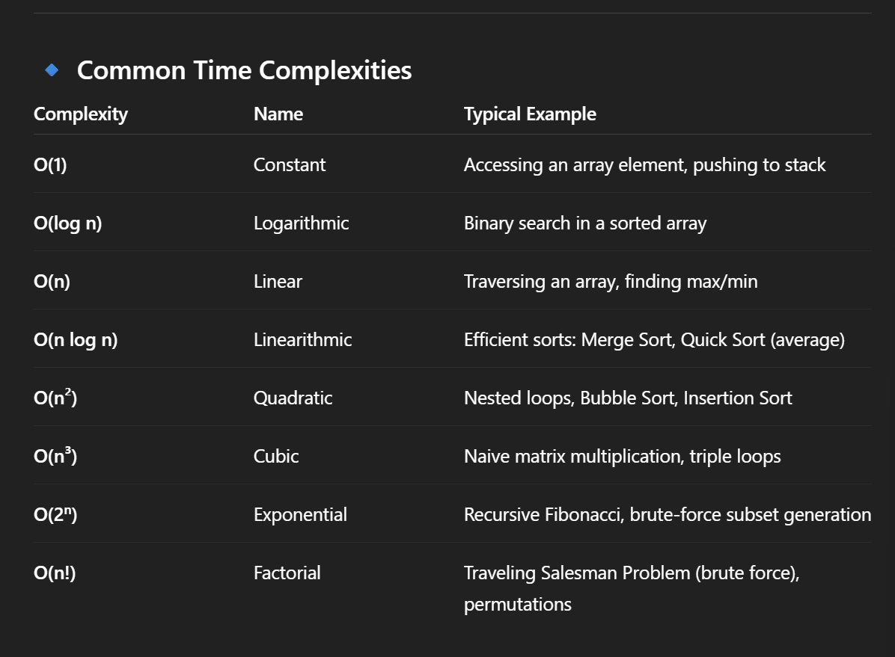
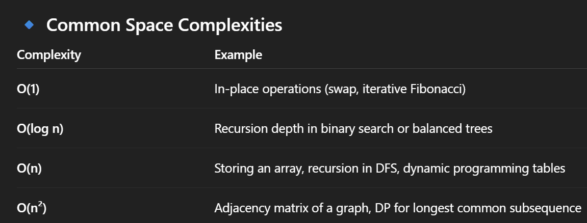
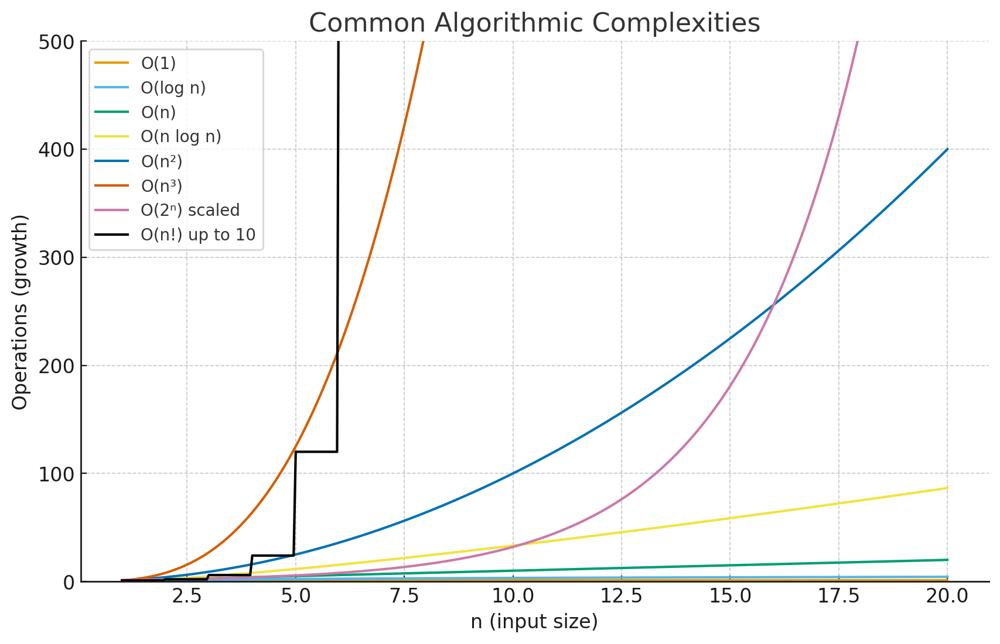

## Algorithm && Program

==> Algorithm

1. Algorithm: The conceptual solution, independent of programming language
2. Design: Planning the structure and approach of the solution
3. Domain Knowledge: Understanding the specific field (finance, healthcare, etc.)
4. Any Language: Can be expressed in any formal notation or natural language
5. Hardware and Operating System: Generally independent of specific technology
6. Analyzing: Evaluating the efficiency, correctness, and complexity of the solution

==> Program

1. Program: The concrete implementation of an algorithm
2. Implementation: The actual coding and building process
3. Programming Knowledge: Understanding syntax, language features, and coding patterns
4. Programming Language: Must use a specific language (Python, Java, C++, etc.)
5. Hardware and Operating System: Must account for specific technology constraints
6. Testing: Verifying the program works correctly through unit tests, integration tests, etc.

## Algorithm vs. Programming

--> An algorithm is a step-by-step procedure or formula for solving a problem, while programming is the process of writing code to implement those algorithms

## Priori Analysis (Algorithms) && Posteriori Testing (Programs)

==> Priori Analysis (Algorithms)
--> Algorithm: The theoretical approach to problem-solving
--> Independent of Language: Can be expressed in any notation or natural language
--> Hardware Independent: Conceptually separate from physical implementation
--> Time & Space Function: Analyzed theoretically using Big O notation for efficiency

==> Posteriori Testing (Programs)
--> Program: The concrete implementation
--> Language dependent: Tied to a specific programming language
--> Hardware dependent: Performance affected by the physical computing environment
--> Watch time & Bytes: Measured empirically during execution

==> This comparison highlights the fundamental distinction in how we evaluate solutions:
--> Priori Analysis: Theoretical evaluation before implementation (analyzing "on paper")
--> Posteriori Testing: Practical evaluation after implementation (measuring actual performance)

# Characteristics of an algorithm

--> Input – An algorithm can have zero or more inputs. These are the values supplied externally to the algorithm.

--> Output – It should produce at least one output. The result or outcome of the algorithm must be well-defined.

--> Definiteness – Every step of the algorithm must be clearly and unambiguously defined.

--> Finiteness – The algorithm must terminate after a finite number of steps. It should not run indefinitely.

--> Effectiveness – All operations must be basic enough to be performed, in principle, by a person using only paper and pencil in a finite amount of time.

## Time & Space Complexities

==> What is Big-O?

--> Big-O notation describes how the time or space required by an algorithm grows relative to the input size n.
--> It helps us measure efficiency and scalability of algorithms.

==> Common Algorithmic Complexities & Their Uses

1. O(1) → Constant Time
   Meaning: Execution time does not depend on input size.
   Examples:
   Accessing an element in an array/hash table
   Pushing/popping from stack
   Use: When you need fast, predictable operations.

2. O(log n) → Logarithmic Time
   Meaning: Time grows slowly as input size increases.
   Examples:
   Binary search in sorted array
   Searching in balanced BST (like AVL, Red-Black Tree)
   Heap operations (insert/delete-min)
   Use: Efficient searching and divide-and-conquer problems.

3. O(n) → Linear Time
   Meaning: Time increases proportionally to input size.
   Examples:
   Linear search
   Traversing a list or array
   Use: When you must check every element once.

4. O(n log n) → Linearithmic Time
   Meaning: Slightly more than linear, but efficient for large inputs.
   Examples:
   Merge Sort, Quick Sort (average case)
   Heap Sort
   Divide & conquer algorithms
   Use: Best choice for sorting large datasets.

5. O(n²) → Quadratic Time
   Meaning: Time grows as the square of input size.
   Examples:
   Bubble Sort, Insertion Sort, Selection Sort
   Checking all pairs in a list (nested loops)
   Use: Works for small datasets, but inefficient for large input.

6. O(n³) → Cubic Time
   Meaning: Time grows as the cube of input size.
   Examples:
   Matrix multiplication (naïve approach)
   Dynamic programming (e.g., Floyd-Warshall shortest path)
   Use: Typically in graph algorithms, DP, and matrix problems.

7. O(2ⁿ) → Exponential Time
   Meaning: Time doubles with each additional input.
   Examples:
   Recursive Fibonacci
   Subset generation / brute force search
   Use: Only feasible for very small input sizes.

8. O(n!) → Factorial Time
   Meaning: Extremely slow, checks all possible permutations.
   Examples:
   Traveling Salesman (brute force)
   Permutation generation
   Use: Only for very tiny inputs, usually replaced with optimization.

==> Why Do We Use Complexities?

1. Comparison → To choose the best algorithm for a problem.
2. Prediction → To estimate performance before running code.
3. Optimization → To improve algorithms for large datasets.
4. Scalability → To ensure the solution works as input grows.

==> Graph of Growth Rates (Intuition)

From fastest → slowest growth:

O(1) < O(log n) < O(n) < O(n log n) < O(n²) < O(n³) < O(2ⁿ) < O(n!)

--> O(1), O(log n), O(n) grow very slowly.
--> O(n²), O(n³) start rising steeply.
--> O(2ⁿ), O(n!) explode rapidly, making them impractical for large n.
