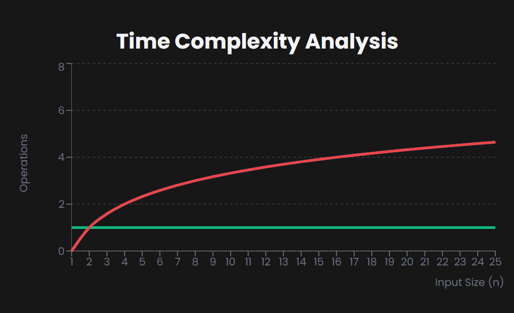

## Binary Search

==> What is Binary Search

--> Binary Search is an efficient algorithm for finding an item in a **sorted list**. It works by repeatedly dividing the search interval in half.
--> If the target value is less than the middle element, the search continues in the lower half. Otherwise, it continues in the upper half. This process repeats until the value is found.

==> How Does It Work
Imagine you have a sorted list of numbers: [1, 2, 3, 4, 5, 6, 7] and you want to find the number d.

1. Compare 7 with the middle element (7). It matches! Return the position.
2. If searching for 5:
   --> First middle is 7 (too high)
   --> Search left half: [1, 3, 5]
   --> New middle is 3 (too low)
   --> Search right portion: [5]
   --> Found at position 2

If the number is not in the list (e.g., searching for 8), the search ends when the subarray becomes empty.

==> Algorithm Steps

1. Start with the entire sorted array
2. Compare the target with the middle element:
   --> If equal, return the position
   --> If target is smaller, search the left half
   --> If target is larger, search the right half
3. Repeat until the element is found or the subarray is empty
4. If not found, return "Not Found"

==> Time Complexity

Best Case: Target is the middle element → O(1).
Worst Case: Element not present → O(log n) (halves search space each step).


Note :- Binary Search is extremely fast for large datasets but requires the list to be sorted beforehand. It's much more efficient than Linear Search for sorted data.

# Binary Search Implementation

==> JavaScript

```JavaScript
// Binary Search in JavaScript (Iterative)
function binarySearch(arr, target) {
  let left = 0;
  let right = arr.length - 1;

  while (left <= right) {
    const mid = Math.floor((left + right) / 2);

    if (arr[mid] === target) {
      return mid; // Target found
    } else if (arr[mid] < target) {
      left = mid + 1; // Search right half
    } else {
      right = mid - 1; // Search left half
    }
  }

  return -1; // Target not found
}

// Usage example
const sortedNumbers = [10, 20, 30, 40, 50, 60, 70];
const target = 40;
const result = binarySearch(sortedNumbers, target);

if (result !== -1) {
  console.log(`Element found at index: ${result}`);
} else {
  console.log("Element not found");
}
```

==> Python

```python
# Binary Search in Python (Iterative)
def binary_search(arr, target):
    left, right = 0, len(arr) - 1

    while left <= right:
        mid = (left + right) // 2

        if arr[mid] == target:
            return mid  # Target found
        elif arr[mid] < target:
            left = mid + 1  # Search right half
        else:
            right = mid - 1  # Search left half

    return -1  # Target not found

# Usage example
sorted_numbers = [10, 20, 30, 40, 50, 60, 70]
target = 40
result = binary_search(sorted_numbers, target)

if result != -1:
    print(f"Element found at index: {result}")
else:
    print("Element not found")
```
