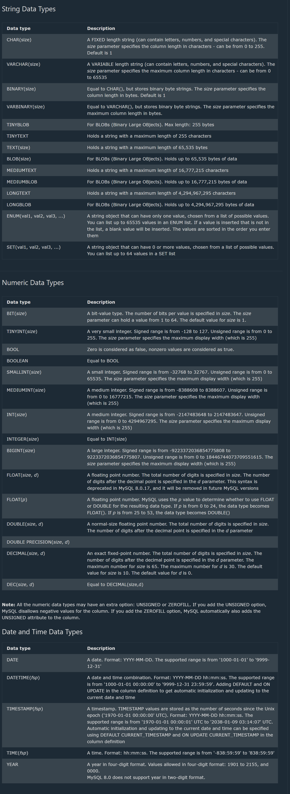
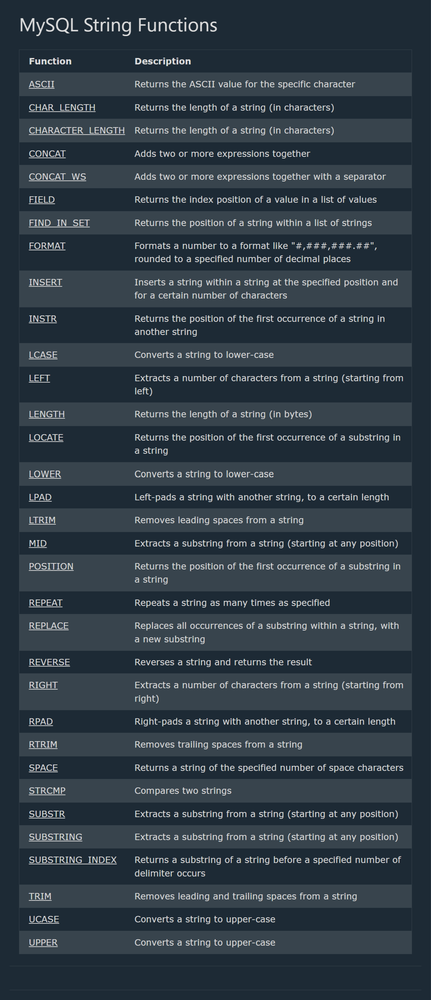
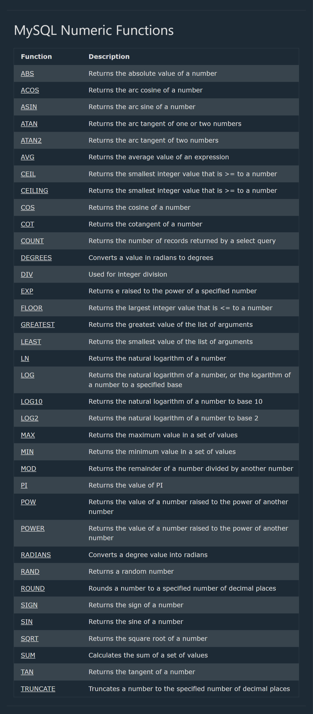
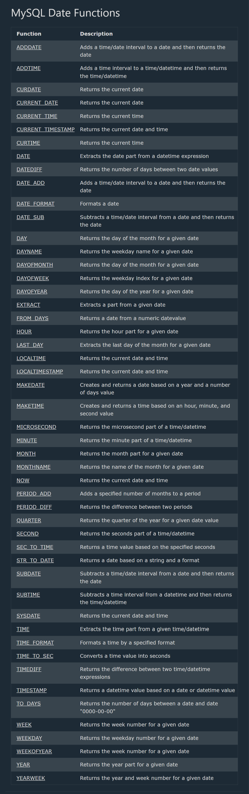
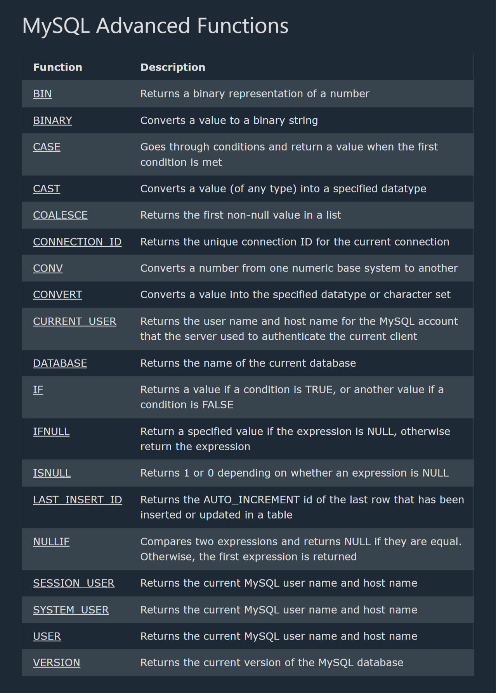

## Database

It is collection of data in a format that can be easily accessed(Digital)
A software application used to manage our DB is called DBMS(Database Management System)

# Types of Databases with Use Explanations

==> Relational Databases (RDBMS) - Store structured data in tables with predefined schemas and relationships; ideal for transactional applications with complex queries.

1. MySQL - Popular open-source database for web applications with good read performance.
2. PostgreSQL - Advanced open-source database with robust features and extensibility.
3. Oracle Database - Enterprise-grade database with comprehensive features for large organizations.
4. Microsoft SQL Server - Microsoft's enterprise database solution with strong Windows integration.
5. MariaDB - MySQL fork with enhanced features and performance.
6. SQLite - Lightweight, serverless database that runs within applications.

==> NoSQL Databases - Non-relational databases designed for specific data models and flexible schemas.

1. Document Databases - Store data in flexible, JSON-like documents; ideal for content management and applications with variable data.
2. MongoDB - Popular document database for applications with evolving schemas.
3. CouchDB - Document database with strong synchronization for distributed applications.
4. Firebase Firestore - Google's cloud document database for mobile and web apps.

## SQL

--> Structured Query language
--> Programming language used to interact with relational databases
--> It is used to perform crud operation:
create , read , update , delete

## MySQL

--> MySQL is a widely used relational database management system (RDBMS).
--> MySQL is free and open-source.
--> MySQL is ideal for both small and large applications.
--> MySQL is very fast, reliable, scalable, and easy to use
--> MySQL is cross-platform
--> MySQL is compliant with the ANSI SQL standard
--> MySQL was first released in 1995
--> MySQL is developed, distributed, and supported by Oracle Corporation

==> Show Data On Your Web Site
--> To build a web site that shows data from a database, will need:
--> An RDBMS database program (like MySQL)
--> A server-side scripting language, like PHP
--> To use SQL to get the data you want
--> To use HTML / CSS to style the page

## MySQL RDBMS

--> RDBMS stands for Relational Database Management System.
--> RDBMS is a program used to maintain a relational database.
--> RDBMS is the basis for all modern database systems such as MySQL, Microsoft SQL Server, Oracle, and Microsoft Access.
--> RDBMS uses SQL queries to access the data in the database.

# Database Table

--> A table is a collection of related data entries, and it consists of columns and rows.
--> A column holds specific information about every record in the table.
--> A record (or row) is each individual entry that exists in a table.

# Relational Database

--> A relational database defines database relationships in the form of tables.
--> The tables are related to each other - based on data common to each.

