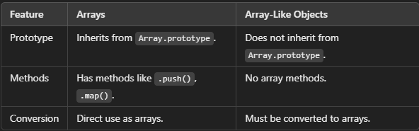
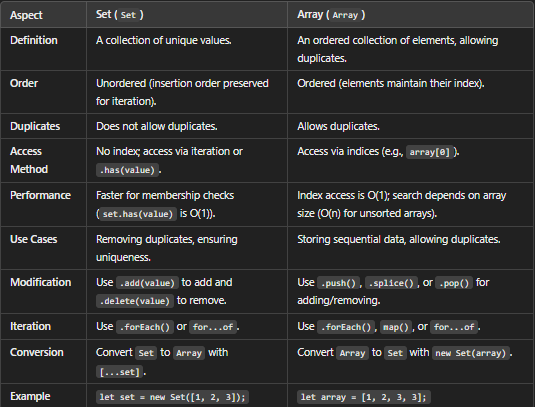
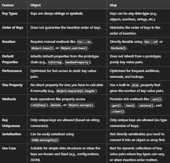
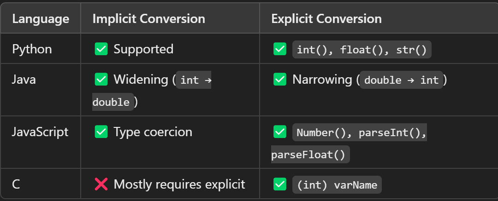
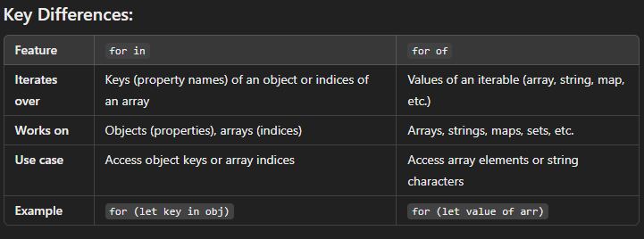
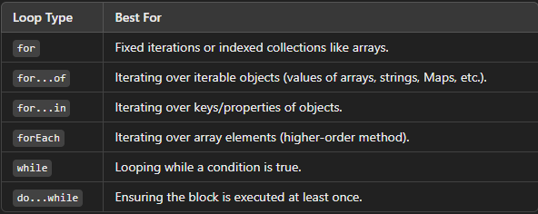

--> Common Practice to end statement in javascript with a semi-colon (;)
--> In JavaScript, variable names are case-sensitive. This means that name and NAME would be treated as two different variables.
--> function is used to define a function in JavaScript
--> ${name} inserts the value of the name variable into the string.

# Variable 
--> Point to a specific Memeory address that store a value 
--> Giving a name 
--> It is done with let,Const & Var 
--> Assign a value to variable using assignment Operator ( = )
--> Assigning a value to a variable at moment of its declaration is knownas Initialization 

--> Var --> Used for very old Java script 
--> Const --> Value Cannot change 
--> Let --> Value Can be changed 

# Primitive Data Types 
--> Created using ( )
--> number , string ,boolean ,null ,undefined ,symbol(introduced in ES6) ,bigint (introduced in ES11)
--> Primitive are saved in stack 
--> 1, 2, 3, 4, "String", null, undefined

# Use split() to make string to array 

# Array 
--> Created using [ ]
--> ordered Collection of items / elements 
--> Reference types Also known as objects 
--> [1, 2, 3, 4, "String", null, undefined ]
--> semi colon 

# Objects
--> Created using { }
--> Array are good but not sufficent for real world data 
--> objects store key value pairs 
--> objects don't have index
--> { name:"Shanu", age:23}
--> comma at end of each object

# Array.from() --> Converts any iterable or array-like object into a real array
# The spread operator (...) --> can also convert array-like objects into arrays.

# Array like object
--> Objects that resemble arrays but do not have all the features of a true array
--> Manipulating DOM NodeLists when working with the DOM.
--> Performing array operations on any object with a length and indexed properties.
--> They lack array-specific methods like .push(), .map(), or .filter().
# 

# Function 
--> Function Decleration 
--> function functionName(parameters) {
    // code to be executed
    }

# Function expression 
--> way to define a function in programming (usually JavaScript) using an expression.
--> const j = function () {
    console.log("happy birthday to you ......")
    }
    j()

# Arrow Function 
--> const k = () => {
    console.log("My name is shanu jaiswal")
    }
    k()

# One line Function 
--> const n = Number => Number % 2 === 0;
    console.log(n(14))

# JavaScript Hoisting
--> a variable can be declared after it has been used./ a variable can be used before it has been declared.

# Sets
--> ([ ])
--> It is iterable
--> used to store data , of any type, whether primitive values or object references.
--> Unique items only (no duplicate allowed)
--> It also have its own methods
--> No index based access
--> Order is not guaranteed  
--> Best uses in creating id's because it takes only unique values 
# 

# Map
--> Map is a collection of key-value pairs where the keys can be of any data type (objects, functions, primitives, etc.). 
--> It is similar to an object but provides more flexibility and useful methods for working with key-value pairs.
--> It is an iterable.
--> Store data in ordered fashion.
--> Store key value pair(like object).
--> Duplicate keys are not allowed like objects.
# 

# Memory Layout:
--> Primitive (x and y):
--> x is in the stack with value 20.
--> y is in the stack with value 10.
--> x and y are independent copies.

# Reference Type (obj1 and obj2):
--> obj1 and obj2 are in the stack, both holding the same reference to an object in the heap.
--> The object in the heap looks like { name: "Bob" }.
--> Both obj1 and obj2 point to the same object, so modifying the object through either reference affects both.
--> array , objects
--> To access string we use square bracket []

# Iterables 
--> An iterable is an object that can be iterated over, meaning its elements can be accessed sequentially
--> Arrays: [1, 2, 3], Strings: 'Hello', Maps: new Map() ,Sets: new Set(), Typed Arrays: Int32Array, Uint8Array, etc., Arguments Object (function arguments)

# Non-Iterable Objects
--> Objects like plain JavaScript objects {} are not iterable by default. 

# Switch Statement
--> evaluates a value against multiple cases and executes the code block of the matching case
--> Provide break if you want to stop the execution and no further responses from code otherwise it will provide all the given cases 

# While loop
--> Condition is checked before the loop body executes.
--> Use while when you don't know in advance how many times the loop will execute, and you want to repeat the loop as long as a condition remains true.
--> we declare variable before starting while 

# For loop function 
--> for loop Condition is checked before the loop body executes, similar to while, but it has an initialization step, a condition, and an increment step all in one line
--> Use for when the number of iterations is known or easily determined before the loop starts (e.g., looping over a range or through an array).
--> If we declare variable inside starting   paranthesis then it will became local variable 
--> we can use var instead of let for making it from local to global 

# Do while 
--> Condition is checked after the loop body executes.
--> Use do-while when you want the loop to execute at least once before checking the condition (e.g., when a menu is presented to the user and you want to ensure the menu shows up at least once).
# 
# 
# 

# Break 
--> It will stop after given condition satisfy 

# Continue 
--> continue the output from starting to end except the desire result.

# push and pop is faster than unshift & shift because push and pop have to create and dealt with last element whereas unshift & shift have to make changes in starting and deal with all other elements 

--> In javascript key are in string 

# Dot Notation:
--> Uses a period (.) to access object properties
--> Used for static property access

# Bracket Notation:
--> Uses square brackets [] to access properties
--> Required when property names are not valid identifiers
--> When property names contain special characters or spaces,using variables or expressions to access properties,property names start with numbers:

==> window.alert(),console.log(),document.write() are correct syntax for writing output in JavaScript

# Lexical Scope 
-–> This concept refers to the scope in which a variable is defined. When a value is requested, the program first checks if it is available within the current scope. If it’s not found, the search continues in the parent scope, and so on, moving upwards through the scope chain until the value is found or the global scope is reached.

# Block scope 
--> let and const are block scope 
--> let and const are only access in that block scope 
--> we can use same name variable if we are using block scope
--> we can not call variable in different block 

# Function scope
--> var is function scope 
--> var is access from outside of block scope 
--> we can call variable in different block 

# Default Parameter
--> Provide a default value for a parameter if no value is provided.

# Rest Parameter
--> Collect all remaining arguments into an array.

# Destructuring 
--> simplifies extracting values from arrays and objects.
--> It makes the function parameters more readable, especially when working with complex data structures.
--> You can use default values to ensure that a parameter has a fallback value.

# Callback function 
--> Format :- (callback(element, index, array), thisArg);
--> Is a function that is passed as an argument to another function and is executed after the completion of that function's execution. 
--> It allows you to customize the behavior of the function you are passing it to, based on certain conditions, or to be executed once some task is finished.
--> A function that tests each element in the array. It takes the following arguments:
--> Element: The current element being processed in the array.
--> Index (optional): The index of the current element.
--> Array (optional): The array that find() is called on.
--> ThisArg (optional): A value to use as this when executing the callback.

# Methods used in array
# ForEach 
--> It used in placeof for loop . but it is not conditional as in for loop  .
--> It will execute the code till the end .
--> It will not give new array .and we use console not return 

# Map
--> It will return new array.

# Filter method 
--> The filter() method is used to create a new array containing all the elements from an original array that pass a test specified by a provided function.
--> Work on boolean function . Returns true or False. 
--> It doesn't modify the original array but returns a new one with the elements that satisfy the condition set in the callback function.

# In function method if there is return we have to create a new variable , if there is direct console then there is no need to make a new variable 

# Reduce method
--> The reduce() method is used to reduce an array to a single value by applying a reducer function on each element of the array, one at a time, and accumulating the results

# Sort method 
--> the sort() function is used to sort the elements of an array in place. 
--> By default, it sorts the elements as strings, but we can provide a custom sorting function to sort elements according to specific criteria.

# Find method
--> The find() method in JavaScript is an array method that is used to search for the first element in an array that satisfies a provided test condition
--> Once the condition is met, it returns that element. If no element is found that satisfies the condition, it returns undefined.

# Every method 
--> The every method in JavaScript is an array method used to test whether "all elements" in an array pass the given condition (specified by a callback function). 
--> If every element in the array satisfies the condition, the method returns true; otherwise, it returns false.
--> Return in Boolean 

# Some method
--> The some method in JavaScript is an array method that checks if "at least one element" in the array satisfies the condition specified in a callback function. 
--> If any element meets the condition, it returns true; otherwise, it returns false.

# FIll method 
--> The fill method in JavaScript is an array method used to fill all or part of an array with a static value. 
--> You can specify the start and end indices to control which part of the array is filled.

# Splice method 
--> The splice method in JavaScript is an array method used to add, remove, or replace elements in an array. 
--> It modifies the original array and optionally returns the removed elements as a new array.

# OOPs / Prototypal Inheritance

# Methods
--> Function inside object 