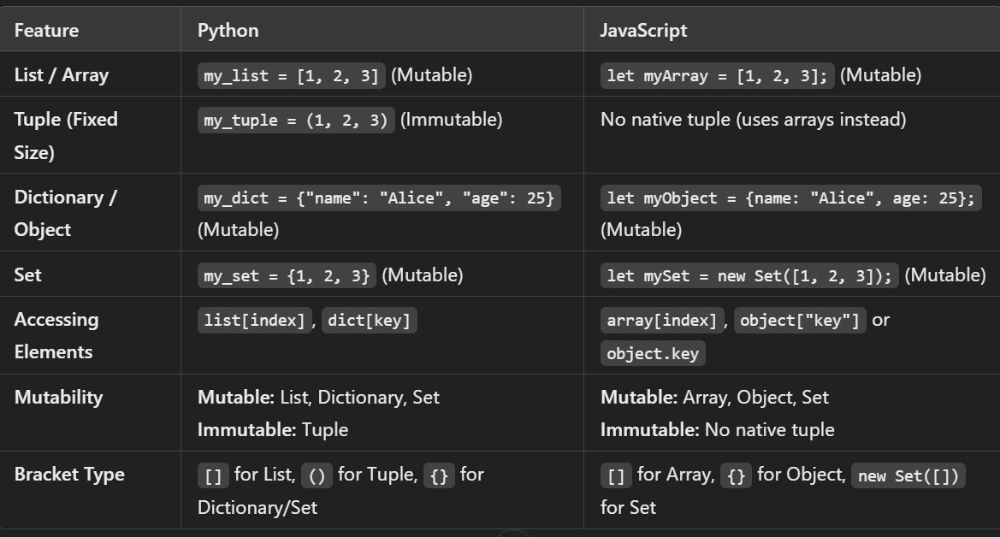

==> ALT + Shift + Down Button -- Duplicate the Current Line 
==> CTRL + Shift + J -- Open console in Browser (not for VS Code)
==> CTRL + / -- Comment 
==> ALT + UP Button or Down Button -- To move whole Line up and down 
==> Common Practice to end statement in javascript with a semi-colon (;)

--> In JavaScript, variable names are case-sensitive. This means that name and NAME would be treated as two different variables.
--> function is used to define a function in JavaScript
==> Variable 
--> Point to a specific Memeory address that store a value 
--> Giving a name 
--> It is done with let,Const & Var 
--> Assign a value to variable using assignment Operator ( = )
--> Assigning a value to a variable at moment of its declaration is knownas Initialization 

==> Var --> Used for very old Java script 
==> Const --> Value Cannot change 
==> Let --> Value Can be changed 

==> Primitive Data Types 
--> Created using ( )
--> number , string ,boolean ,null ,undefined ,symbol(introduced in ES6) ,bigint (introduced in ES11)
--> Primitive are saved in stack 
--> 1, 2, 3, 4, "String", null, undefined

==> Array 
--> Created using [ ]
--> ordered Collection of items / elements 
--> Reference types Also known as objects 
--> [1, 2, 3, 4, "String", null, undefined ]
--> semi colon 

==> Objects
--> Created using { }
--> Array are good but not sufficent for real world data 
--> objects store key value pairs 
--> objects don't have index
--> { name:"Shanu", age:23}
--> comma ,

==> Function 
--> function functionName(parameters) {
    // code to be executed
}
--> 

==> Memory Layout:

--> Primitive (x and y):
--> x is in the stack with value 20.
--> y is in the stack with value 10.
--> x and y are independent copies.

--> Reference Type (obj1 and obj2):
--> obj1 and obj2 are in the stack, both holding the same reference to an object in the heap.
--> The object in the heap looks like { name: "Bob" }.
--> Both obj1 and obj2 point to the same object, so modifying the object through either reference affects both.
--> array , objects

--> To access string we use square bracket []

==> Switch Statement
--> evaluates a value against multiple cases and executes the code block of the matching case
--> Provide break if you want to stop the execution and no further responses from code otherwise it will provide all the given cases 

==> While loop
--> Condition is checked before the loop body executes.
--> Use while when you don't know in advance how many times the loop will execute, and you want to repeat the loop as long as a condition remains true.
--> we declare variable before starting while 

==> for loop function 
--> for loop Condition is checked before the loop body executes, similar to while, but it has an initialization step, a condition, and an increment step all in one line
--> Use for when the number of iterations is known or easily determined before the loop starts (e.g., looping over a range or through an array).
--> if we declare variable inside starting   paranthesis then it will became local variable 
--> we can use var instead of let for making it from local to global 

==> do while 
--> Condition is checked after the loop body executes.
--> Use do-while when you want the loop to execute at least once before checking the condition (e.g., when a menu is presented to the user and you want to ensure the menu shows up at least once).
 

==> Break 
--> It will stop after given condition satisfy 

==> Continue 
--> continue the  output from starting to end except the desire result.

==> push and pop is faster than unshift & shift 
because push and pop have to create and dealt with last element whereas unshift & shift have to make changes in starting and deal with all other elements 

--> In javascript key are in string 

==> Dot Notation:
--> Uses a period (.) to access object properties
--> Used for static property access

==> Bracket Notation:
--> Uses square brackets [] to access properties
--> Required when property names are not valid identifiers
--> When property names contain special characters or spaces,using variables or expressions to access properties,property names start with numbers:

--> window.alert(),console.log(),document.write() are correct syntax for writing output in JavaScript