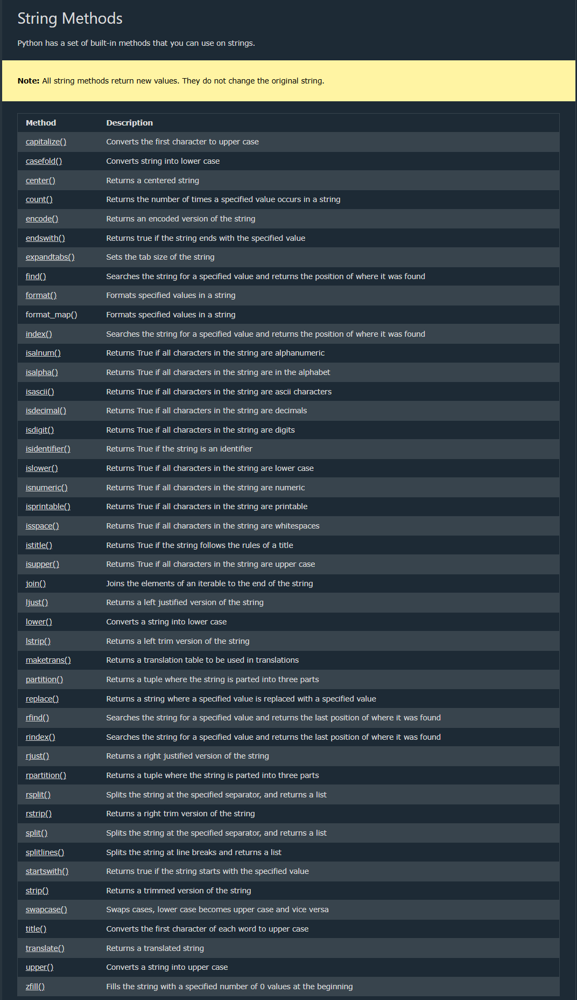
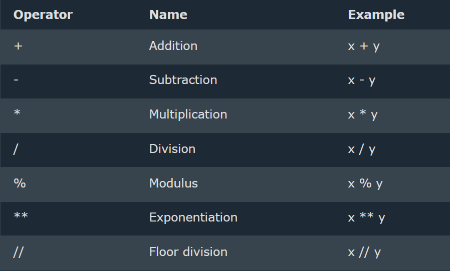
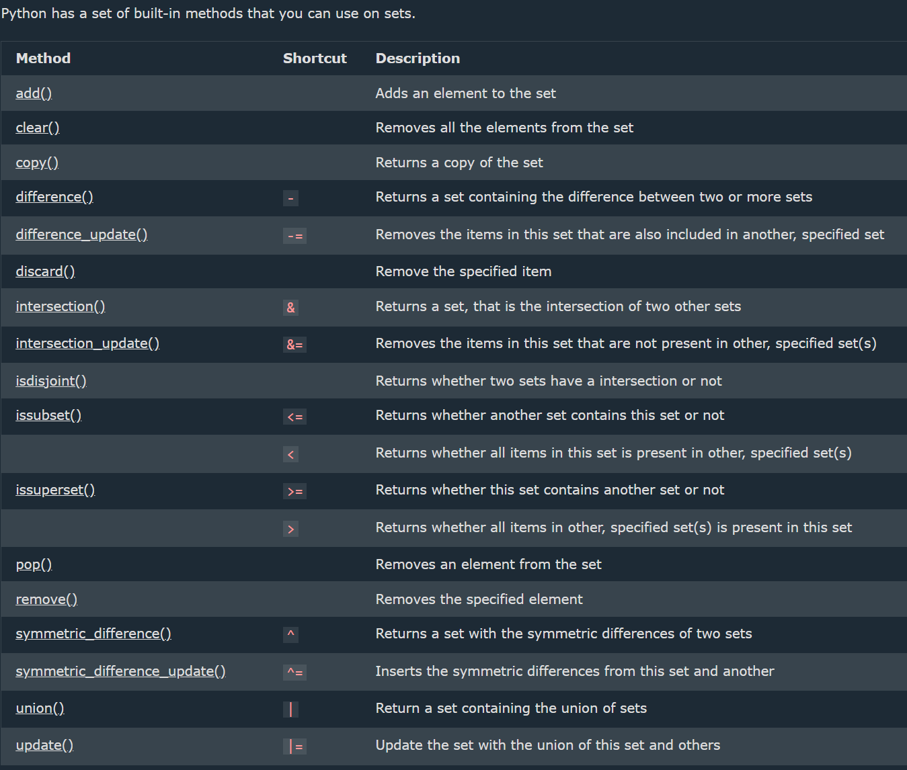

## Python

--> Python is a very simple language, and has a very straightforward syntax.
--> Python is a popular programming language.
--> Python is a case-sensitive language. It considers that uppercase and lowercase characters are different.
--> Python can be used on a server to create web applications.
--> There are two major Python versions, Python 2 and Python 3. Python 2 and 3 are quite different
--> One difference between Python 2 and 3 is the print statement. In Python 2, the "print" statement is not a function, and therefore it is invoked without parentheses. However, in Python 3, it is a function, and must be invoked with parentheses.

## Indentation

--> Indentation refers to the spaces at the beginning of a code line.
--> Where in other programming languages the indentation in code is for readability only, the indentation in Python is very important.
--> Python uses indentation to indicate a block of code . Python will give you an error if you skip the indentation:
--> The standard indentation requires standard Python code to use four spaces,but it has to be at least one.

## Input in Python

input() statement is used to accept value ( using keyboard) from user
input()--> default is always a str
int(input()) ---> value will be integer
float(input()) ---> value will be float

## Comments

--> used to explain Python code.
--> used to make the code more readable.
--> used to prevent execution when testing code.
--> Comments starts with a #, and Python will ignore them:
--> Add a multiline string (triple quotes) in our code, and place your comment inside it:

## Variables and Types

--> Variable -- containers for storing data values -- Memory allocation
--> Variable is a name given to a memory location in a program.
--> Every variable in Python is an object.
--> Python is completely "object oriented", and not "statically typed". Do not need to declare variables before using them, or declare their type.
--> A variable can have a short name (like x and y) or a more descriptive name (age, carname, total_volume).

# Rules for Python variables:

--> A variable name must start with a letter or the underscore character
--> A variable name cannot start with a number
--> A variable name can only contain alpha-numeric characters and underscores (A-z, 0-9, and \_ )
--> Variable names are case-sensitive (age, Age and AGE are three different variables)
--> A variable name cannot be any of the Python keywords.

# Legal variable names:

myvar = "John"
my_var = "John"
\_my_var = "John"
myVar = "John"
MYVAR = "John"
myvar2 = "John"

# Illegal variable names:

2myvar = "John"
my-var = "John"
my var = "John"

# Multi Words Variable Names

--> Variable names with more than one word can be difficult to read.
--> There are several techniques you can use to make them more readable:
==> Camel Case
--> Each word, except the first, starts with a capital letter:
myVariableName = "John"
==> Pascal Case
--> Each word starts with a capital letter:
MyVariableName = "John"
==> Snake Case
--> Each word is separated by an underscore character:
my_variable_name = "John"

# Variables - Assign Multiple Values

==> Many Values to Multiple Variables
--> correct syntax to assign values to multiple variables in one line
x,y,z = "Orange", "Banana", "Cherry"
==> One Value to Multiple Variables
--> The same value to multiple variables in one line:
--> correct syntax to add the value to 3 variables in one statement
x = y = z = "Hello World"
==> Unpack a Collection
--> If you have a collection of values in a list, tuple etc. Python allows you to extract the values into variables. This is called unpacking.
==> Unpack a list:

```python
fruits = ["apple", "banana", "cherry"]
x, y, z = fruits
print(x)
print(y)
print(z)
```

# Output Variables

==> Output Variables
--> The Python print() function is often used to output variables.
--> In the print() function, you output multiple variables, separated by a comma:
x = "Python"
y = "is"
z = "awesome"
print(x, y, z)
--> Can also use the + operator to output multiple variables, For numbers, the + character works as a mathematical operator
x = "Python "
y = "is "
z = "awesome"
print(x + y + z)
--> In the print() function, when you try to combine a string and a number with the + operator, Python will give you an error, The best way to output multiple variables in the print() function is to separate them with commas, which even support different data types:

# Global Variable

--> Variables that are created outside of a function
are known as global variables.
--> Global variables can be used by everyone, both inside of functions and outside.
--> If you create a variable with the same name inside a function, this variable will be local, and can only be used inside the function. The global variable with the same name will remain as it was, global and with the original value.
==> The global Keyword
--> Normally, when you create a variable inside a function, that variable is local, and can only be used inside that function.
--> To create a global variable inside a function, you can use the global keyword.
--> Use the global keyword if want to change a global variable inside a function.(To change the value of a global variable inside a function, refer to the variable by using the global keyword)
--> def myfunc():
global
x
x = "fantastic"

## Built-in Data Types

--> In programming, data type is an important concept.
--> Variables can store data of different types, and different types can do different things.
--> Python has the following data types built-in by default, in these categories:
--> Can get the data type of any object by using the type() function:


1. List is a collection which is ordered and changeable. Allows duplicate members.
2. Tuple is a collection which is ordered and unchangeable. Allows duplicate members.
3. Set is a collection which is unordered, unchangeable\*, and unindexed. No duplicate members.
4. Dictionary is a collection which is ordered\*\* and changeable. No duplicate members.
   \*\* Python version 3.7, dictionaries are ordered. In Python 3.6 and earlier, dictionaries are unordered.

## Type Conversion(automatically) & type casting(manual)

Type Conversion is the automatic or manual process of changing a variable's data type, while Type Casting is the explicit (manual) conversion using functions like int(), float(), and str().
float is superior than int.
--> lst = [1, 2, 3, 4, 5] -- List  
--> tpl = (1, 2, 3, 4, 5) -- Tuple  
--> strg = "Hello" -- String  
--> dct = {"a": 1, "b": 2} -- Dictionary  
--> st = {1, 2, 3, 4, 5} -- Set  
--> rng = range(10) -- Range  
--> byt = b"Hello" -- Bytes
==> Get the Type
--> Get the data type of a variable with the type() function

# Rules for identifier (any name )

--> A name used to identify a variable, function, class, module, or other object

1. It can be combination of uppercase and lowercase letters,digits or an underscore(\_)
   --> ex:- myVariable , variable_1, variable_for_print all aare valid python identifier
2. An identifier can not start with digit .So while variable1 is valid 1Variable is not valid
3. An identifier can not start with symbols like !,@,#,%,$ ,etc in our identifier
4. Identifier can be of any length


## Numbers

--> Python supports two types of numbers - integers(whole numbers) and floating point numbers(decimals) ,also supports complex numbers ,
--> Float can also be scientific numbers with an "e" to indicate the power of 10.
--> Complex numbers are written with a "j" as the imaginary part:
--> Cannot convert complex numbers into another number type.
==> Random Number
--> Python does not have a random() function to make a random number, but Python has a built-in module called random that can be used to make random numbers:
--> ex:-
import random
print(random.randrange(1, 10))

## Strings

--> Strings are defined either with a single quote or a double quotes.
--> Triple-Quoted Strings -- For multi-line strings to a variable or embedded quotes.
--> The difference between the two is that using double quotes makes it easy to include apostrophes (whereas these would terminate the string if using single quotes)

# Raw Strings (r"" or R"" in Python)

Raw strings treat backslashes (\) as literal characters, useful for file paths and regex.can use raw strings by adding an r before the first quote:
--> Mixing operators between numbers and strings is not supported:


# Strings are Arrays

--> Strings in Python are arrays of bytes representing unicode characters.
--> Square brackets can be used to access elements of the string.
--> Python does not have a character data type, a single character is simply a string with a length of 1.

# Looping Through a String

--> Since strings are arrays, we can loop through the characters in a string, with a for loop.

--> Loop through the letters in the word "Shanu":
for x in "Shanu":
print(x)

# Using Operators with Strings in Python

1.  String Creation
    --> Strings can be created using **single (`'`), double (`"`)**, or **triple quotes (`''' """`)**.

2.  String Concatenation (`+`)
    --> Strings can be **combined** using the `+` operator.
    --> It does **not** add spaces automatically, so must include them manually if needed.
    --> Example: `"Hello" + " World"` → `"Hello World"`
    --> To add a space between them, add a " ":
    a + " " + b

3.  String Length
    --> Use `len(string)` to find the length of a string.

4.  Accessing Characters
    --> Strings are **indexed** starting from `0`.
    --> Example: `"Python"[0]` → `'P'`, `"Python"[-1]` → `'n'`

5.  String Slicing(Accessing parts of a strings)
    --> Extract a portion of a string using `[start:end]` notation.
    --> sequence[start:stop:step]
    start: index to begin the slice (inclusive)
    stop: index to end the slice (exclusive)
    step: how many indices to jump (default is 1)
    --> Example: `"Python"[0:3]` → `'Pyt'` (Characters from index 0 to 2)
    --> By leaving out the start index, the range will start at the first character: (print(b[:5]))
    --> By leaving out the end index, the range will go to the end:(print(b[2:]))
    --> Use negative indexes to start the slice from the end of the string: print(b[-5:-2])

6.  String Case Operations
    --> `.upper()` → Converts string to uppercase.
    --> `.lower()` → Converts string to lowercase.
    --> `.title()` → Converts first letter of each word to uppercase.
    --> `.capitalize()` → Capitalizes 1st char

7.  String Strip Operations
    --> `.strip()` → Removes spaces from both ends.
    --> `.lstrip()` → Removes spaces from the left.
    --> `.rstrip()` → Removes spaces from the right.

8.  String Find and Replace
    --> `.find(substring)` → Returns index of first occurrence.
    --> `.replace(old, new)` → Replaces occurrences of a substring.
    --> `.endswith("substr")` → returns true if string ends with substr
    --> `.count("word")` → counts the occurrence of substr in string

9.  String Splitting and Joining
    --> `.split(delimiter)` → Splits a string into a list.
    --> `.join(iterable)` → Joins elements of an iterable into a string.

10. Membership Operators (`in`, `not in`)
    --> The `in` operator checks if a substring exists within a string.
    --> The `not in` operator checks if a substring does **not** exist in a string.
    --> Example: `"Py" in "Python"` → `True`

11. String Repetition (`*`)
    --> The `*` operator repeats a string multiple times.
    --> Example: `"Hi" * 3` → `"HiHiHi"`

12. Using Comparison Operators with Strings
    --> Python allows using `==`, `!=`, `<`, `>`, `<=`, `>=` with strings.
    --> Strings are compared lexicographically (alphabetical order based on ASCII values).

 ----> Image Fixed upto this

# String Formatting in Python

1.  Using `%` Operator (Old Style Formatting)
    --> The `%` operator is used like C-style string formatting.
    --> `%s` for strings, `%d` for integers, `%f` for floating-point numbers.
    --> Example: `"Hello %s" % name`
2.  Using `format()` Method (Modern Style)
    --> The `format()` method allows inserting variables inside curly `{}` braces.
    --> Supports positional and keyword arguments.
    --> Example: `"Hello, {}!".format(name)`
3.  Using f-strings (Python 3.6+)
    --> Introduced in Python 3.6, f-strings are prefixed with `f` and allow embedding expressions directly inside `{}`.
    --> Example: `f"Hello, {name}!"`

# Placeholders and Modifiers

--> A placeholder can contain variables, operations, functions, and modifiers to format the value.
--> eg : Add a placeholder for the price variable:

```python
price = 59
txt = f"The price is {price} dollars"
print(txt)
```

4.  Using Template Strings (`string.Template`)(Best to use in before Python 3.6+)
    --> The `Template` class from the `string` module allows placeholder-based string formatting using `$`.
5.  Formatting Numbers
    --> `{:.2f}` → Rounds to 2 decimal places.
    --> `{:,}` → Adds a thousands separator.
    --> `{:<10}` → Left-align, `{:>10}` → Right-align, `{:^10}` → Center-align.
6.  Formatting Dates
    --> The `strftime()` method from the `datetime` module is used to format dates.

==> **Variable Assignment vs. Comparison**
--> Variable assignment is done using a single equals operator (`=`).
--> Comparison between two variables is done using the double equals operator (`==`).
--> The "not equals" operator is marked as (`!=`).

==> **The "is" Operator**
--> Unlike the double equals operator (`==`), the **`is`** operator checks whether two variables refer to the **same object in memory**.

## Boolean Operators

--> Booleans represent one of two values: True or False.
--> Python has three boolean operators to evaluate conditions:

1. `and` – Returns `True` if both conditions are `True`.
2. `or` – Returns `True` if at least one condition is `True`.
3. `not` – Negates a condition (`True` becomes `False`, and vice versa).

==> **Truthy and Falsy Values**
A statement is evaluated as `True` if one of the following is correct:

1. The **`True`** boolean variable is given, or calculated using an expression.
2. An object that is **not considered empty** is passed.

Falsy values include:

--> `None`
--> `False`
--> `0` (integer or float)
--> `0.0` (float zero)
--> `""` (empty string)
--> `[]` (empty list)
--> `{}` (empty dictionary)
--> `set()` (empty set)
--> `()` (empty tuple)
--> object that is made from a class with a **len** function that returns 0 or False

==> Functions can Return a Boolean
--> can create functions that returns a Boolean Value
--> Eg :-

```python
def myFunction() :
   return True
   print(myFunction())
```

--> Python also has many built-in functions that return a boolean value, like the isinstance() function, which can be used to determine if an object is of a certain data type:
--> EG:
x = 200
print(isinstance(x, int))

# Python Operators

--> Python divides the operators in the following groups:

--> Arithmetic operators
--> Assignment operators
--> Comparison operators
--> Logical operators
--> Identity operators
--> Membership operators
--> Bitwise operators

1. Arithmetic Operators
   --> Arithmetic operators are used with numeric values to perform common mathematical operations
   --> 
2. Assignment Operators
   --> Assignment operators are used to assign values to variables
   --> 
3. Comparison Operators\*\*
   --> Comparison operators are used to compare two values:
   --> 
4. Logical Operators
   -->Logical operators are used to combine conditional statements:
   --> 
5. Identity Operators
   --> Identity operators are used to compare the objects, not if they are equal, but if they are actually the same object, with the same memory location:
   --> 
6. Membership Operators
   --> Membership operators are used to test if a sequence is presented in an object:
   --> 
7. Bitwise Operators
   --> Bitwise operators are used to compare (binary) numbers:
   --> 

# Operator Precedence

--> Operator precedence describes the order in which operations are performed.
--> Addition + and subtraction - has the same precedence, and therefore we evaluate the expression from left to right:
--> 

## List

--> Lists are very similar to arrays.
--> can create a list using square brackets []
--> They can contain any type of variable, and they can contain as many variables as needed
--> A built-in data structure that allows you to store multiple items in a single variable.

# List Items

--> Lists are ordered, mutable (changeable), and allow duplicate values.
--> List items are indexed, the first item has index [0], the second item has index [1] etc.

==> Ordered
--> Lists are ordered, it means that the items have a defined order, and that order will not change.
--> If add new items to a list, the new items will be placed at the end of the list.

==> Changeable
--> The list is changeable, meaning that we can change, add, and remove items in a list after it has been created.

==> Allow Duplicates
--> lists are indexed, lists can have items with the same value:

# Accessing Elements

--> Use indexing (starting from 0) to access elements:
--> Negative Indexing
Negative indexing means start from the end
-1 refers to the last item, -2 refers to the second last item

==> Range of Indexes
--> specify a range of indexes by specifying where to start and where to end the range
--> the search will includes start index but not includes the end index
--> Range of Negative Indexes
negative indexes if want to start the search from the end of the list

==> Adding Elements
--> append(): Adds an element at the end of the list.
--> extend(): Adds multiple elements to the end of the list.
--> insert(): Adds an element at a specific position.

==> Removing Elements
--> remove(value) → Removes the first occurrence of a value.
--> pop(index) → Removes and returns an element at a specific index (default: last).
--> clear() → Removes all elements.

==> Looping Through a List
--> for fruit in fruits:
print(fruit)

# List Operations

--> Concatenation: new_list = list1 + list2
--> Repetition: list3 = list1 \* 2
--> Check if an item exists: "apple" in fruits

==> Sorting and Reversing
--> fruits.sort() # Sorts the list in ascending order
--> fruits.reverse() # Reverses the list

==> The list() Constructor
--> use the list() constructor when creating a new list.

==> Nested Lists (Lists inside lists)
--> Shallow vs. Deep Copy (copy() and deepcopy())
--> List vs. Tuple (Differences and when to use each)
--> Performance Considerations (Time complexity of list operations)


==> Using Operators with Lists in Python

1. Concatenation (`+`)
   --> The `+` operator is used to combine two or more lists into a new list.
   --> It **does not** modify the original lists but creates a new one.

2. Repetition (`*`)
   --> The `*` operator repeats a list multiple times.

3. Membership Operators (`in`, `not in`)
   --> The `in` operator checks if an element exists in a list.
   --> The `not in` operator checks if an element does **not** exist in a list.

4. Comparison Operators (`==`, `!=`, `<`, `>`, `<=`, `>=`)
   --> Lists are compared **element by element**.
   --> The comparison is **lexicographical** (similar to string comparison based on ASCII values).

5. Assignment Operators (`+=`, `*=`)
   --> The `+=` operator appends elements from another list to the existing list.
   --> The `*=` operator repeats and updates the list in place.

6. Identity Operators (`is`, `is not`)
   --> The `is` operator checks if two lists refer to the **same memory location**.
   --> The `is not` operator checks if they refer to **different objects**.

7. Logical Operators (`and`, `or`, `not`)
   --> `and` returns the second list if the first list is non-empty, otherwise returns the first list.
   --> `or` returns the first non-empty list.
   --> `not` returns `True` if the list is empty, otherwise `False`.

# List Methods

--> print(len()) # determine how many items a list has
--> list.append(4) # adds one element at the end [2, 1, 3, 4]
--> list.sort() # sorts in ascending order [1, 2, 3]
--> list.sort(reverse=True) # sorts in descending order [3, 2, 1]
--> list.reverse() # reverses list [3, 1, 2]
--> list.insert(idx, el) # insert element at index
--> list.remove() # removes first occurrence if elements
--> list.pop(idx) # removeelements at idx
--> Shallow Copy (copy()) → Copies references, not actual objects.
--> Deep Copy (deepcopy()) → Creates an independent copy.

# Change List Items

--> To change the value of a specific item, refer to the index number:
--> Example : Change the second item:

thislist = ["apple", "banana", "cherry"]
thislist[1] = "blackcurrant"
print(thislist)

==> Change a Range of Item Values
--> To change the value of items within a specific range, define a list with the new values, and refer to the range of index numbers where you want to insert the new values:
--> If you insert more items than you replace, the new items will be inserted where you specified, and the remaining items will move accordingly:
--> The length of the list will change when the number of items inserted does not match the number of items replaced.
--> If you insert less items than you replace, the new items will be inserted where you specified, and the remaining items will move accordingly
--> Example Change the values "banana" and "cherry" with the values "blackcurrant" and "watermelon":

thislist = ["apple", "banana", "cherry", "orange", "kiwi", "mango"]
thislist[1:3] = ["blackcurrant", "watermelon"]
print(thislist)

==> Insert Items
--> To insert a new list item, without replacing any of the existing values, we can use the insert() method.
--> The insert() method inserts an item at the specified index

==> Extend List
To append elements from another list to the current list, use the extend() method.
--> Example Add the elements of tropical to thislist:
thislist = ["apple", "banana", "cherry"]
tropical = ["mango", "pineapple", "papaya"]
thislist.extend(tropical)
print(thislist)

==> Add Any Iterable
--> The extend() method does not have to append lists, you can add any iterable object (tuples, sets, dictionaries etc.).
--> Example
Add elements of a tuple to a list:

thislist = ["apple", "banana", "cherry"]
thistuple = ("kiwi", "orange")
thislist.extend(thistuple)
print(thislist)

# Remove List Items

--> Remove Specified Item
--> The remove() method removes the specified item.
--> If there are more than one item with the specified value, the remove() method removes the first occurrence:

==> Remove Specified Index
--> The pop() method removes the specified index.
--> If you do not specify the index, the pop() method removes the last item.
--> The del keyword also removes the specified index:The del keyword can also delete the list completely.

==> Clear the List
--> The clear() method empties the list.
--> The list still remains, but it has no content.

# Loop Through a List

--> You can loop through the list items by using a for loop:
--> Example - Print all items in the list, one by one:

thislist = ["apple", "banana", "cherry"]
for x in thislist:
print(x)

==> Loop Through the Index Numbers
--> You can also loop through the list items by referring to their index number.
--> Use the range() and len() functions to create a suitable iterable.
--> Example - Print all items by referring to their index number:

```python
thislist = ["apple", "banana", "cherry"]
for i in range(len(thislist)):
print(thislist[i])
```

==> Using a While Loop
--> Can loop through the list items by using a while loop.
--> the len() function to determine the length of the list, then start at 0 and loop your way through the list items by referring to their indexes.

# Looping Using List Comprehension

--> List Comprehension offers the shortest syntax for looping through lists:
--> Without list comprehension you will have to write a for statement with a conditional test
--> Syntax :- newlist = [expression for item in iterable if condition == True]
--> Eg : -
thislist = ["apple", "banana", "cherry"]
** [print(x) for x in thislist] **
--> The return value is a new list, leaving the old list unchanged.

==> Condition
--> The condition is like a filter that only accepts the items that evaluate to True.

==> Expression
--> The expression is the current item in the iteration, but it is also the outcome, which you can manipulate before it ends up like a list item in the new list:

# Sort Lists

--> List objects have a sort() method that will sort the list alphanumerically, ascending, by default:

==> Sort Descending
To sort descending, use the keyword argument reverse = True:
--> variable_name.sort(reverse = True)

==> Customize Sort Function
--> can also customize own function by using the keyword argument -- key = function

==> Case Insensitive Sort
--> By default the sort() method is case sensitive, resulting in all capital letters being sorted before lower case letters:
--> want a case-insensitive sort function, use str.lower as a key function:
--> variable_name.sort(key = str.lower)

==> Reverse Order
--> if you want to reverse the order of a list, regardless of the alphabet. The reverse() method reverses the current sorting order of the elements.

# Copy Lists

--> Use the copy() method
variable_name2 = variable_name1.copy()
--> Use the list() method
variable_name2 = variable_name1(thislist)
--> Use the slice Operator -- using the : (slice) operator.
variable_name2 = variable_name1[:]

# Join Lists

==> Join Two Lists
--> One of the easiest ways are by using the + operator.
list3 = list1 + list2
--> Another way to join two lists is by appending all the items from list2 into list1, one by one:
--> eg :-

```python
for x in list2:
list1.append(x)
print(list1)
```

--> can use the extend() method, where the purpose is to add elements from one list to another list:
list1.extend(list2)
--> 

## Tuples in Python

--> A tuple is a built-in immutable data structure in Python that allows you to store multiple items in a single variable.
--> Tuples are ordered, indexed, and can contain mixed data types like lists, but unchangeable(cannot be modified after creation) .
--> Tuples are useful for storing fixed data, returning multiple values from functions, and using as dictionary keys.
--> Tuples are more memory-efficient and faster than lists due to their immutability.
--> When creating a tuple with only one item, remember to include a comma after the item, otherwise it will not be identified as a tuple.

==> Ordered
--> When we say that tuples are ordered, it means that the items have a defined order, and that order will not change.

==> Unchangeable
--> Tuples are unchangeable, meaning that we cannot change, add or remove items after the tuple has been created.

==> Creating a Tuple
--> Tuples are defined using parentheses ("")

--> x = ("hello")
print(type(x)) # <class 'str'> ❗️not a tuple

--> y = ("hello",)
print(type(y)) # <class 'tuple'> ✅ tuple (note the comma)

==> The tuple() Constructor
--> It is also possible to use the tuple() constructor to make a tuple.
--> Using the tuple() method to make a tuple:
thistuple = tuple(("apple", "banana", "cherry")) # note the double round-brackets
print(thistuple)

# Tuple Items

--> Tuple items are ordered, unchangeable, and allow duplicate values.
-->Tuple items are indexed, the first item has index [0], the second item has index [1] etc.
--> A tuple can contain different data types:
A tuple with strings, integers and boolean values:
tuple1 = ("abc", 34, True, 40, "male")

==> Allow Duplicates
--> Since tuples are indexed, they can have items with the same value:

==> Accessing Tuple Elements
--> Like lists, tuples are indexed, meaning each element has a position starting from 0
==> Tuple Immutability
Tuples cannot be modified after creation.
==> Slicing a Tuple
--> Tuples support slicing (start:end:step).
--> Negative Indexing
--> Negative indexing means start from the end.
--> -1 refers to the last item, -2 refers to the second last item etc.
==> Range of Indexes
--> Can specify a range of indexes by specifying where to start and where to end the range.
--> When specifying a range, the return value will be a new tuple with the specified items.
--> By leaving out the start value, the range will start at the first item:
--> By leaving out the end value, the range will go on to the end of the tuple:
==> Range of Negative Indexes
negative indexes if you want to start the search from the end of the tuple
--> thistuple = ("apple", "banana", "cherry")
if "apple" in thistuple:
print("Yes, 'apple' is in the fruits tuple")
==> Check if Item Exists
To determine if a specified item is present in a tuple use the in keyword:

# Update Tuples

--> Tuples are unchangeable, meaning that you cannot change, add, or remove items once the tuple is created.
==> Change Tuple Values
--> convert the tuple into a list, change the list, and convert the list back into a tuple.
--> x = ("apple", "banana", "cherry")
y = list(x)
y[1] = "kiwi"
x = tuple(y)

print(x)

==> Add Items
--> Since tuples are immutable, they do not have a built-in append() method, but there are other ways to add items to a tuple.
--> convert it into a list, add your item(s), and convert it back into a tuple.
--> Add tuple to a tuple. You are allowed to add tuples to tuples, so if you want to add one item, (or many), create a new tuple with the item(s), and add it to the existing tuple:

==> Remove Items
--> use the same used for changing and adding tuple items Or you can delete the tuple completely:

# Unpack Tuples

--> When we create a tuple, we normally assign values to it. This is called **packing** a tuple:
--> Packing a tuple:
fruits = ("apple", "banana", "cherry")
--> to extract the values back into variables. This is called **unpacking**:
--> Unpacking a tuple:
fruits = ("apple", "banana", "cherry")
(green, yellow, red) = fruits
print(green)
print(yellow)
print(red)
--> Note: The number of variables must match the number of values in the tuple, if not, you must use an asterisk to collect the remaining values as a list.
==> Using Asterisk*
--> If the number of variables is less than the number of values, you can add an * to the variable name and the values will be assigned to the variable as a list:
--> If the asterisk is added to another variable name than the last, Python will assign values to the variable until the number of values left matches the number of variables left.

# Loop Tuples

--> loop through the tuple items by using a for loop.
thistuple = ("apple", "banana", "cherry")
for x in thistuple:
print(x)
==> Loop Through the Index Numbers
--> Use the range() and len() functions to create a suitable iterable.
thistuple = ("apple", "banana", "cherry")
for i in range(len(thistuple)):
print(thistuple[i])
==> Using a While Loop
--> loop through the tuple items by using a while loop.
--> Use the len() function to determine the length of the tuple, then start at 0 and loop your way through the tuple items by referring to their indexes.

# Join Tuples

--> To join two or more tuples you can use the + operator:
tuple3 = tuple1 + tuple2
--> want to multiply the content of a tuple a given number of times, you can use the _ operator
variable_name2 = variable_name1 _ 2

==> Tuple Methods
--> tup.index(element) #returns index of first occurrence.
--> tup.count(element) #return total count occurrences.

==> Tuple Functions
print(len(Variable_name)) # Length of tuple: 5
print(max(nums)) # Max value: 9
print(min(nums)) # Min value: 1

==> Converting Between Lists and Tuples
--> tuples are immutable, can convert them into lists to modify them.


## Set

--> A set in Python is an unordered, mutable collection of unique elements, unchangeable( but can remove items and add new items.)
--> It is used to store distinct items and supports various set operations such as union, intersection, and difference.
--> Duplicate value will be ignored
--> Used to store multiple items in a single variable.
--> The values True and 1 are considered the same value in sets, and are treated as duplicates
--> The values False and 0 are considered the same value in sets, and are treated as duplicates:

# To create new set

variable = set{} # create empty set
--> The set() Constructor
It is also possible to use the set() constructor to make a set.

==> Access Set Items
--> cannot access items in a set by referring to an index or a key.
--> can loop through the set items using a for loop, or ask if a specified value is present in a set, by using the in keyword
--> Loop through the set, and print the values:
thisset = {"apple", "banana", "cherry"}
for x in thisset:
print(x)
--> Check if "banana" is present in the set:
thisset = {"apple", "banana", "cherry"}
print("banana" in thisset)
--> Check if "banana" is NOT present in the set:
thisset = {"apple", "banana", "cherry"}
print("banana" not in thisset)
==> Change Items
Once a set is created, you cannot change its items, but you can add new items.

# Add Set Items

==> Add Items
--> Once a set is created, you cannot change its items, but you can add new items.
--> To add one item to a set use the add() method.
==> Add Sets
--> To add items from another set into the current set, use the update() method.
==> Add Any Iterable
-->The object in the update() method does not have to be a set, it can be any iterable object (tuples, lists, dictionaries etc.).

Python - Remove Set Items
--> To remove an item in a set, use the remove(), or the discard() method.
--> If the item to remove does not exist, remove() will raise an error.
--> If the item to remove does not exist, discard() will NOT raise an error.
--> use the pop() method to remove an item, but this method will remove a random item, so you cannot be sure what item that gets removed.
--> The return value of the pop() method is the removed item
--> Sets are unordered, so when using the pop() method, you do not know which item that gets removed.

# Loop Sets

--> loop through the set items by using a for loop:

==> Characteristics of Sets
--> Unordered → Elements in a set do not maintain a specific order.
--> Mutable → Elements can be added or removed after creation.
--> Unique Elements → A set does not allow duplicate values
--> Unindexed → Does not support indexing or slicing.
--> Hashable Elements Only → Elements must be immutable (e.g., numbers, strings, tuples) because sets use a hash table for storage.

==> Operations on Sets
--> set.add(el) → Use methods to insert new elements.
--> set.remove(el) → Different methods allow deleting elements safely.
--> Set Operations → Includes union, intersection, difference, and symmetric difference.
--> Membership Testing → Checking whether an element exists in a set.
--> Set Comprehension → Create sets dynamically using expressions.
--> set.clear() -> empties the set.
--> set.pop() -> remove a random value.
--> print(len(variable_name)) -> how many items a set has, use the len() function

==> Set Methods
--> Creation → Can be defined using {} or set().
--> Adding Elements → Methods allow adding single or multiple elements.
--> Removing Elements → Provides ways to remove specific items or clear the set.
--> Mathematical Operations → Includes union, intersection, difference, and symmetric difference.
--> Copying a Set → Methods exist to create a duplicate of a set.
--> Frozen Set → An immutable version of a set that does not allow modification.

# Join Sets

# union

--> set.union(set2) # combine set values & returns new

--> The union() and update() methods joins all items from both sets.
set3 = set1.union(set2)
--> use the | operator instead of the union() method, and you will get the same result.
set3 = set1 | set2
==> Join Multiple Sets
--> All the joining methods and operators can be used to join multiple sets.
--> When using a method, just add more sets in the parentheses, separated by commas:
myset = set1.union(set2, set3, set4)
--> When using the | operator, separate the sets with more | operators:
--> myset = set1 | set2 | set3 |set4
==> Join a Set and a Tuple
--> The union() method allows you to join a set with other data types, like lists or tuples.
--> The | operator only allows you to join sets with sets, and not with other data types like you can with the union() method.
==> Update
-->The update() method inserts all items from one set into another.
-->The update() changes the original set, and does not return a new set.
--> Both union() and update() will exclude any duplicate items.

# Intersection

--> set.intersection(set2) #combine common values & returns new
--> Keep ONLY the duplicates
--> The intersection() method will return a new set, that only contains the items that are present in both set
--> use the & operator instead of the intersection() method, and will get the same result.
set3 = set1 & set2
--> The intersection_update() method will also keep ONLY the duplicates, but it will change the original set instead of returning a new set.
--> The values True and 1 are considered the same value. The same goes for False and 0.

# Difference

--> The difference() method will return a new set that will contain only the items from the first set that are not present in the other set.
--> The difference() method keeps the items from the first set that are not in the other set(s).
--> use the - operator instead of the difference() method, and you will get the same result.
set3 = set1 - set2

# Symmetric Differences

--> The symmetric_difference() method keeps all items EXCEPT the duplicates.
--> The symmetric_difference() method will keep only the elements that are NOT present in both sets.
--> use the ^ operator instead of the symmetric_difference() method, and you will get the same result.
--> The symmetric_difference_update() method will also keep all but the duplicates, but it will change the original set instead of returning a new set

# Use Cases of Sets

--> Removing duplicates from a collection.
--> Efficient membership checks due to hashing.
--> Performing set operations in mathematical computations.
--> Storing unique values in a collection.


## Dictionaries

--> A dictionary is an unordered, mutable collection of key:value pairs.
--> Each key in a dictionary must be unique and immutable, while values can be of any data type.
--> A dictionary can be created using curly braces {} or the dict() constructor.
--> Each item in a dictionary consists of a key and its corresponding value, separated by a colon ":"
--> Dictionaries are mutable, meaning their contents can be modified after creation.
--> Keys in a dictionary must be unique. If a duplicate key is assigned a new value, it overwrites the previous value.
--> Values can be accessed using their corresponding keys inside square brackets [] or with the get() method.
--> Items can be removed using methods like pop(), popitem(), del, or clear().
--> A dictionary can contain another dictionary as a value, creating a nested structure.
--> data = {
"names": ["Alice", "Bob", "Charlie"], # List inside dictionary
"coordinates": (40.7128, -74.0060), # Tuple inside dictionary
"details": {
"age": 25,
"city": "New York"
}
}

print(data) # Printing the entire dictionary
print(data["names"]) # List inside dictionary  
print(data["details"]["age"]) # Nested dictionary value

variable_name["key1"],variable_name["key2"],variable_name["key3"]
variable_name["key1"]= "Value" # To assign or add new
--> To create new dict
dict = {} # create empty dict.

# Dictionary Methods

--> A dictionary is a collection which is ordered\*, changeable and do not allow duplicates.(Python version 3.7, dictionaries are ordered. In Python 3.6 and earlier, dictionaries are unordered.)
--> Dictionaries are used to store data values in key:value pairs.
--> Data Types -- The values in dictionary items can be of any data type
--> dict() Constructor-- It is also possible to use the dict() constructor to make a dictionary

# Accessing Items

You can access the items of a dictionary by referring to its key name, inside square brackets:
--> myDict.keys() -- Returns all the keys from the dictionary.
--> myDict.values() -- Returns all the values from the dictionary.
--> myDict.items() -- Returns all (key, value) pairs as tuples.
--> myDict.get("key") -- Returns the value associated with the specified key.
The list of the keys is a view of the dictionary, meaning that any changes done to the dictionary will be reflected in the keys list.
--> print(len(thisdict)) -- Print the number of items in the dictionary:
If the key does not exist, it returns None instead of an error.
--> myDict.update(newDict) --Inserts the specified items from newDict into myDict.
Updates existing keys or adds new keys if they don’t exist.
--> print(len(list(Variable_name.keys()))) -- counts and prints the number of keys in the given dictionary
--> Check if Key Exists
To determine if a specified key is present in a dictionary use the in keyword:

# Change Dictionary Items

change the value of a specific item by referring to its key name
==> Update Dictionary
The update() method will update the dictionary with the items from the given argument.

The argument must be a dictionary, or an iterable object with key:value pairs

==> Adding Items
--> Adding an item to the dictionary is done by using a new index key and assigning a value to it:
Variable_name["key"] = "value"

==> Update Dictionary
--> The update() method will update the dictionary with the items from a given argument. If the item does not exist, the item will be added.
--> The argument must be a dictionary, or an iterable object with key:value pairs.
Variable_name.update({"key": "value"})

==> Remove Dictionary Items
--> There are several methods to remove items from a dictionary:
--> The pop() method removes the item with the specified key name:
Variable_name.pop("key")
--> The popitem() method removes the last inserted item (in versions before 3.7, a random item is removed instead):
Variable_name.popitem()
--> The del keyword removes the item with the specified key name:
del Variable_name["key"]
--> The del keyword can also delete the dictionary completely:
del Variable_name
--> The clear() method empties the dictionary:
Variable_name.clear()

# Loop Dictionaries

==> Loop Through a Dictionary
--> loop through a dictionary by using a for loop.
--> When looping through a dictionary, the return value are the keys of the dictionary, but there are methods to return the values as well.
for x in Variable_name:
print(x)
--> use the keys() method to return the keys of a dictionary:
for x in thisdict.keys():
print(x)
--> can also use the values() method to return values of a dictionary:
for x in Variable_name.values():
print(x)
--> Loop through both keys and values, by using the items() method:
for x, y in thisdict.items():
print(x, y)

# Copy Dictionaries

==> Copy a Dictionary
--> use the built-in Dictionary method copy().
Variable_name2 = Variable_name1.copy()
--> Another way to make a copy is to use the built-in function dict().
Variable_name2 = dict(Variable_name1)

# Nested Dictionaries

--> A dictionary can contain dictionaries, this is called nested dictionaries.
myfamily = {
"child1" : {
"name" : "Emil",
"year" : 2004
},
"child2" : {
"name" : "Tobias",
"year" : 2007
},
"child3" : {
"name" : "Linus",
"year" : 2011
}
}

--> add three dictionaries into a new dictionary
child1 = {
"name" : "Emil",
"year" : 2004
}
child2 = {
"name" : "Tobias",
"year" : 2007
}
child3 = {
"name" : "Linus",
"year" : 2011
}

myfamily = {
"child1" : child1,
"child2" : child2,
"child3" : child3
}

==> Access Items in Nested Dictionaries
--> To access items from a nested dictionary, you use the name of the dictionaries, starting with the outer dictionary:
print(myfamily["child2"]["name"]) ----> Reference above exapmle

==> Loop Through Nested Dictionaries
--> can loop through a dictionary by using the items() method like this:
for x, obj in myfamily.items():
print(x)

for y in obj:
print(y + ':', obj[y])


## Conditions

--> Python supports the usual logical conditions from mathematics:

# If statements

Equals: a == b
Not Equals: a != b
Less than: a < b
Less than or equal to: a <= b
Greater than: a > b
Greater than or equal to: a >= b
-->These conditions can be used in several ways, most commonly in "if statements" and loops.
--> An "if statement" is written by using the if keyword.

# Elif

==> if-elif- else (syntax)
if(condition):
Statement 1
elif(conditional):
statement 2
else:
statement N

# Else

--> The else keyword catches anything which isn't caught by the preceding conditions.

# Ternary Operators, or Conditional Expressions.

==> **Short Hand If**

-->if a > b: print("a is greater than b")

==> **Short Hand If ... Else**

--> a = 2
b = 330
print("A") if a > b else print("B")

==> multiple else statements on the same line:

--> One line if else statement, with 3 conditions:
--> a = 330
b = 330
print("A") if a > b else print("=") if a == b else print("B")

==> And
--> The and keyword is a logical operator, and is used to combine conditional statements:
a = 200
b = 33
c = 500
if a > b and c > a:
print("Both conditions are True")

==> Or
--> The or keyword is a logical operator, and is used to combine conditional statements:
a = 200
b = 33
c = 500
if a > b or a > c:
print("At least one of the conditions is True")

==> Nested If
Can have if statements inside if statements, this is called nested if statements.
--> Writing statement inside another statement
if (cond 1):
if (cond 2):
print()

==> The pass Statement
--> if statements cannot be empty, but if you for some reason have an if statement with no content, put in the pass statement to avoid getting an error.

```python
a = 33
b = 200
if b > a:
   pass
```

## Switch Statement in Python

--> Python does not have a built-in switch statement like some other programming languages (such as C, C++, or Java).
--> Similar functionality can be achieved using **match** statements (introduced in Python 3.10) or dictionary-based approaches.

# Python Match

--> The match statement is used to perform different actions based on different conditions.

==> The Python Match Statement
--> Instead of writing many if..else statements, you can use the match statement.
--> The match statement selects one of many code blocks to be executed.

```python
match expression:
    case x:
        # code block
    case y:
        # code block
    case z:
        # code block
```

==> This is how it works:
--> The match expression is evaluated once.
--> The value of the expression is compared with the values of each case.
--> If there is a match, the associated block of code is executed.
-->

```Python
day = 4
match day:
  case 1:
    print("Monday")
  case 2:
    print("Tuesday")
  case 3:
    print("Wednesday")
  case 4:
    print("Thursday")
  case 5:
    print("Friday")
  case 6:
    print("Saturday")
  case 7:
    print("Sunday")
```

==> Default Value
Use the underscore character \_ as the last case value if you want a code block to execute when there are not other matches:
-->The value \_ will always match, so it is important to place it as the last case to make it beahave as a default case.
-->

```python
day = 4
match day:
  case 6:
    print("Today is Saturday")
  case 7:
    print("Today is Sunday")
  case _:
    print("Looking forward to the Weekend")
```

==> Combine Values
Use the pipe character | as an or operator in the case evaluation to check for more than one value match in one case:
-->

```python
day = 4
match day:
  case 1 | 2 | 3 | 4 | 5:
    print("Today is a weekday")
  case 6 | 7:
    print("I love weekends!")
```

==>If Statements as Guards
You can add if statements in the case evaluation as an extra condition-check:

```Python
month = 5
day = 4
match day:
  case 1 | 2 | 3 | 4 | 5 if month == 4:
    print("A weekday in April")
  case 1 | 2 | 3 | 4 | 5 if month == 5:
    print("A weekday in May")
  case _:
    print("No match")
```

## Loops in python

--> Loops in Python are used to execute a block of code multiple times.
--> There are different types of loops, each with its specific use case.
--> Traverse means to go through or iterate over each element in a data structure, such as an array, list, or string, one by one.
--> remember to increment i, or else the loop will continue forever.
--> for loop ,while loop

# Iterator and Iteration

--> An iterator and iteration in a loop are fundamental concepts in programming, especially in Python.

1. Iterator
   --> An iterator is an object that contains a countable number of values, allows traversal (iteration) through a sequence (like lists, tuples, dictionaries, or sets) one element at a time.
   --> All these objects(Lists, tuples, dictionaries, and sets) have a iter() method which is used to get an iterator,Even strings are iterable objects, and can return an iterator
   --> The for loop actually creates an iterator object and executes the next() method for each loop.
   -->It implements two methods:
   i. **iter**() → Returns the iterator object itself.
   ii. **next**() → Returns the next element in the sequence. Raises StopIteration when there are no more elements.
2. Iteration
   Iteration is the process of repeatedly accessing elements in a sequence, usually using loops (for or while).

==> Create an Iterator
--> To create an object/class as an iterator have to implement the methods **iter**() and **next**() to our object.
--> The **iter**() method acts similar, can do operations (initializing etc.), but must always return the iterator object itself.
--> The **next**() method also allows to do operations, and must return the next item in the sequence.

==> StopIteration
--> StopIteration is a signal used by Python to say an iterator has no more items to give.
--> It automatically stops loops like for when all values are done.
--> In the **next**() method, we can add a terminating condition to raise an error if the iteration is done a specified number of times:

# Types of Loops in Python

There are two types of loops in Python:

--> **for loop** - Used for iterating over a sequence (list, tuple, string, dictionary, range, etc.).
--> **while loop** - Runs as long as a specified condition is `True`.

==> break Statement
--> Exits the loop immediately when encountered.
--> Stops further iterations even if the loop condition is still True.

```python
for num in range(1, 6):
if num == 3:
break # Stops the loop at 3
print(num)
```

==> continue Statement
--> Skips the current iteration and moves to the next one.
--> The loop does not terminate but jumps to the next cycle.

```python
for num in range(1, 6):
    if num == 3:
        continue  # Skips printing 3
    print(num)
```

# while Loop

--> The while loop runs a block of code as long as a given condition is True.
--> The loop checks the condition before each iteration.
--> If the condition becomes False, the loop terminates.
--> It requires careful use to prevent infinite loops.
--> Syntax
while condition:
statement to print(upto condition is true)
--> Example:

```python
i = 1
while i <= 5:
print(i)
i += 1
```

==> Loop Control Statements
Python provides control statements to alter the normal loop execution:

==> The else Statement
--> With the else statement we can run a block of code once when the condition no longer is true:

# for Loop

--> The for loop is used for iterating over a sequence, such as a list, tuple, string, or range.
--> It runs a block of code for each element in the sequence.
--> The loop variable takes the value of each item in the sequence during each iteration.
--> works more like an iterator method as found in other object-orientated programming languages.
--> It automatically stops when all elements in the sequence have been processed.
--> The for loop does not require an indexing variable to set beforehand.
--> syntax
for element in list:
print(element)
else:
print("message")

==> Looping Through a String
Even strings are iterable objects, they contain a sequence of characters:

```python
for x in "banana":
  print(x)
```

==> else Clause in for Loops
--> The else clause in loops executes after the loop completes all iterations normally.
--> If the loop is terminated using break, the else block does not execute.
-->

```python
for num in range(1, 6):
   if num == 3:
      break
      print(num)
   else:
      print("Loop completed")
```

# Nested Loops

--> A nested loop is a loop inside another loop.
--> The inner loop runs completely for each iteration of the outer loop.
--> It is commonly used for processing multi-dimensional data.

==> When to Use Which Loop?

- Use `for` loops when the number of iterations is known.
- Use `while` loops when the number of iterations depends on a condition.

# Range()

--> Range functions returns a sequence of numbers, starting from 0 by default, and increments by 1 (by default), and stops before a specified number.
--> Syntax of range()
range( start?, stop, step? )
Where:

1. start (optional) → The starting number of the sequence (default is 0).
2. stop (required) → The sequence ends before this number.
3. step (optional) → The difference between each number (default is 1)

==> Using range() in Loops

1. Basic Usage (Only stop is provided)
   --> If only one argument is given, start is assumed to be 0, and step is 1
   --> Syntax
   for i in range(5):
   print(i)
2. Specifying start and stop
   --> If two arguments are provided, the sequence starts from start and stops before stop.
   --> Syntax
   for i in range(0x, 6):
   print(i)
   --> Note that range(6) is not the values of 0 to 6, but the values 0 to 5.
3. Using a Step Value (start, stop, step)
   --> We can control the increment using the step argument
   --> Syntax
   for i in range(1, 10, 2):
   print(i)
4. Using a Negative Step (Descending Order)
   --> If step is negative, range() generates numbers in decreasing order.
   --> Syntax
   for i in range(10, 0, -2):
   print(i)
5. Using range() with list()
   The range() function produces a generator, meaning it doesn’t create a list in memory. However, you can convert it into a list if needed:
   --> Synatx
   print(list(range(5)))

==> Pass Statement
--> Pass is a null statement that does nothing.It is used as a placeholder when a statement is required syntactically but no action is needed.
--> for el in range(10):
pass

## Functions in Python

--> Block of statements that perform a specific task.
--> Can pass data, known as parameters, into a function
--> A function can return data as a result.
==> Creating a Function
--> In Python a function is defined using the def keyword:
--> Syntax

```python
def func_name( param1, param2..) : # some work
return val
func_name(arg1, arg2..)
```

--> eg:-

```python
def sum(a,b):
s = a + b
return s
print(sum(2,3))
```

==> Calling a Function
--> To call a function, use the function name followed by parenthesis:

# Types of Functions in Python 🐍

1. Built-in Functions
   --> These are predefined functions in Python, available without importing any module.
   --> Examples: print(), len(), type(), sum(), max(), min(), etc.
2. User-Defined Functions
   These are functions created by the user to perform a specific task.
3. Anonymous (Lambda) Functions
   These are single-line functions without a name, defined using the lambda keyword.
4. Recursive Functions
   These functions call themselves repeatedly until a condition is met.
5. Higher-Order Functions
   These are functions that take other functions as arguments or return functions.
6. Generator Functions
   These use yield instead of return, allowing them to produce values lazily.
7. Nested Functions (Inner Functions)
   A function inside another function.


# Arguments

--> Information can be passed into functions as arguments.
--> Arguments are specified after the function name, inside the parentheses. You can add as many arguments as you want, just separate them with a comma.
--> Arguments are often shortened to args in Python documentations.
--> The following example has a function with one argument (fname). When the function is called, we pass along a first name, which is used inside the function to print the full name:
--> Eg :-

```python
def my_function(fname):
  print(fname + " Refsnes")

my_function("Emil")
my_function("Tobias")
my_function("Linus")
```

==> Parameters or Arguments?
--> The terms parameter and argument can be used for the same thing: information that are passed into a function.
==> From a function's perspective:
--> A parameter is the variable listed inside the parentheses in the function definition.
--> An argument is the value that is sent to the function when it is called.

==> Number of Arguments
--> By default, a function must be called with the correct number of arguments. Meaning that if your function expects 2 arguments, you have to call the function with 2 arguments, not more, and not less.
--> function expects 2 arguments, and gets 2 arguments: Correct method

```python
def my_function(fname, lname):
  print(fname + " " + lname)

my_function("Emil", "Refsnes")
```

--> function expects 2 arguments, but gets only 1: Wrong method

```python
def my_function(fname, lname):
  print(fname + " " + lname)

my_function("Emil")
```

==> Arbitrary Arguments, _args
--> If you do not know how many arguments that will be passed into your function, add a (_) before the parameter name in the function definition.
--> This way the function will receive a tuple of arguments, and can access the items accordingly:
--> Arbitrary Arguments are often shortened to \*args in Python documentations.
--> Example
If the number of arguments is unknown, add a \* before the parameter name:

```python
def my_function(*kids):
  print("The youngest child is " + kids[2])

my_function("Emil", "Tobias", "Linus")
```

# Keyword Arguments

--> Send arguments with the key = value syntax.
--> This way the order of the arguments does not matter.
--> The phrase Keyword Arguments are often shortened to kwargs in Python documentations.
--> Example

```python
def my_function(child3, child2, child1):
  print("The youngest child is " + child3)

my_function(child1 = "Emil", child2 = "Tobias", child3 = "Linus")
```

==> Arbitrary Keyword Arguments, **kwargs
--> If you do not know how many keyword arguments that will be passed into your function, add two asterisk: ** before the parameter name in the function definition.
--> This way the function will receive a dictionary of arguments, and can access the items accordingly:
--> Example
If the number of keyword arguments is unknown, add a double \*\* before the parameter name:

```python
def my_function(\*\*kid):
print("His last name is " + kid["lname"])

my_function(fname = "Tobias", lname = "Refsnes")
```

# Default Parameters

--> Assigning a default value to parameter , which is used when no argument is passed
--> If call the function without argument, it uses the default value:
--> Non default argument follow default argument
--> Eg :

```python
def my_function(country = "Norway"):
  print("I am from " + country)

my_function("Sweden")
my_function("India")
my_function()
my_function("Brazil")
```

==> Passing a List as an Argument
--> send any data types of argument to a function (string, number, list, dictionary etc.), and it will be treated as the same data type inside the function.
-->if send a List as an argument, it will still be a List when it reaches the function:
-->

```python
def my_function(food):
  for x in food:
    print(x)
fruits = ["apple", "banana", "cherry"]
my_function(fruits)
```

==> Return Values
To let a function return a value, use the return statement:

```python
def my_function(x):
  return 5 * x

print(my_function(3))
print(my_function(5))
print(my_function(9))
```

==> The pass Statement
--> function definitions cannot be empty, but if you for some reason have a function definition with no content, put in the pass statement to avoid getting an error.

Example

```python
def myfunction():
  pass
```

==> Positional-Only Arguments
--> You can specify that a function can have ONLY positional arguments, or ONLY keyword arguments.
--> To specify that a function can have only positional arguments, add , / after the arguments:
--> Example
def my_function(x, /):
print(x)
my_function(3)

--> Without the , / you are actually allowed to use keyword arguments even if the function expects positional arguments:
--> Example
def my_function(x):
print(x)
my_function(x = 3)

--> But when adding the , / you will get an error if you try to send a keyword argument:
--> Example
def my_function(x, /):
print(x)

my_function(x = 3)

==> Keyword-Only Arguments
--> To specify that a function can have only keyword arguments, add \*, before the arguments:
--> Example
def my_function(\*, x):
print(x)
my_function(x = 3)

--> Without the \*, you are allowed to use positionale arguments even if the function expects keyword arguments:
--> Example
def my_function(x):
print(x)
my_function(3)
--> But with the \*, you will get an error if you try to send a positional argument:
--> Example
def my_function(\*, x):
print(x)
my_function(3)

==> Combine Positional-Only and Keyword-Only
--> You can combine the two argument types in the same function.
--> Any argument before the / , are positional-only, and any argument after the \*, are keyword-only.
--> Example
def my_function(a, b, /, \*, c, d):
print(a + b + c + d)
my_function(5, 6, c = 7, d = 8)

## Recursion

--> Python also accepts function recursion, which means a defined function can call itself.
--> A process where a function calls itself to solve a smaller subproblem of the original problem.
--> It continues calling itself until it reaches a base case, which is a condition where the recursion stops.
--> The function keeps calling itself, reducing the problem step by step.
--> Recursion is a common mathematical and programming concept. It means that a function calls itself. This has the benefit of meaning that you can loop through data to reach a result.

==> Key Components of Recursion

1. Base Case:
   --> This stops the recursion when a certain condition is met.
   --> Without a base case, the function will call itself infinitely, leading to a stack overflow.
2. Recursive Case:
   --> This is where the function calls itself with a smaller or simpler input to gradually reach the base case.

--> Example

```python
def tri_recursion(k):
  if(k > 0):
    result = k + tri_recursion(k - 1)
    print(result)
  else:
    result = 0
  return result

print("Recursion Example Results:")
tri_recursion(6)
```

## File I/O in Python

--> File I/O (Input/Output) in Python allows reading from and writing to files.
--> Python provides built-in functions to handle file operations efficiently.

1. File Handling Modes
   When working with files, you need to specify the mode:
   --> "r" Read (default mode). Opens file for reading; error if file doesn't exist.
   --> "w" Write. Creates a new file or overwrites an existing one.
   --> "a" Append. Opens file for writing but preserves existing content.
   --> "r+" Read and Write. File must exist.
   --> "w+" Write and Read. Creates a new file or overwrites an existing one.
   --> "a+" Append and Read. Creates file if it doesn’t exist.
   --> 'x' create a new file and open it for writing
   --> 'b' binary mode
   --> 't' text mode (default)
   --> '+' open a disk file for updating (reading and writing)
   
2. Opening and Closing a File (open,read & Close File)
   --> Use open("filename", "mode") to open a file.
   --> Always close the file using close() to free system resources.
   --> Default value is read
   --> Example
   f = open("example.txt", "r") # Open file in read mode
   f.close() # Close file
3. Reading a File
   --> read() → Reads entire file.
   --> readline() → Reads one line at a time.
   --> readlines() → Reads all lines as a list.
   --> Example
   f = open("example.txt", "r")
   content = f.read() # Reads the entire file
   f.close()
4. Writing to a File
   write() → Writes a string to the file.
   writelines() → Writes a list of strings.
   --> Example
   f = open("example.txt", "w")
   f.write("Hello, World!") # Overwrites the file with this text
   f.close()
5. ** Using with Statement (Best Practice) **
   The with statement automatically closes the file after execution.
   --> Example
   with open("example.txt", "r") as f:
   content = f.read() # No need to explicitly close the file
6. File Handling Exceptions
   Always handle errors using try-except to prevent crashes.
   --> Example
   try:
   f = open("nonexistent.txt", "r")
   except FileNotFoundError:
   print("File not found!")
7. Working with Binary Files
   Use "rb" or "wb" modes for non-text files (e.g., images, PDFs).
8. Deleting a File
   using the os module
   --> import os
   os.remove(filename)

# \*\*Module(Code Library)

--> It is a file written by another programmer that generally has a function we can use

## Python Lambda

--> A lambda function is a small anonymous function.
--> A lambda function can take any number of arguments, but can only have one expression.
--> Use lambda functions when an anonymous function is required for a short period of time.

==> Syntax
lambda arguments : expression
--> The expression is executed and the result is returned:

==> Why Use Lambda Functions?
--> The power of lambda is better shown when you use them as an anonymous function inside another function.

## Python Arrays

--> Python does not have built-in support for Arrays, but Python Lists can be used instead.
--> to work with arrays in Python you will have to import a library, like the NumPy library.
--> Arrays are used to store multiple values in one single variable:
--> Create an array containing car names:
cars = ["Ford", "Volvo", "BMW"]

==> What is an Array?
--> An array is a special variable, which can hold more than one value at a time.
--> If you have a list of items (a list of car names, for example), storing the cars in single variables could look like this:
car1 = "Ford"
car2 = "Volvo"
car3 = "BMW"
--> An array can hold many values under a single name, and you can access the values by referring to an index number.

==> Access the Elements of an Array
--> Refer to an array element by referring to the index number.
--> Get the value of the first array item:
x = cars[0]
--> Modify the value of the first array item:
cars[0] = "Toyota"

==> The Length of an Array
--> Use the len() method to return the length of an array (the number of elements in an array).
x = len(cars)
--> The length of an array is always one more than the highest array index.

==> Looping Array Elements
--> You can use the for in loop to loop through all the elements of an array.
--> Ex:- Print each item in the cars array:
for x in cars:
print(x)

==> Adding Array Elements
--> You can use the append() method to add an element to an array.
cars.append("Honda")

==> Removing Array Elements
--> You can use the pop() method to remove an element from the array
cars.pop(1) # Delete the second element of the cars array:
--> use the remove() method to remove an element from the array.
cars.remove("Volvo") # Delete the element that has the value "Volvo":
--> The list's remove() method only removes the first occurrence of the specified value.


## OOPS in Python

--> Python is an object oriented programming language.
--> To map with real world scenarios we started using objects in code.It is called as object orinted programming .
--> Object-Oriented Programming (OOP) in Python is based on four fundamental principles:

1. Encapsulation – Wrapping data and methods into a single unit (class) and restricting direct access to some components.
2. Abstraction – Hiding complex implementation details and showing only the essential features.
3. Inheritance – Acquiring properties and behaviors of a parent class in a child class.
4. Polymorphism – Performing the same operation in different ways based on the object or context.

--> there are several other related concepts, such as class, objects, constructors, and method overriding.

# Class and Objects

--> A class is like an object constructor, or a blueprint for creating objects. It defines attributes (variables) and methods (functions) that describe the behavior of objects.
==> Create a Class
--> To create a class, use the keyword class:
--> Class name always start with capital letter.
--> eg: creating class
class Student:
name = "karan kumar"

==> Create Object
--> An object is an instance of a class that holds data and can perform actions defined by the class.
eg : Creating object (instance)
s1 = Student()
print(s1.name)

obj attr >> class attr

==> A class has two main parts:

==> Data (Attributes)
--> These are the variables that hold information about the object.
For example, in a Car class, attributes could be color, make, and speed.
The term "attributes" is another word for these data variables.

==> Methods(Function)
--> These are the functions defined inside a class that describe the behaviors or actions the object can perform.
For the Car class, methods could be drive(), brake(), or honk().

# Method

A method in Python is a function that is defined inside a class and operates on instances (objects) of that class. It is used to perform operations related to the object’s data.

==> Types of Methods in Python

1. Instance Methods
   --> These methods work on instance variables (attributes) and require an instance of the class.
   --> The first parameter of an instance method is always self, which refers to the current object.
   --> These methods can access and modify instance attributes.
2. Class Methods
   --> Defined using @classmethod decorator.
   --> The first parameter is cls, which refers to the class itself.
   --> Can modify class attributes but not instance attributes directly.
3. Static Methods
   --> Defined using @staticmethod decorator.
   --> Convert a function to be a static method
   --> Do not require self or cls as the first parameter.
   --> Act as regular functions inside the class but are logically related to the class.
   --> eg :
   class Student:
   @staticmethod # decorator
   def college():
   print("ABC College")

--> Decorators -- It allow us to wrap another function in order to extend the behavior of the wrapped function ,without permanently modifying it

==> Special Methods (Dunder Methods)
**init**() → Constructor method, initializes object attributes.
**str**() → Returns a string representation of the object.
**repr**() → Used for debugging, returns an official string representation.

==> Method Calling
--> Methods are called using the dot (.) operator with an object (object.method()).
--> Class methods and static methods can be called using the class name (Class.method()).

# The **init**() Function Constructors

--> A constructor (**init** method) is a special method that initializes an object's attributes when it is created.
--> All classes have a function called **init**(), which is always executed when the class is being initiated.
--> It is automatically called when a new instance of a class is created.
--> Use the **init**() function to assign values to object properties, or other operations that are necessary to do when the object is being created:
==> Creating class
--> To create a class, use the keyword class:
class Student :
def **init**(self,fullname):
self.name = fullname
--> The self parameter is a reference to the current instance of the class , and is used to access variable that belong to the class

==> creating object
s1 = Student("karan")
print(s1.name)
--> different types of constructors based on how they are used:

1. Default Constructor
   --> A constructor that does not take any arguments except self.
   --> It initializes the object with default values.
2. Parameterized Constructor
   --> A constructor that takes arguments in addition to self.
   --> It allows object properties to be initialized with specific values at the time of object creation.
3. Constructor with Default Arguments
   --> A constructor that has default values for some or all parameters.
   --> If arguments are not provided during object creation, the default values are used.
4. Private Constructor
   --> A constructor that is prefixed with double underscores (\*\*).
   --> It restricts object instantiation outside the class.
5. Static Constructor
   --> Python does not have a built-in static constructor like some other languages.
   --> However, class methods or the \*\*new\_\_ method can be used to mimic static initialization before the object is created.

==> The **str**() Function
--> The **str**() function controls what should be returned when the class object is represented as a string.
--> If the **str**() function is not set, the string representation of the object is returned:
--> Ex - The string representation of an object WITHOUT the **str**() function:

```python
class Person:
   def **init**(self, name, age):
      self.name = name
      self.age = age
p1 = Person("John", 36)

print(p1)      # <__main__.Person object at 0x15039e602100>
```

--> Ex - The string representation of an object WITH the **str**() function:

```python
class Person:
  def __init__(self, name, age):
    self.name = name
    self.age = age

  def __str__(self):
    return f"{self.name}({self.age})"

p1 = Person("John", 36)

print(p1)   #John(36)
```

==> Object Methods
--> Objects can also contain methods. Methods in objects are functions that belong to the object.
-->

```python
class Person:
  def __init__(self, name, age):
    self.name = name
    self.age = age

  def myfunc(self):
    print("Hello my name is " + self.name)

p1 = Person("John", 36)
p1.myfunc()
```

--> The self parameter is a reference to the current instance of the class, and is used to access variables that belong to the class.

==> The self Parameter
--> The self parameter is a reference to the current instance of the class, and is used to access variables that belong to the class.
--> It does not have to be named self, you can call it whatever you like, but it has to be the first parameter of any function in the class:
--> Eg:- words mysillyobject and abc instead of self:

```python
class Person:
  def __init__(mysillyobject, name, age):
    mysillyobject.name = name
    mysillyobject.age = age

  def myfunc(abc):
    print("Hello my name is " + abc.name)

p1 = Person("John", 36)
p1.myfunc()
```

==> Modify Object Properties
You can modify properties on objects like this:

==> Delete Object Properties
You can delete properties on objects by using the del keyword:

==> Delete Objects
You can delete objects by using the del keyword:

==> The pass Statement
--> class definitions cannot be empty, but if you for some reason have a class definition with no content, put in the pass statement to avoid getting an error.

# Inheritance

--> Inheritance is the mechanism that allows a class (child class) to inherit attributes and methods from another class (parent class).
--> Parent class is the class being inherited from, also called base class.
--> Child class is the class that inherits from another class, also called derived class.
-->It helps in code reusability and hierarchical classification.

==> Types of Inheritance in Python:

1. Single Inheritance: A child class inherits from a single parent class.
2. Multiple Inheritance: A child class inherits from more than one parent class.
3. Multilevel Inheritance: A class inherits from another class, which in turn inherits from another class, forming a chain.
4. Hierarchical Inheritance: Multiple child classes inherit from a single parent class.
5. Hybrid Inheritance: A combination of multiple inheritance types.

==>Create a Parent Class
--> Any class can be a parent class, so the syntax is the same as creating any other class:
--> Example
Create a class named Person, with firstname and lastname properties, and a printname method:

```python
class Person:
  def __init__(self, fname, lname):
    self.firstname = fname
    self.lastname = lname

  def printname(self):
    print(self.firstname, self.lastname)

#Use the Person class to create an object, and then execute the printname method:

x = Person("John", "Doe")
x.printname()
```

==> Create a Child Class
--> To create a class that inherits the functionality from another class, send the parent class as a parameter when creating the child class:
--> Example
Create a class named Student, which will inherit the properties and methods from the Person class:

```python
class Student(Person):
  pass
```

--> Use the pass keyword when you do not want to add any other properties or methods to the class.

--> The Student class has the same properties and methods as the Person class.
--> Example
Use the Student class to create an object, and then execute the printname method:

```python
x = Student("Mike", "Olsen")
x.printname()
```

==> Add the **init**() Function
--> Add the **init**() function to the child class (instead of the pass keyword).
Note: The **init**() function is called automatically every time the class is being used to create a new object.

--> When you add the **init**() function, the child class will no longer inherit the parent's **init**() function.
--> To keep the inheritance of the parent's **init**() function, add a call to the parent's **init**() function:
--> Example

```python
class Student(Person):
  def __init__(self, fname, lname):
    Person.__init__(self, fname, lname)
```

==> Use the super() Function
--> By using the super() function, do not have to use the name of the parent element, it will automatically inherit the methods and properties from its parent.

==> Add Properties
--> Example: Add a property called graduationyear to the Student class:

```python
class Student(Person):
  def __init__(self, fname, lname):
    super().__init__(fname, lname)
    self.graduationyear = 2019
```

==> Add Methods
--> Eg: Add a method called welcome to the Student class:

```python
class Student(Person):
  def __init__(self, fname, lname, year):
    super().__init__(fname, lname)
    self.graduationyear = year

  def welcome(self):
    print("Welcome", self.firstname, self.lastname, "to the class of", self.graduationyear)
```

# Polymorphism

--> Polymorphism allows a single interface to be used for different types.
--> The word "polymorphism" means "many forms", and in programming it refers to methods/functions/operators with the same name that can be executed on many objects or classes.
--> It enables the same function or method to have different behaviors based on the object it is acting upon.
==> Types of Polymorphism:

1. Method Overriding: A child class provides a specific implementation of a method that is already defined in its parent class.
2. Method Overloading (not directly supported in Python): Achieved through default arguments or variable-length arguments (\*args, \*\*kwargs).
3. Operator Overloading: The ability to define the behavior of operators (+, -, \*, etc.) for user-defined objects.

==> Method Overriding
--> Method overriding occurs when a subclass provides a specific implementation of a method that is already defined in its parent class.
--> The overridden method in the child class must have the same name and parameters as the method in the parent class.

==> Function Polymorphism
--> Python function that can be used on different objects is the len() function.
--> String
For strings len() returns the number of characters
--> Tuple
For tuples len() returns the number of items in the tuple:
--> Dictionary
For dictionaries len() returns the number of key/value pairs in the dictionary

==> Class Polymorphism
--> Often used in Class methods, where we can have multiple classes with the same method name.

==> Inheritance Class Polymorphism
--> Child classes inherits the properties and methods from the parent class.

==> Del Keyword
--> Used to delete objects, such as variables, list items, or dictionary entries.
--> Once deleted, the object or item is no longer accessible.
--> eg :-
class Student:
def **init**(self, name):
self.name = name

s1 = Student("shradha")

del s1
print(s1)

# Abstraction

--> Abstraction is the concept of hiding the internal implementation details of an object and exposing only the necessary functionalities.
--> It allows users to interact with an object through a well-defined interface without knowing the underlying complexity.
--> Abstraction is typically achieved using abstract classes and methods, which define a structure but leave implementation details to subclasses.

# Encapsulation

--> Encapsulation is the process of(Wrapping Data and function into a single unit(object))
--> It restricts direct access to certain details of an object and can be achieved using access modifiers:

1. Public: Accessible from anywhere.
2. Protected: Indicated with a single underscore (\_), meant to be used within the class and subclasses.
3. Private: Indicated with double underscores (\_\_), intended for internal use within the class.

--> Encapsulation helps in data hiding and ensures controlled access to an object's attributes.

# Private(like) attribute & methods

--> Private attribute & methods are meant to be used only within the class and are not accessible from outside the class
--> Python doesn’t have strict access modifiers like private, protected, or public as in other languages like Java or C++. But we can simulate privacy using naming conventions.


## Python Scope

--> A variable is only available from inside the region it is created. This is called scope.

# Local Scope

--> A variable created inside a function belongs to the local scope of that function, and can only be used inside that function.

```python
def myfunc():
  x = 300
  print(x)

myfunc()
```

==> Function Inside Function
--> The variable x is not available outside the function, but it is available for any function inside the function
--> Eg:

```python
def myfunc():
  x = 300
  def myinnerfunc():
    print(x)
  myinnerfunc()

myfunc()
```

# Global Scope

--> A variable created in the main body of the Python code is a global variable and belongs to the global scope.
--> Global variables are available from within any scope, global and local.

==> Naming Variables
--> If you operate with the same variable name inside and outside of a function, Python will treat them as two separate variables, one available in the global scope (outside the function) and one available in the local scope (inside the function)

# Global Keyword

--> If need to create a global variable, but are stuck in the local scope, you can use the global keyword.
--> The global keyword makes the variable global
--> Use the global keyword if you want to make a change to a global variable inside a function.
--> Eg:- use the global keyword, the variable belongs to the global scope:

```python
def myfunc():
  global x
  x = 300

myfunc()

print(x)
```

==> Nonlocal Keyword
--> The nonlocal keyword is used to work with variables inside nested functions.
--> The nonlocal keyword makes the variable belong to the outer function.

```Python
 def myfunc1():
  x = "Jane"
  def myfunc2():
    nonlocal x
    x = "hello"
  myfunc2()
  return x

print(myfunc1())
```

## Python Modules

==> Module
--> A module to be the same as a code library.
--> A file containing a set of functions you want to include in your application.

==> Create a Module
--> To create a module just save the code you want in a file with the file extension .py

==> Use a Module
--> can use the module just created, by using the import statement:

# When using a function from a module, use the syntax: module_name.function_name.

==> Variables in Module
The module can contain functions, but also variables of all types (arrays, dictionaries, objects etc)

Example:- Save this code in the file mymodule.py

```Python
person1 = {
  "name": "John",
  "age": 36,
  "country": "Norway"
}
# Import the module named mymodule, and access the person1 dictionary:

import mymodule

a = mymodule.person1["age"]
print(a)
```

==> Naming a Module
--> can name the module file whatever like, but it must have the file extension .py
==> Re-naming a Module
--> can create an alias when you import a module, by using the as keyword:

==> Built-in Modules
--> There are several built-in modules in Python, which can import whenever uses.
--> Ex:-
import platform

x = platform.system()
print(x)

==> Using the dir() Function
--> There is a built-in function to list all the function names (or variable names) in a module. The dir() function:
--> The dir() function can be used on all modules, also the ones you create yourself.
-->
import platform
x = dir(platform)
print(x)

==> Import From Module
--> can choose to import only parts from a module, by using the from keyword.
--> Note: When importing using the from keyword, do not use the module name when referring to elements in the module. Example: person1["age"], not mymodule.person1["age"]
--> from mymodule import person1

print (person1["age"])

## Python Datetime

==> Python Dates
--> A date in Python is not a data type of its own, but we can import a module named datetime to work with dates as date objects
import datetime

x = datetime.datetime.now()
print(x)

==> Date Output
--> The date contains year, month, day, hour, minute, second, and microsecond.
--> The datetime module has many methods to return information about the date object.

==> Creating Date Objects
--> To create a date, we can use the datetime() class (constructor) of the datetime module.
--> The datetime() class requires three parameters to create a date: year, month, day.
--> The datetime() class also takes parameters for time and timezone (hour, minute, second, microsecond, tzone), but they are optional, and has a default value of 0, (None for timezone).

==> The strftime() Method
--> The datetime object has a method for formatting date objects into readable strings.
--> The method is called strftime(), and takes one parameter, format, to specify the format of the returned string


## Python Maths

--> Python has a set of built-in math functions, including an extensive math module, that allows you to perform mathematical tasks on numbers.
==> Built-in Math Functions
--> The min() and max() functions can be used to find the lowest or highest value in an iterable:
--> The abs() function returns the absolute (positive) value of the specified number:
--> The pow(x, y) function returns the value of x to the power of y (xy).
==> The Math Module
--> Python has also a built-in module called math, which extends the list of mathematical functions.
--> To use it,must import the math module:

--> When imported the math module, start using methods and constants of the module.
--> The math.sqrt() method for example, returns the square root of a number:
--> The math.ceil() method rounds a number upwards to its nearest integer,
--> the math.floor() method rounds a number downwards to its nearest integer, and returns the result:
--> The math.pi constant, returns the value of PI (3.14...):

