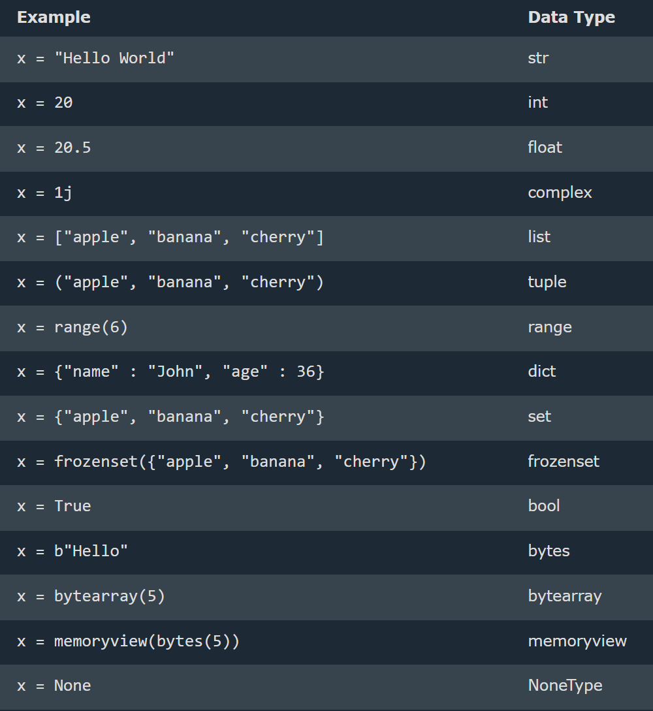

# Python

--> Python is a very simple language, and has a very straightforward syntax.
--> Python is a popular programming language.
--> Python is a case-sensitive language. It considers that uppercase and lowercase characters are different.
--> Python can be used on a server to create web applications.
--> There are two major Python versions, Python 2 and Python 3. Python 2 and 3 are quite different
--> One difference between Python 2 and 3 is the print statement. In Python 2, the "print" statement is not a function, and therefore it is invoked without parentheses. However, in Python 3, it is a function, and must be invoked with parentheses.

# Indentation

--> Indentation refers to the spaces at the beginning of a code line.
--> Where in other programming languages the indentation in code is for readability only, the indentation in Python is very important.
--> Python uses indentation to indicate a block of code . Python will give you an error if you skip the indentation:
--> The standard indentation requires standard Python code to use four spaces,but it has to be at least one.

# Input in Python

input() statement is used to accept value ( using keyboard) from user
input()--> default is always a str
int(input()) ---> value will be integer
float(input()) ---> value will be float

# Comments

--> used to explain Python code.
--> used to make the code more readable.
--> used to prevent execution when testing code.
--> Comments starts with a #, and Python will ignore them:
--> Add a multiline string (triple quotes) in our code, and place your comment inside it:

# Variables and Types

--> Variable -- containers for storing data values -- Memory allocation
--> Variable is a name given to a memory location in a program.
--> Every variable in Python is an object.
--> Python is completely "object oriented", and not "statically typed". Do not need to declare variables before using them, or declare their type.
--> A variable can have a short name (like x and y) or a more descriptive name (age, carname, total_volume).

==>Rules for Python variables:
--> A variable name must start with a letter or the underscore character
--> A variable name cannot start with a number
--> A variable name can only contain alpha-numeric characters and underscores (A-z, 0-9, and \_ )
--> Variable names are case-sensitive (age, Age and AGE are three different variables)
--> A variable name cannot be any of the Python keywords.

==> Legal variable names:
myvar = "John"
my_var = "John"
\_my_var = "John"
myVar = "John"
MYVAR = "John"
myvar2 = "John"

==> Illegal variable names:
2myvar = "John"
my-var = "John"
my var = "John"

==> Multi Words Variable Names
--> Variable names with more than one word can be difficult to read.
--> There are several techniques you can use to make them more readable:

==> Camel Case
--> Each word, except the first, starts with a capital letter:
myVariableName = "John"
==> Pascal Case
--> Each word starts with a capital letter:
MyVariableName = "John"
==> Snake Case
--> Each word is separated by an underscore character:
my_variable_name = "John"

# Variables - Assign Multiple Values

==> Many Values to Multiple Variables
--> correct syntax to assign values to multiple variables in one line
x,y,z = "Orange", "Banana", "Cherry"
==> One Value to Multiple Variables
--> The same value to multiple variables in one line:
--> correct syntax to add the value to 3 variables in one statement
x = y = z = "Hello World"
==> Unpack a Collection
--> If you have a collection of values in a list, tuple etc. Python allows you to extract the values into variables. This is called unpacking.
==> Unpack a list:
fruits = ["apple", "banana", "cherry"]
x, y, z = fruits
print(x)
print(y)
print(z)

# Python - Output Variables

==> Output Variables
--> The Python print() function is often used to output variables.
--> In the print() function, you output multiple variables, separated by a comma:
x = "Python"
y = "is"
z = "awesome"
print(x, y, z)
--> Can also use the + operator to output multiple variables, For numbers, the + character works as a mathematical operator
x = "Python "
y = "is "
z = "awesome"
print(x + y + z)
--> In the print() function, when you try to combine a string and a number with the + operator, Python will give you an error, The best way to output multiple variables in the print() function is to separate them with commas, which even support different data types:

# Global Variable

--> Variables that are created outside of a function
are known as global variables.
--> Global variables can be used by everyone, both inside of functions and outside.
--> If you create a variable with the same name inside a function, this variable will be local, and can only be used inside the function. The global variable with the same name will remain as it was, global and with the original value.
==> The global Keyword
--> Normally, when you create a variable inside a function, that variable is local, and can only be used inside that function.
--> To create a global variable inside a function, you can use the global keyword.
--> Use the global keyword if want to change a global variable inside a function.(To change the value of a global variable inside a function, refer to the variable by using the global keyword)
--> def myfunc():
global
x
x = "fantastic"

# Built-in Data Types

--> In programming, data type is an important concept.
--> Variables can store data of different types, and different types can do different things.
--> Python has the following data types built-in by default, in these categories:
--> Can get the data type of any object by using the type() function:


# Type Conversion(automatically) & type casting(manual)

Type Conversion is the automatic or manual process of changing a variable's data type, while Type Casting is the explicit (manual) conversion using functions like int(), float(), and str().
float is superior than int.
--> lst = [1, 2, 3, 4, 5] # List  
--> tpl = (1, 2, 3, 4, 5) # Tuple  
--> strg = "Hello" # String  
--> dct = {"a": 1, "b": 2} # Dictionary  
--> st = {1, 2, 3, 4, 5} # Set  
--> rng = range(10) # Range  
--> byt = b"Hello" # Bytes
==> Get the Type
--> Get the data type of a variable with the type() function

# Rules for identifier (any name )

--> A name used to identify a variable, function, class, module, or other object

1. It can be combination of uppercase and lowercase letters,digits or an underscore(\_),
   ex:- myVariable , variable_1, variable_for_print all aare valid python identifier
2. An identifier can not start with digit .So while variable1 is valid 1Variable is not valid
3. An identifier can not start with symbols like !,@,#,%,$ ,etc in our identifier
4. Identifier can be of any length


# Numbers

--> Python supports two types of numbers - integers(whole numbers) and floating point numbers(decimals) ,also supports complex numbers ,
--> Float can also be scientific numbers with an "e" to indicate the power of 10.
--> Complex numbers are written with a "j" as the imaginary part:
--> Cannot convert complex numbers into another number type.
==> Random Number
--> Python does not have a random() function to make a random number, but Python has a built-in module called random that can be used to make random numbers:
--> ex:-
import random
print(random.randrange(1, 10))

# Strings

--> Strings are defined either with a single quote or a double quotes.
--> Triple-Quoted Strings -- For multi-line strings or embedded quotes.
--> The difference between the two is that using double quotes makes it easy to include apostrophes (whereas these would terminate the string if using single quotes)
==> Raw Strings (r"" or R"" in Python)
Raw strings treat backslashes (\) as literal characters, useful for file paths and regex.can use raw strings by adding an r before the first quote:
--> Strings can be concatenated (glued together) with the + operator, and repeated with \*:
--> Two or more string literals (i.e. the ones enclosed between quotes) next to each other are automatically concatenated.-- works with two literals though, not with variables or expressions:
--> Strings can be indexed (subscripted), with the first character having index 0. There is no separate character type; a character is simply a string of size one:
--> Mixing operators between numbers and strings is not supported:


# Strings are Arrays

--> Strings in Python are arrays of bytes representing unicode characters.
--> Square brackets can be used to access elements of the string.

==> Looping Through a String
--> Since strings are arrays, we can loop through the characters in a string, with a for loop.
--> Loop through the letters in the word "Shanu":
for x in "Shanu":
print(x)
--> String Length
--> To get the length of a string, use the len() function.
--> Example
The len() function returns the length of a string:
a = "Hello, World!"
print(len(a))

# Basic Operators

# Arithmetic Operators

--> Arithmetic operators in Python are used to perform mathematical operations like addition, subtraction, multiplication, and more.
--> 

# Using Operators with Strings in Python

## 1. String Creation

--> Strings can be created using **single (`'`), double (`"`)**, or **triple quotes (`''' """`)**.

## 2. String Concatenation (`+`)

--> Strings can be **combined** using the `+` operator.
--> It does **not** add spaces automatically, so must include them manually if needed.
--> Example: `"Hello" + " World"` → `"Hello World"`

## 3. String Length

--> Use `len(string)` to find the length of a string.

## 4. Accessing Characters

--> Strings are **indexed** starting from `0`.
--> Example: `"Python"[0]` → `'P'`, `"Python"[-1]` → `'n'`

## 5. String Slicing(Accessing parts of a strings)

--> Extract a portion of a string using `[start:end]` notation.
--> Example: `"Python"[0:3]` → `'Pyt'` (Characters from index 0 to 2)

## 6. String Case Operations

--> `.upper()` → Converts string to uppercase.
--> `.lower()` → Converts string to lowercase.
--> `.title()` → Converts first letter of each word to uppercase.
--> `.capitalize()` → Capitalizes 1st char

## 7. String Strip Operations

--> `.strip()` → Removes spaces from both ends.
--> `.lstrip()` → Removes spaces from the left.
--> `.rstrip()` → Removes spaces from the right.

## 8. String Find and Replace

--> `.find(substring)` → Returns index of first occurrence.
--> `.replace(old, new)` → Replaces occurrences of a substring.
--> `.endswith("substr")` → returns true if string ends with substr
--> `.count("word")` → counts the occurrence of substr in string

## 9. String Splitting and Joining

--> `.split(delimiter)` → Splits a string into a list.
--> `.join(iterable)` → Joins elements of an iterable into a string.

## 10. Checking Substrings

--> `"substring" in "string"` → Returns `True` or `False`.

## 11. String Repetition (`*`)

--> The `*` operator repeats a string multiple times.
--> Example: `"Hi" * 3` → `"HiHiHi"`

## 12. Using Comparison Operators with Strings

--> Python allows using `==`, `!=`, `<`, `>`, `<=`, `>=` with strings.
--> Strings are compared lexicographically (alphabetical order based on ASCII values).

## 13. Membership Operators (`in`, `not in`)

--> The `in` operator checks if a substring exists within a string.
--> The `not in` operator checks if a substring does **not** exist in a string.
--> Example: `"Py" in "Python"` → `True`

# String Formatting in Python

## 1. Using `%` Operator (Old Style Formatting)

--> The `%` operator is used like C-style string formatting.
--> `%s` for strings, `%d` for integers, `%f` for floating-point numbers.
--> Example: `"Hello %s" % name`

## 2. Using `format()` Method (Modern Style)

--> The `format()` method allows inserting variables inside curly `{}` braces.

- Supports positional and keyword arguments.
- Example: `"Hello, {}!".format(name)`

## 3. Using f-strings (Python 3.6+)

- Introduced in Python 3.6, f-strings are prefixed with `f` and allow embedding expressions directly inside `{}`.
- Example: `f"Hello, {name}!"`

## 4. Using Template Strings (`string.Template`)

- The `Template` class from the `string` module allows placeholder-based string formatting using `$`.

5. Formatting Numbers

- `{:.2f}` → Rounds to 2 decimal places.
- `{:,}` → Adds a thousands separator.
- `{:<10}` → Left-align, `{:>10}` → Right-align, `{:^10}` → Center-align.

6. Formatting Dates

- The `strftime()` method from the `datetime` module is used to format dates.

## **Variable Assignment vs. Comparison**

- Variable assignment is done using a single equals operator (`=`).
- Comparison between two variables is done using the double equals operator (`==`).
- The "not equals" operator is marked as (`!=`).

## **Boolean Operators**

Python has three boolean operators to evaluate conditions:

1. `and` – Returns `True` if both conditions are `True`.
2. `or` – Returns `True` if at least one condition is `True`.
3. `not` – Negates a condition (`True` becomes `False`, and vice versa).

## **The "in" Operator**

- The `in` operator is used to check if a specified object exists within an iterable object container, such as a list or string.

## **Truthy and Falsy Values**

A statement is evaluated as `True` if one of the following is correct:

1. The **`True`** boolean variable is given, or calculated using an expression.
2. An object that is **not considered empty** is passed.

Falsy values include:

- `None`
- `False`
- `0` (integer or float)
- `0.0` (float zero)
- `""` (empty string)
- `[]` (empty list)
- `{}` (empty dictionary)
- `set()` (empty set)
- `()` (empty tuple)

## **The "is" Operator**

- Unlike the double equals operator (`==`), the **`is`** operator checks whether two variables refer to the **same object in memory**.

## **Summary of Comparison Operators**

| Operator | Meaning                  |
| -------- | ------------------------ |
| `==`     | Equal to                 |
| `!=`     | Not equal to             |
| `>`      | Greater than             |
| `<`      | Less than                |
| `>=`     | Greater than or equal to |
| `<=`     | Less than or equal to    |
| `is`     | Same object reference    |
| `in`     | Exists in an iterable    |

# Conditions

==> if-elif- else (syntax)
if(condition):
Statement 1
elif(conditional):
statement 2
else:
statement N

# Nesting

--> Writing statement inside another statement
if (cond 1):
if (cond 2):
print()

# List

--> Lists are very similar to arrays.
--> They can contain any type of variable, and they can contain as many variables as you wish
--> A built-in data structure that allows you to store multiple items in a single variable. Lists are ordered, mutable (changeable), and allow duplicate values.

==> Creating a List
--> can create a list using square brackets []
==> Accessing Elements
--> Use indexing (starting from 0) to access elements:
==> Modifying Lists
==> Adding Elements
--> append(): Adds an element at the end of the list.
--> extend(): Adds multiple elements to the end of the list.
--> insert(): Adds an element at a specific position.
==> Removing Elements
--> remove(value) → Removes the first occurrence of a value.
--> pop(index) → Removes and returns an element at a specific index (default: last).
--> clear() → Removes all elements.
==> Looping Through a List
--> for fruit in fruits:
print(fruit)
==> List Operations
--> Concatenation: new_list = list1 + list2
--> Repetition: list3 = list1 \* 2
--> Check if an item exists: "apple" in fruits
==> Sorting and Reversing
--> fruits.sort() # Sorts the list in ascending order
--> fruits.reverse() # Reverses the list

--> List Methods (append(), extend(), sort(), etc.)
--> Shallow Copy (copy()) → Copies references, not actual objects.
--> Deep Copy (deepcopy()) → Creates an independent copy.
Advanced List Concepts

==> Nested Lists (Lists inside lists)
--> Shallow vs. Deep Copy (copy() and deepcopy())
--> List vs. Tuple (Differences and when to use each)
--> Performance Considerations (Time complexity of list operations)


# Using Operators with Lists in Python

1. Concatenation (`+`)

--> The `+` operator is used to combine two or more lists into a new list.
--> It **does not** modify the original lists but creates a new one.

2. Repetition (`*`)

--> The `*` operator repeats a list multiple times.

3. Membership Operators (`in`, `not in`)

--> The `in` operator checks if an element exists in a list.
--> The `not in` operator checks if an element does **not** exist in a list.

4. Comparison Operators (`==`, `!=`, `<`, `>`, `<=`, `>=`)

--> Lists are compared **element by element**.
--> The comparison is **lexicographical** (similar to string comparison based on ASCII values).

5. Assignment Operators (`+=`, `*=`)

--> The `+=` operator appends elements from another list to the existing list.
--> The `*=` operator repeats and updates the list in place.

6. Identity Operators (`is`, `is not`)

--> The `is` operator checks if two lists refer to the **same memory location**.
--> The `is not` operator checks if they refer to **different objects**.

7. Logical Operators (`and`, `or`, `not`)

--> `and` returns the second list if the first list is non-empty, otherwise returns the first list.
--> `or` returns the first non-empty list.
--> `not` returns `True` if the list is empty, otherwise `False`.

# List Methods

list.append(4) # adds one element at the end [2, 1, 3, 4]
list.sort() # sorts in ascending order [1, 2, 3]
list.sort(reverse=True) # sorts in descending order [3, 2, 1]
list.reverse() # reverses list [3, 1, 2]
list.insert(idx, el) # insert element at index
list.remove() # removes first occurrence if elements
list.pop(idx) # removeelements at idx

# Tuples in Python

--> A tuple is a built-in immutable data structure in Python that allows you to store multiple items in a single variable.
--> Tuples are ordered, indexed, and can contain mixed data types like lists, but they cannot be modified after creation.
--> Tuples are useful for storing fixed data, returning multiple values from functions, and using as dictionary keys.
--> Tuples are more memory-efficient and faster than lists due to their immutability.

==> Creating a Tuple
--> Tuples are defined using parentheses ()
==> Accessing Tuple Elements
--> Like lists, tuples are indexed, meaning each element has a position starting from 0
==> Tuple Immutability
Tuples cannot be modified after creation.
==> Slicing a Tuple
--> Tuples support slicing (start:end:step).

==> Tuple Functions
print(len(nums)) # Length of tuple: 5
print(max(nums)) # Max value: 9
print(min(nums)) # Min value: 1
tup.index(element) #returns index of first occurrence.
tup.count(element) #return total count occurrences.

==> Converting Between Lists and Tuples
--> tuples are immutable, can convert them into lists to modify them.


# Dictionaries & Sets

--> A dictionary is an unordered, mutable collection of key:value pairs.
--> Each key in a dictionary must be unique and immutable, while values can be of any data type.
--> A dictionary can be created using curly braces {} or the dict() constructor.
--> Each item in a dictionary consists of a key and its corresponding value, separated by a colon ":"
--> Dictionaries are mutable, meaning their contents can be modified after creation.
--> Keys in a dictionary must be unique. If a duplicate key is assigned a new value, it overwrites the previous value.
--> Values can be accessed using their corresponding keys inside square brackets [] or with the get() method.
--> Items can be removed using methods like pop(), popitem(), del, or clear().
--> A dictionary can contain another dictionary as a value, creating a nested structure.
--> data = {
"names": ["Alice", "Bob", "Charlie"], # List inside dictionary
"coordinates": (40.7128, -74.0060), # Tuple inside dictionary
"details": {
"age": 25,
"city": "New York"
}
}

print(data) # Printing the entire dictionary
print(data["names"]) # List inside dictionary  
print(data["details"]["age"]) # Nested dictionary value

variable_name["key1"],variable_name["key2"],variable_name["key3"]
variable_name["key1"]= "Value" # To assign or add new
--> To create new dict
dict = {} # create empty dict.

# Dictionary Methods

--> myDict.keys() -- Returns all the keys from the dictionary.
--> myDict.values() -- Returns all the values from the dictionary.
--> myDict.items() -- Returns all (key, value) pairs as tuples.
--> myDict.get("key") -- Returns the value associated with the specified key.
If the key does not exist, it returns None instead of an error.
--> myDict.update(newDict) --Inserts the specified items from newDict into myDict.
Updates existing keys or adds new keys if they don’t exist.
--> print(len(list(Variable_name.keys()))) -- counts and prints the number of keys in the given dictionary

# Set

--> A set in Python is an unordered, mutable collection of unique elements.
--> It is used to store distinct items and supports various set operations such as union, intersection, and difference.
--> Duplicate value will be ignored

# To create new set

variable = set{} # create empty set

==> Characteristics of Sets
--> Unordered → Elements in a set do not maintain a specific order.
--> Mutable → Elements can be added or removed after creation.
--> Unique Elements → A set does not allow duplicate values
--> Unindexed → Does not support indexing or slicing.
--> Hashable Elements Only → Elements must be immutable (e.g., numbers, strings, tuples) because sets use a hash table for storage.

==> Operations on Sets
--> set.add(el) → Use methods to insert new elements.
--> set.remove(el) → Different methods allow deleting elements safely.
--> Set Operations → Includes union, intersection, difference, and symmetric difference.
--> Membership Testing → Checking whether an element exists in a set.
--> Set Comprehension → Create sets dynamically using expressions.
--> set.clear() -> empties the set.
--> set.pop() -> remove a random value.

==> Set Methods
--> Creation → Can be defined using {} or set().
--> Adding Elements → Methods allow adding single or multiple elements.
--> Removing Elements → Provides ways to remove specific items or clear the set.
--> Mathematical Operations → Includes union, intersection, difference, and symmetric difference.
--> Copying a Set → Methods exist to create a duplicate of a set.
--> Frozen Set → An immutable version of a set that does not allow modification.
--> set.union(set2) # combine set values & returns new
--> set.intersection(set2) #combine common values & returns new

==> Use Cases of Sets
--> Removing duplicates from a collection.
--> Efficient membership checks due to hashing.
--> Performing set operations in mathematical computations.
--> Storing unique values in a collection.

# Loops in python

--> Loops in Python are used to execute a block of code multiple times.
--> There are different types of loops, each with its specific use case.
--> Traverse means to go through or iterate over each element in a data structure, such as an array, list, or string, one by one.
--> for loop ,while loop

==> Iterator and Iteration
--> An iterator and iteration in a loop are fundamental concepts in programming, especially in Python.

1. Iterator
   --> An iterator is an object that allows traversal (iteration) through a sequence (like lists, tuples, dictionaries, or sets) one element at a time. It implements two methods:
   --> **iter**() → Returns the iterator object itself.
   --> **next**() → Returns the next element in the sequence. Raises StopIteration when there are no more elements.

2. Iteration
   Iteration is the process of repeatedly accessing elements in a sequence, usually using loops (for or while).

==> Types of Loops in Python

There are two types of loops in Python:

--> **for loop** - Used for iterating over a sequence (list, tuple, string, dictionary, range, etc.).
--> **while loop** - Runs as long as a specified condition is `True`.

# while Loop

--> The while loop runs a block of code as long as a given condition is True.
--> The loop checks the condition before each iteration.
--> If the condition becomes False, the loop terminates.
--> It requires careful use to prevent infinite loops.
--> Syntax
while condition:
statement to print(upto condition is true)
--> Example:

count = 1
while count <= 5:
print(count)
count += 1

==> Loop Control Statements
Python provides control statements to alter the normal loop execution:

==> break Statement
--> Exits the loop immediately when encountered.
--> Stops further iterations even if the loop condition is still True.
--> ```python
for num in range(1, 6):
if num == 3:
break # Stops the loop at 3
print(num)

````

==> continue Statement
--> Skips the current iteration and moves to the next one.
--> The loop does not terminate but jumps to the next cycle.
```python
for num in range(1, 6):
    if num == 3:
        continue  # Skips printing 3
    print(num)
````

# for Loop

--> The for loop is used for iterating over a sequence, such as a list, tuple, string, or range.
--> It runs a block of code for each element in the sequence.
--> The loop variable takes the value of each item in the sequence during each iteration.
--> It automatically stops when all elements in the sequence have been processed.
--> syntax
for element in list:
print(element)
else:
print("message")

==> else Clause in for Loops
--> The else clause in loops executes after the loop completes all iterations normally.
--> If the loop is terminated using break, the else block does not execute.
--> ```python
for num in range(1, 6):
if num == 3:
break
print(num)
else:
print("Loop completed")

==> Nested Loops
--> A nested loop is a loop inside another loop.
--> The inner loop runs completely for each iteration of the outer loop.
--> It is commonly used for processing multi-dimensional data.

## When to Use Which Loop?

- Use `for` loops when the number of iterations is known.
- Use `while` loops when the number of iterations depends on a condition.

## Switch Statement in Python

--> Python does not have a built-in switch statement like some other programming languages (such as C, C++, or Java).
--> Similar functionality can be achieved using match statements (introduced in Python 3.10) or dictionary-based approaches.

# Range()

--> Range functions returns a sequence of numbers, starting from 0 by default, and increments by 1 (by default), and stops before a specified number.
--> Syntax of range()
range( start?, stop, step? )
Where:

1. start (optional) → The starting number of the sequence (default is 0).
2. stop (required) → The sequence ends before this number.
3. step (optional) → The difference between each number (default is 1)

==> Using range() in Loops

1. Basic Usage (Only stop is provided)
   --> If only one argument is given, start is assumed to be 0, and step is 1
   --> Syntax
   for i in range(5):
   print(i)
2. Specifying start and stop
   --> If two arguments are provided, the sequence starts from start and stops before stop.
   --> Syntax
   for i in range(2, 6):
   print(i)
3. Using a Step Value (start, stop, step)
   --> We can control the increment using the step argument
   --> Syntax
   for i in range(1, 10, 2):
   print(i)
4. Using a Negative Step (Descending Order)
   --> If step is negative, range() generates numbers in decreasing order.
   --> Syntax
   for i in range(10, 0, -2):
   print(i)
5. Using range() with list()
   The range() function produces a generator, meaning it doesn’t create a list in memory. However, you can convert it into a list if needed:
   --> Synatx
   print(list(range(5)))

==> Pass Statement
--> Pass is a null statement that does nothing.It is used as a placeholder when a statement is required syntactically but no action is needed.
--> for el in range(10):
pass

# Function & Recursion

# Functions in Python

--> Block of statements that perform a specific task.
--> Syntax
def func_name( param1, param2..) : # some work
return val
func_name(arg1, arg2..)
--> eg:-
def sum(a,b):
s = a + b
return s
print(sum(2,3))

# Types of Functions in Python 🐍

1. Built-in Functions
   --> These are predefined functions in Python, available without importing any module.
   --> Examples: print(), len(), type(), sum(), max(), min(), etc.
2. User-Defined Functions
   These are functions created by the user to perform a specific task.
3. Anonymous (Lambda) Functions
   These are single-line functions without a name, defined using the lambda keyword.
4. Recursive Functions
   These functions call themselves repeatedly until a condition is met.
5. Higher-Order Functions
   These are functions that take other functions as arguments or return functions.
6. Generator Functions
   These use yield instead of return, allowing them to produce values lazily.
7. Nested Functions (Inner Functions)
   A function inside another function.


==> Default Parameters
--> Assigning a default value to parameter , which is used when no argument is passed
--> Non default argument follow default argument

# Recursion

--> A process where a function calls itself to solve a smaller subproblem of the original problem.
--> It continues calling itself until it reaches a base case, which is a condition where the recursion stops.
--> The function keeps calling itself, reducing the problem step by step.

==> Key Components of Recursion

1. Base Case:
   --> This stops the recursion when a certain condition is met.
   --> Without a base case, the function will call itself infinitely, leading to a stack overflow.
2. Recursive Case:
   --> This is where the function calls itself with a smaller or simpler input to gradually reach the base case.

# File I/O in Python

--> File I/O (Input/Output) in Python allows reading from and writing to files.
--> Python provides built-in functions to handle file operations efficiently.

1. File Handling Modes
   When working with files, you need to specify the mode:
   --> "r" Read (default mode). Opens file for reading; error if file doesn't exist.
   --> "w" Write. Creates a new file or overwrites an existing one.
   --> "a" Append. Opens file for writing but preserves existing content.
   --> "r+" Read and Write. File must exist.
   --> "w+" Write and Read. Creates a new file or overwrites an existing one.
   --> "a+" Append and Read. Creates file if it doesn’t exist.
   --> 'x' create a new file and open it for writing
   --> 'b' binary mode
   --> 't' text mode (default)
   --> '+' open a disk file for updating (reading and writing)
   
2. Opening and Closing a File (open,read & Close File)
   --> Use open("filename", "mode") to open a file.
   --> Always close the file using close() to free system resources.
   --> Default value is read
   --> Example
   f = open("example.txt", "r") # Open file in read mode
   f.close() # Close file
3. Reading a File
   --> read() → Reads entire file.
   --> readline() → Reads one line at a time.
   --> readlines() → Reads all lines as a list.
   --> Example
   f = open("example.txt", "r")
   content = f.read() # Reads the entire file
   f.close()
4. Writing to a File
   write() → Writes a string to the file.
   writelines() → Writes a list of strings.
   --> Example
   f = open("example.txt", "w")
   f.write("Hello, World!") # Overwrites the file with this text
   f.close()
5. ** Using with Statement (Best Practice) **
   The with statement automatically closes the file after execution.
   --> Example
   with open("example.txt", "r") as f:
   content = f.read() # No need to explicitly close the file
6. File Handling Exceptions
   Always handle errors using try-except to prevent crashes.
   --> Example
   try:
   f = open("nonexistent.txt", "r")
   except FileNotFoundError:
   print("File not found!")
7. Working with Binary Files
   Use "rb" or "wb" modes for non-text files (e.g., images, PDFs).
8. Deleting a File
   using the os module
   --> import os
   os.remove(filename)

# Module(Code Library)

--> It is a file written by another programmer that generally has a function we can use

# OOPS in Python

--> To map with real world scenarios we started using objects in code.It is called as object orinted programming .
--> Object-Oriented Programming (OOP) in Python is based on four fundamental principles:

1. Encapsulation
2. Abstraction
3. Inheritance
4. Polymorphism.

--> there are several other related concepts, such as class, objects, constructors, and method overriding.

# Class and Objects

--> A class is a blueprint for creating objects. It defines attributes (variables) and methods (functions) that describe the behavior of objects.
--> Class name always start with capital letter.
--> eg: creating class
class Student:
name = "karan kumar"
--> An object is an instance of a class that holds data and can perform actions defined by the class.
eg : Creating object (instance)
s1 = Student()
print(s1.name)

obj attr > class attr

# What is a Method?

A method in Python is a function that is defined inside a class and operates on instances (objects) of that class. It is used to perform operations related to the object’s data.

==> Types of Methods in Python

1. Instance Methods
   These methods work on instance variables (attributes) and require an instance of the class.
   The first parameter of an instance method is always self, which refers to the current object.
   These methods can access and modify instance attributes.
2. Class Methods
   Defined using @classmethod decorator.
   The first parameter is cls, which refers to the class itself.
   Can modify class attributes but not instance attributes directly.
3. Static Methods
   Defined using @staticmethod decorator.
   Do not require self or cls as the first parameter.
   Act as regular functions inside the class but are logically related to the class.

==> Special Methods (Dunder Methods)
**init**() → Constructor method, initializes object attributes.
**str**() → Returns a string representation of the object.
**repr**() → Used for debugging, returns an official string representation.

==> Method Calling
--> Methods are called using the dot (.) operator with an object (object.method()).
--> Class methods and static methods can be called using the class name (Class.method()).

# **init** Function /\ Constructors

--> A constructor (**init** method) is a special method that initializes an object's attributes when it is created.
--> It is automatically called when a new instance of a class is created.

==> Creating class
class Student :
def **init**(self,fullname):
self.name = fullname
--> The self parameter is a reference to the current instance of the class , and is used to access variable that belong to the class

==> creating object
s1 = Student("karan")
print(s1.name)
--> different types of constructors based on how they are used:

1. Default Constructor
   --> A constructor that does not take any arguments except self.
   --> It initializes the object with default values.
2. Parameterized Constructor
   --> A constructor that takes arguments in addition to self.
   --> It allows object properties to be initialized with specific values at the time of object creation.
3. Constructor with Default Arguments
   --> A constructor that has default values for some or all parameters.
   --> If arguments are not provided during object creation, the default values are used.
4. Private Constructor
   --> A constructor that is prefixed with double underscores (\*\*).
   --> It restricts object instantiation outside the class.
5. Static Constructor
   --> Python does not have a built-in static constructor like some other languages.
   --> However, class methods or the \*\*new\_\_ method can be used to mimic static initialization before the object is created.

# Encapsulation

--> Encapsulation is the process of bundling data (attributes) and methods (functions) that operate on the data into a single unit called a class.
--> It restricts direct access to certain details of an object and can be achieved using access modifiers:

1. Public: Accessible from anywhere.
2. Protected: Indicated with a single underscore (\_), meant to be used within the class and subclasses.
3. Private: Indicated with double underscores (\_\_), intended for internal use within the class.

--> Encapsulation helps in data hiding and ensures controlled access to an object's attributes.

# Abstraction

--> Abstraction is the concept of hiding the internal implementation details of an object and exposing only the necessary functionalities.
--> It allows users to interact with an object through a well-defined interface without knowing the underlying complexity.
--> Abstraction is typically achieved using abstract classes and methods, which define a structure but leave implementation details to subclasses.

# Inheritance

--> Inheritance is the mechanism that allows a class (child class) to inherit attributes and methods from another class (parent class).
-->It helps in code reusability and hierarchical classification.
==> Types of Inheritance in Python:

1. Single Inheritance: A child class inherits from a single parent class.
2. Multiple Inheritance: A child class inherits from more than one parent class.
3. Multilevel Inheritance: A class inherits from another class, which in turn inherits from another class, forming a chain.
4. Hierarchical Inheritance: Multiple child classes inherit from a single parent class.
5. Hybrid Inheritance: A combination of multiple inheritance types.

# Polymorphism

--> Polymorphism allows a single interface to be used for different types.
--> It enables the same function or method to have different behaviors based on the object it is acting upon.
==> Types of Polymorphism:

1. Method Overriding: A child class provides a specific implementation of a method that is already defined in its parent class.
2. Method Overloading (not directly supported in Python): Achieved through default arguments or variable-length arguments (\*args, \*\*kwargs).
3. Operator Overloading: The ability to define the behavior of operators (+, -, \*, etc.) for user-defined objects.

# Method Overriding

--> Method overriding occurs when a subclass provides a specific implementation of a method that is already defined in its parent class.
--> The overridden method in the child class must have the same name and parameters as the method in the parent class.
