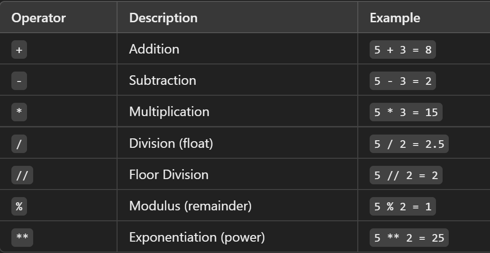

# Python

--> Python is a very simple language, and has a very straightforward syntax.
--> Python is a popular programming language.
--> Case Sensetive 
--> Python can be used on a server to create web applications.
--> There are two major Python versions, Python 2 and Python 3. Python 2 and 3 are quite different
--> One difference between Python 2 and 3 is the print statement. In Python 2, the "print" statement is not a function, and therefore it is invoked without parentheses. However, in Python 3, it is a function, and must be invoked with parentheses.


# Indentation

--> Python uses indentation for blocks, instead of curly braces. Both tabs and spaces are supported, but the standard indentation requires standard Python code to use four spaces.

# Variables and Types

--> Variable -- Memory allocation
--> Variable is a name given to a memory location in a program.
--> Every variable in Python is an object.
--> Python is completely "object oriented", and not "statically typed". Do not need to declare variables before using them, or declare their type.

# Rules for identifier (any name )

--> a name used to identify a variable, function, class, module, or other object

1. it can be combination of uppercase and lowercase letters,digits or an underscore(-),
   ex:- myVariable , variable_1, variable_for_print all aare valid python identifier
2. An identifier can not start with digit .So while variable1 is valid 1Variable is not valid
3. An identifier can not start with symbols like !,@,#,%,$ ,etc in our identifier
4. Identifier can be of any length


# Strings

--> Strings are defined either with a single quote or a double quotes.
--> Triple-Quoted Strings -- For multi-line strings or embedded quotes.
--> The difference between the two is that using double quotes makes it easy to include apostrophes (whereas these would terminate the string if using single quotes)

--> Raw Strings (r"" or R"" in Python)
Raw strings treat backslashes (\) as literal characters, useful for file paths and regex.can use raw strings by adding an r before the first quote:
--> Strings can be concatenated (glued together) with the + operator, and repeated with \*:
--> Two or more string literals (i.e. the ones enclosed between quotes) next to each other are automatically concatenated.-- works with two literals though, not with variables or expressions:
--> Strings can be indexed (subscripted), with the first character having index 0. There is no separate character type; a character is simply a string of size one:
--> Mixing operators between numbers and strings is not supported:


# Numbers

--> Python supports two types of numbers - integers(whole numbers) and floating point numbers(decimals).
-->(It also supports complex numbers)

# List

--> Lists are very similar to arrays.
--> They can contain any type of variable, and they can contain as many variables as you wish
--> A built-in data structure that allows you to store multiple items in a single variable. Lists are ordered, mutable (changeable), and allow duplicate values.

\\ Creating a List
--> can create a list using square brackets []
\\ Accessing Elements
--> Use indexing (starting from 0) to access elements:
\\ Modifying Lists
\\ Adding Elements
--> append() → Adds an element at the end.
--> insert(index, item) → Inserts an element at a specific index.
\\ Removing Elements
--> remove(value) → Removes the first occurrence of a value.
--> pop(index) → Removes and returns an element at a specific index (default: last).
--> clear() → Removes all elements.

\\ Looping Through a List
--> for fruit in fruits:
print(fruit)
\\ List Operations
--> Concatenation: new_list = list1 + list2
--> Repetition: list3 = list1 \* 2
--> Check if an item exists: "apple" in fruits

\\ Sorting and Reversing
--> fruits.sort() # Sorts the list in ascending order
--> fruits.reverse() # Reverses the list

--> List Methods (append(), extend(), sort(), etc.)
--> Shallow Copy (copy()) → Copies references, not actual objects.
--> Deep Copy (deepcopy()) → Creates an independent copy.
Advanced List Concepts

--> List Slicing (list[start:stop:step])
--> Nested Lists (Lists inside lists)
--> Shallow vs. Deep Copy (copy() and deepcopy())
--> List vs. Tuple (Differences and when to use each)
--> Performance Considerations (Time complexity of list operations)


# Type Conversion(automatically) & type casting(manual)
Type Conversion is the automatic or manual process of changing a variable's data type, while Type Casting is the explicit (manual) conversion using functions like int(), float(), and str().
float is superior than int.

# Basic Operators

# Arithmetic Operators

--> Arithmetic operators in Python are used to perform mathematical operations like addition, subtraction, multiplication, and more.
--> 

# Using Operators with Strings in Python

1. String Concatenation (`+`)

--> The `+` operator is used to join two or more strings.
--> It does **not** add spaces automatically, so you must include them manually if needed.

2. String Repetition (`*`)

--> The `*` operator repeats a string multiple times.

3. Using Comparison Operators with Strings

--> Python allows using `==`, `!=`, `<`, `>`, `<=`, `>=` with strings.
--> Strings are compared lexicographically (alphabetical order based on ASCII values).

4. Membership Operators (`in`, `not in`)

--> The `in` operator checks if a substring exists within a string.
--> The `not in` operator checks if a substring does **not** exist in a string.

5. Using Logical Operators with Strings

--> Python treats non-empty strings as `True` and empty strings as `False`.
--> `and`, `or`, and `not` can be used with strings.

6. Using Assignment Operators with Strings

--> The `+=` operator appends a string to an existing string.
--> Equivalent to `string = string + new_value`.

# Using Operators with Lists in Python

1. Concatenation (`+`)

--> The `+` operator is used to combine two or more lists into a new list.
--> It **does not** modify the original lists but creates a new one.

2. Repetition (`*`)

--> The `*` operator repeats a list multiple times.

3. Membership Operators (`in`, `not in`)

--> The `in` operator checks if an element exists in a list.
--> The `not in` operator checks if an element does **not** exist in a list.

4. Comparison Operators (`==`, `!=`, `<`, `>`, `<=`, `>=`)

--> Lists are compared **element by element**.
--> The comparison is **lexicographical** (similar to string comparison based on ASCII values).

5. Assignment Operators (`+=`, `*=`)

--> The `+=` operator appends elements from another list to the existing list.
--> The `*=` operator repeats and updates the list in place.

6. Identity Operators (`is`, `is not`)

--> The `is` operator checks if two lists refer to the **same memory location**.
--> The `is not` operator checks if they refer to **different objects**.

7. Logical Operators (`and`, `or`, `not`)

--> `and` returns the second list if the first list is non-empty, otherwise returns the first list.
--> `or` returns the first non-empty list.
--> `not` returns `True` if the list is empty, otherwise `False`.



# input in Python 
input() statement is used to accept value ( using keyboard) from user 
input()--> default is always a str 
int(input())  ---> value will be integer
float(input())  ---> value will be float

# String Formatting

1. Using `%` Operator (Old Style Formatting)
   --> The `%` operator is used like C-style string formatting.
   --> `%s` is used for strings, `%d` for integers, and `%f` for floating-point numbers, %.<number of digits>f - Floating point numbers with a fixed amount of digits to the right of the dot, %x/%X - Integers in hex representation (lowercase/uppercase)

2. Using `format()` Method (Modern Style)
   --> The `format()` method allows inserting variables inside curly `{}` braces.
   --> It supports positional and keyword arguments.

3. Using f-strings (Python 3.6+)
   --> Introduced in Python 3.6, f-strings are prefixed with `f` and allow embedding expressions directly inside `{}`.

4. Using Template Strings (`string.Template`)
   --> The `Template` class from the `string` module allows placeholder-based string formatting using `$`.

5. Formatting Numbers
   --> `{:.2f}` → Rounds to 2 decimal places.
   --> `{:,}` → Adds a thousands separator.
   --> `{:<10}` → Left-align, `{:>10}` → Right-align, `{:^10}` → Center-align.

6. Formatting Dates
   --> The `strftime()` method from the `datetime` module is used to format dates.

# Basic String Operations in Python

## 1. String Creation

- Strings can be created using **single (`'`), double (`"`)**, or **triple quotes (`''' """`)**.

## 2. String Concatenation

- Strings can be **combined** using the `+` operator.
- Example: `"Hello" + " World"` → `"Hello World"`

## 3. String Repetition

- Strings can be repeated using the `*` operator.
- Example: `"Hi" * 3` → `"HiHiHi"`

## 4. Accessing Characters

- Strings are **indexed** starting from `0`.
- Example: `"Python"[0]` → `'P'`, `"Python"[-1]` → `'n'`

## 5. String Slicing

- Extract a portion of a string using `[start:end]` notation.
- Example: `"Python"[0:3]` → `'Pyt'` (Characters from index 0 to 2)

## 6. String Length

- Use `len(string)` to find the length of a string.

## 7. String Case Operations

- `.upper()` → Converts string to uppercase.
- `.lower()` → Converts string to lowercase.
- `.title()` → Converts first letter of each word to uppercase.

## 8. String Strip Operations

- `.strip()` → Removes spaces from both ends.
- `.lstrip()` → Removes spaces from the left.
- `.rstrip()` → Removes spaces from the right.

## 9. String Find and Replace

- `.find(substring)` → Returns index of first occurrence.
- `.replace(old, new)` → Replaces occurrences of a substring.

## 10. String Splitting and Joining

- `.split(delimiter)` → Splits a string into a list.
- `.join(iterable)` → Joins elements of an iterable into a string.

## 11. Checking Substrings

- `"substring" in "string"` → Returns `True` or `False`.

## 12. String Formatting

- `f"Hello, {name}!"` (f-strings)
- `"Hello, {}!".format(name)`
- `"Hello, %s!" % name` (old-style)

# Conditions

--> Python uses boolean logic to evaluate conditions. --> The boolean values True and False are returned when an expression is compared or evaluated.
--> Notice that variable assignment is done using a single equals operator "=", whereas comparison between two variables is done using the double equals operator "==". The "not equals" operator is marked as "!=".

# Conditions in Python

Python uses boolean logic to evaluate conditions. The boolean values **True** and **False** are returned when an expression is compared or evaluated.

## **Variable Assignment vs. Comparison**

- Variable assignment is done using a single equals operator (`=`).
- Comparison between two variables is done using the double equals operator (`==`).
- The "not equals" operator is marked as (`!=`).

## **Boolean Operators**

Python has three boolean operators to evaluate conditions:

1. `and` – Returns `True` if both conditions are `True`.
2. `or` – Returns `True` if at least one condition is `True`.
3. `not` – Negates a condition (`True` becomes `False`, and vice versa).

## **The "in" Operator**

- The `in` operator is used to check if a specified object exists within an iterable object container, such as a list or string.

## **Indentation in Python**

- Python uses indentation to define code blocks instead of brackets `{}`.
- The standard Python indentation is **4 spaces**, though tabs and other space sizes will work as long as they are consistent.

## **Truthy and Falsy Values**

A statement is evaluated as `True` if one of the following is correct:

1. The **`True`** boolean variable is given, or calculated using an expression.
2. An object that is **not considered empty** is passed.

Falsy values include:

- `None`
- `False`
- `0` (integer or float)
- `""` (empty string)
- `[]` (empty list)
- `{}` (empty dictionary)
- `set()` (empty set)

## **The "is" Operator**

- Unlike the double equals operator (`==`), the **`is`** operator checks whether two variables refer to the **same object in memory**.

## **Summary of Comparison Operators**

| Operator | Meaning                  |
| -------- | ------------------------ |
| `==`     | Equal to                 |
| `!=`     | Not equal to             |
| `>`      | Greater than             |
| `<`      | Less than                |
| `>=`     | Greater than or equal to |
| `<=`     | Less than or equal to    |
| `is`     | Same object reference    |
| `in`     | Exists in an iterable    |

# Loops in Python

## Types of Loops in Python

There are two types of loops in Python:

1. **for loop** - Used for iterating over a sequence (list, tuple, string, dictionary, range, etc.).
2. **while loop** - Runs as long as a specified condition is `True`.

## The "for" Loop

For loops iterate over a given sequence.

### Example:

```python
for num in range(1, 6):
    print(num)
```

For loops can iterate over a sequence of numbers using the `range()` function. The difference between `range()` and `xrange()` (in Python 2) is that `range()` returns a new list, whereas `xrange()` returns an iterator, making it more memory efficient. In Python 3, `range()` behaves like `xrange()`.

## The "while" Loop

While loops repeat as long as a certain boolean condition is met.

### Example:

```python
count = 1
while count <= 5:
    print(count)
    count += 1
```

## "break" and "continue" Statements

- **break** – Terminates the loop immediately.
- **continue** – Skips the current iteration and moves to the next.

### Example:

```python
for num in range(1, 6):
    if num == 3:
        break  # Stops the loop at 3
    print(num)
```

```python
for num in range(1, 6):
    if num == 3:
        continue  # Skips printing 3
    print(num)
```

## Using "else" with Loops

Unlike C or C++, Python allows an `else` clause with loops. When the loop condition of `for` or `while` fails, the `else` part executes. However, if a `break` statement is encountered, the `else` part is skipped.

### Example:

```python
for num in range(1, 6):
    if num == 3:
        break
    print(num)
else:
    print("Loop completed")
```

## Looping Through Data Structures

You can use loops to iterate over different data structures such as:

- Lists
- Strings
- Dictionaries

## When to Use Which Loop?

- Use `for` loops when the number of iterations is known.
- Use `while` loops when the number of iterations depends on a condition.
