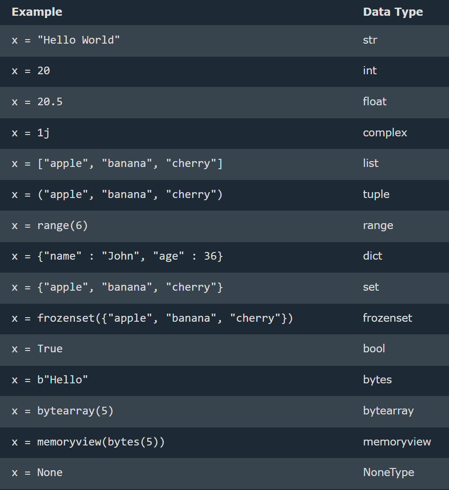

### Python

Python is a programming language, and its implementations involve both compilation and interpretation.
It is not an Integrated Development Environment (IDE).
Python is a case-sensitive language. It considers that uppercase and lowercase characters are different.
Difference between Python 2 and 3 is the print statement. In Python 2, the "print" statement is not a function, therefore it is invoked without parentheses.In Python 3, it is a function, and must be invoked with parentheses.

## Input in Python

Python 3.6 uses the input() method. Python 2.7 uses the raw_input() method.

1. input()--> default is always a str
2. int(input()) ---> value will be integer
3. float(input()) ---> value will be float

--> Python 2.7
username = raw_input("Enter username:")
print("Username is: " + username)

--> Python 3.6
username = input("Enter username:")
print("Username is: " + username)

## Comments

--> Comments starts with a #, and Python will ignore them:
--> Add a multiline string (triple quotes) in code, and place comment inside it:

## Variables and Types

--> Variable --> containers for storing data values --> Memory allocation
--> Every variable in Python is an object.
--> Python is completely "object oriented"
--> Do not need to declare variables before using them, or declare their type.
--> A variable can have a short name (like x and y) or a more descriptive name (age, carname, total_volume).

# Rules for Python variables:

--> A variable name must start with a letter or the underscore character
--> A variable name cannot start with a number
--> A variable name can only contain alpha-numeric characters and underscores (A-z, 0-9, and \_ )
--> Variable names are case-sensitive (age, Age and AGE are three different variables)
--> A variable name cannot be any of the Python keywords.

# Legal variable names:

```python
myvar = "John"
my_var = "John"
_my_var = "John"
myVar = "John"
MYVAR = "John"
myvar2 = "John"
```

# Illegal variable names:

2myvar = "John"
my-var = "John"
my var = "John"

# Multi Words Variable Names

--> Variable names with more than one word can be difficult to read.There are several techniques can use to make them more readable:

1. Camel Case
   --> Each word, except the first, starts with a capital letter:
   myVariableName = "John"
2. Pascal Case
   --> Each word starts with a capital letter:
   MyVariableName = "John"
3. Snake Case
   --> Each word is separated by an underscore character:
   my_variable_name = "John"

# Variables - Assign Multiple Values

==> Many Values to Multiple Variables
--> correct syntax to assign values to multiple variables in one line
x,y,z = "Orange", "Banana", "Cherry"
==> One Value to Multiple Variables
--> The same value to multiple variables in one line:
--> correct syntax to add the value to 3 variables in one statement
x = y = z = "Hello World"
==> Unpack a Collection
--> If you have a collection of values in a list, tuple etc. Python allows to extract the values into variables. This is called unpacking.
==> Unpack a list:

```python
fruits = ["apple", "banana", "cherry"]
x, y, z = fruits
print(x)
print(y)
print(z)
```

# Output Variables

--> In the print() function, when try to combine a string and a number with the + operator, Python will give an error, The best way to output multiple variables in the print() function is to separate them with commas, which even support different data types:
--> write end = "" to avoid/prevent print a new next line at the end.
In the print() function, output multiple variables, separated by a comma:

```python
x = "Python"
y = "is"
z = "awesome"
print(x, y, z)
```

--> Can also use the + operator to output multiple variables, For numbers, the + character works as a mathematical operator

```Python
x = "Python "
y = "is "
z = "awesome"
print(x + y + z)
```

# Global Variable ??

# Data Type



1. List is a collection which is ordered and changeable. Allows duplicate members.
2. Tuple is a collection which is ordered and unchangeable. Allows duplicate members.
3. Set is a collection which is unordered, unchangeable, and unindexed. No duplicate members.
4. Dictionary is a collection which is ordered and changeable. No duplicate members.
   Python version 3.7, dictionaries are ordered. In Python 3.6 and earlier, dictionaries are unordered.

## Type Conversion(automatically) & type casting(manual)

Type Conversion is the automatic or manual process of changing a variable's data type, while Type Casting is the explicit (manual) conversion using functions like int(), float(), and str().
float is superior than int.
--> lst = [1, 2, 3, 4, 5] -- List  
--> tpl = (1, 2, 3, 4, 5) -- Tuple  
--> strg = "Hello" -- String  
--> dct = {"a": 1, "b": 2} -- Dictionary  
--> st = {1, 2, 3, 4, 5} -- Set  
--> rng = range(10) -- Range  
--> byt = b"Hello" -- Bytes

==> Get the Type
--> Get the data type of a variable with the type() function

# Numbers

--> Python supports two types of numbers - integers(whole numbers) and floating point numbers(decimals), also supports complex numbers.
--> Float can also be scientific numbers with an "e" to indicate the power of 10.
--> Complex numbers are written with a "j" as the imaginary part:
--> Cannot convert complex numbers into another number type.

## Strings

--> Strings are defined either with a single quote or a double quotes.
--> Triple-Quoted Strings -- For multi-line strings to a variable or embedded quotes.
--> The difference between the two is that using double quotes makes it easy to include apostrophes (whereas these would terminate the string if using single quotes)
