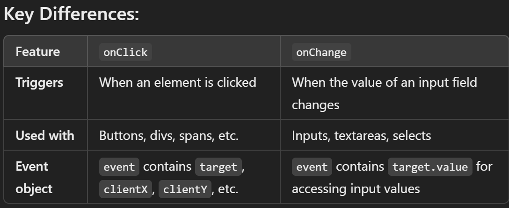

react-dom --> for website
react-native --> for mobile

# React

--> Javascript library for building user interfaces
--> Used to build single-page applications.
--> Allows us to create reusable UI components.
--> React creates a VIRTUAL DOM in memory.
--> Instead of manipulating the browser's DOM directly, React creates a virtual DOM in memory, where it does all the necessary manipulating, before making the changes in the browser DOM.
--> Start by including three scripts, the first two let us write React code in our JavaScripts, and the third, Babel, allows us to write JSX syntax and ES6 in older browsers.

# To Create a new file

==> npx create-react-app my-react-app
--> Node.js is required to use create-react-app.
--> Create-react-app tool is an officially supported way to create React applications.
--> my-react-app == It is the name of new React project folder/directory. It can be replace with preferred project name.
--> A new browser window will pop up with localhost:3000
--> npm create vite@latest --> for vite create

==> npm start --> Start the development Server
==> npm run build --> Bundles the app into statics files for production
==> npm test --> Starts the test runner
==> npm run eject --> Removes this tool and copies build dependencies, configuration file and scripts into the app directory .If it is done , we can't go back.

# NPM -- node package manager

--> NPM is a package manager for JavaScript and is used to manage dependencies (libraries, frameworks, and tools) in Node.js projects.
--> For Running it we need to install Package globally
--> Installing Packages:
npm install package-name
--> Installing Packages Globally:
npm install -g package-name
--> Running Scripts:
You can define scripts in package.json and run them using:
npm run script-name

# Managing Project Dependencies:

--> package.json contains project dependencies and metadata.
--> node_modules/ stores installed packages.

# NPX -- node package executer

--> NPX is a tool that comes with NPM.
--> It is used to execute packages directly without installing them globally.

# ES6

--> ES6 stands for ECMAScript 6.
--> Classes, Arrow Functions, Variables (let, const, var), Array Methods like .map(), Destructuring, Modules, Ternary Operator, Spread Operator

# React ES6 Classes(nowdays Function)

--> A class is a type of function, but instead of using the keyword function to initiate it, we use the keyword class, and the properties are assigned inside a constructor() method.
--> In modern React development, functional components with hooks have largely replaced ES6 class components.

==> Methods in function
--> Methods (or functions) are defined inside the component and do not require this like in class components.
--> Can use regular functions or arrow functions inside a functional component.

==> Inheritance Using Functional Components
--> instead of defining a class with methods, you create a functional component with state and props.
--> React does not use class inheritance. Instead, use composition and props.

# Arrow function

--> Arrow functions allow us to write shorter function syntax:
--> hello = () => {
return "Hello World!";
}
==> If the function has only one statement, and the statement returns a value, you can remove the brackets and the return keyword:
--> Arrow Functions Return Value by Default:
hello = () => "Hello World!"; // works only if the function has only one statement.
==> If you have parameters, you pass them inside the parentheses:
--> Arrow Function With Parameters:
hello = (val) => "Hello " + val;
==> if have only one parameter, you can skip the parentheses as well:
--> Arrow Function Without Parentheses:
hello = val => "Hello " + val;

# React ES6 Variables

1. Variables (var x = 5.6;)

--> var has a function scope, not a block scope
--> Before ES6 there was only one way of defining variables: with the var keyword. If did not define them, they would be assigned to the global object. Unless it was in strict mode, then would get an error if variables were undefined.
--> With ES6, there are three ways of defining your variables: var, let, and const.
--> If you use var outside of a function, it belongs to the global scope.
--> If you use var inside of a function, it belongs to that function.
--> If you use var inside of a block, i.e. a for loop, the variable is still available outside of that block.

2. Const (const x = 5.6;)

--> const is a variable that once it has been created, its value can never change.
--> const has a block scope.
-->The keyword const is a bit misleading.It does not define a constant value. It defines a constant reference to a value.
==> Because of const we can NOT:
Reassign a constant value
Reassign a constant array
Reassign a constant object
==> But you CAN:
Change the elements of constant array
Change the properties of constant object

3. let (let x = 5.6;)

--> let has a block scope.
--> let is the block scoped version of var, and is limited to the block (or expression) where it is defined.
-->If you use let inside of a block, i.e. a for loop, the variable is only available inside of that loop.

# React ES6 Array Methods

--> There are many JavaScript array methods.
--> One of the most useful in React is the .map() array method.
--> The .map() method allows you to run a function on each item in the array, returning a new array as the result.
--> In React, map() can be used to generate lists.

# React ES6 Destructuring

--> A convenient way to extract values from objects or arrays and use them directly in components. It simplifies code, making it cleaner and more readable.
--> When destructuring arrays, the order that variables are declared is important.If we want only item 1 and item 3, we can leave out item 2 but keep the comma for item 2 [ item1, , item3]
--> Using ES6 destructuring in React helps to: ✔ Reduce redundant props. and this.state. references
--> Make code more readable
--> Improve maintainability

# React ES6 Spread Operator

--> The JavaScript spread operator (...) allows us to quickly copy all or part of an existing array or object into another array or object.
--> The spread operator is often used in combination with destructuring.
--> The properties that did not match are combined, but the property that did match are overwritten by the last object that was passed

# React ES6 Modules

==> Modules
--> JavaScript modules allow us to break up code into separate files.
--> This makes it easier to maintain the code-base.
--> ES Modules rely on the import and export statements.
--> ES6 modules allow you to split code into reusable files and import/export them as needed. This improves code organization and maintainability.

# React ES6 Ternary Operator \*\*

--> The ternary operator is a simplified conditional operator like if / else.
--> Syntax(If there is one condition ) condition ? <expression if true> : <expression if false>
--> Syntax(If there is two or more condition ) condition1 ? <expression if true> : condition2 ? <expression if true> : condition3 ? <expression if true> : <expression if false>;

# React Render HTML

--> React renders HTML to the web page by using a function called createRoot() and its method render()
--> In React, HTML is rendered using JSX (JavaScript XML), which allows you to write HTML-like syntax inside JavaScript. React then converts JSX into standard JavaScript using React.createElement()
--> React requires elements to be wrapped in a single parent element, often using a 
 or <> (Fragment).

# The createRoot Function

--> The createRoot() function takes one argument, an HTML element.
--> The purpose of the function is to define the HTML element where a React component should be displayed.

# The render Method

--> The render() method is then called to define the React component that should be rendered.

# React JSX

--> JSX stands for JavaScript XML.
--> JSX allows us to write HTML in React.
--> JSX makes it easier to write and add HTML in React.
--> JSX allows us to write HTML elements in JavaScript and place them in the DOM without any createElement() and/or appendChild() methods.
--> can write expressions inside curly braces { }

==> To Be Known in React
--> {} --> To write javascript in jsx
--> {{}} --> to write object

# If writing code just after return there is no need for bracket , if we are writing code in next line then there is a bracket needed.

==> Expressions in JSX
--> The expression can be a React variable, or property, or any other valid JavaScript expression. JSX will execute the expression and return the result:
--> To write HTML on multiple lines, put the HTML inside parentheses():
--> if write two paragraphs, you must put them inside a parent element, like a div element. Alternatively, you can use a "fragment"(A fragment looks like an empty HTML tag: <></>) to wrap multiple lines. This will prevent unnecessarily adding extra nodes to the DOM.
--> JSX will throw an error if the HTML is not correct, or if the HTML misses a parent element.
==> Elements Must be Closed
--> JSX follows XML rules, and therefore HTML elements must be properly closed
==> Attribute class => className
--> The class attribute is a much used attribute in HTML, but since JSX is rendered as JavaScript, and the class keyword is a reserved word in JavaScript, you are not allowed to use it in JSX. Use attribute className instead.
==> Conditions - if statements
--> React supports if statements, but not inside JSX.
--> To be able to use conditional statements in JSX, should put the if statements outside of the JSX, or use a ternary expression instead

# React Components

--> Components are like functions that return HTML elements.
-->Components are independent and reusable bits of code. They serve the same purpose as JavaScript functions, but work in isolation and return HTML.
--> When creating a React component, the component's name MUST start with an upper case letter.
--> A Function component also returns HTML, and behaves much the same way as a Class component, but Function components can be written using much less code, are easier to understand, and will be preferred in this tutorial.
==> Rendering a Component
--> rendering a component means displaying it inside the DOM. You can render a component using ReactDOM in a regular project or simply return it inside another component.

# React Props

--> Props (short for "properties") in React are used to pass data from a parent component to a child component as read-only values.
--> Props are like function arguments, and you send them into the component as attributes.
--> React Props are read-only! You will get an error if you try to change their value.

# React Events

--> Just like HTML DOM events, React can perform actions based on user events.
--> React has the same events as HTML: click, change, mouseover etc.
--> React events are written in camelCase syntax:( onClick instead of onclick. )
--> React event handlers are written inside curly braces:

==> Adding Events
--> Handling user interactions using event listeners, such as clicks, form submissions, key presses, etc. React uses synthetic events, which are wrappers around native browser events, ensuring consistency across different browsers.
==> Passing Arguments
--> To pass an argument to an event handler, use an arrow function.
==> React Event Object
--> Event handlers have access to the React event that triggered the function.

# React Conditional Rendering
--> In React, you can conditionally render components.
-->There are several ways to do this
==> if Statement
--> Can use the "if" JavaScript operator to decide which component to render.
==> Logical && Operator
--> Another way to conditionally render a React component is by using the && operator.
# React useState Hook

--> Allows us to track state in a function component.
--> Generally refers to data or properties that need to be tracking in an application

==> Initialize useState
--> We initialize our state by calling useState in our function component.
--> useState accepts an initial state and returns two values:

1. The current state.
2. A function that updates the state.

--> These names are variables that can be named anything you would like.

# onClick

--> It triggers when a user clicks an element (like a button, div, or span).
--> Commonly used for handling button clicks or toggling states.

# onchange

--> An event handler used primarily with form elements like <input>, <textarea>, and <select>.
--> It triggers when the value of the element changes, allowing you to update the component’s state or perform other actions based on user input.
--> Works with different input types (text, checkbox, radio, select, etc.)

