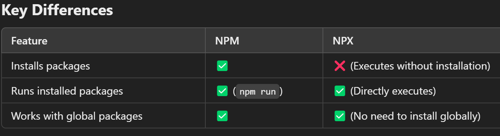
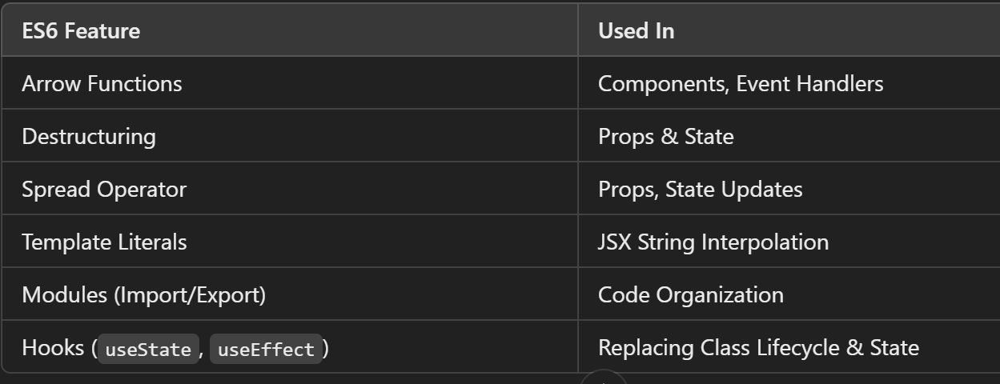

react-dom --> for website
react-native --> for mobile

# React

--> Javascript library for building user interfaces
--> Used to build single-page applications.
--> Allows us to create reusable UI components.
--> React creates a VIRTUAL DOM in memory.
--> Instead of manipulating the browser's DOM directly, React creates a virtual DOM in memory, where it does all the necessary manipulating, before making the changes in the browser DOM.
--> Start by including three scripts, the first two let us write React code in our JavaScripts, and the third, Babel, allows us to write JSX syntax and ES6 in older browsers.

# To Create a new file

==> npx create-react-app my-react-app
--> Node.js is required to use create-react-app.
--> Create-react-app tool is an officially supported way to create React applications.
--> my-react-app == It is the name of new React project folder/directory. It can be replace with preferred project name.
--> A new browser window will pop up with localhost:3000
--> npm create vite@latest --> for vite create

==> npm start --> Start the development Server
==> npm run build --> Bundles the app into statics files for production
==> npm test --> Starts the test runner
==> npm run eject --> Removes this tool and copies build dependencies, configuration file and scripts into the app directory .If it is done , we can't go back.

# NPM -- node package manager

--> NPM is a package manager for JavaScript and is used to manage dependencies (libraries, frameworks, and tools) in Node.js projects.
--> For Running it we need to install Package globally
--> Installing Packages:
npm install package-name
--> Installing Packages Globally:
npm install -g package-name
--> Running Scripts:
You can define scripts in package.json and run them using:
npm run script-name

# Managing Project Dependencies:

--> package.json contains project dependencies and metadata.
--> node_modules/ stores installed packages.

# NPX -- node package executer

--> NPX is a tool that comes with NPM.
--> It is used to execute packages directly without installing them globally.

# ES6

--> ES6 stands for ECMAScript 6.
--> Classes, Arrow Functions, Variables (let, const, var), Array Methods like .map(), Destructuring, Modules, Ternary Operator, Spread Operator

==> React ES6 Classes
--> A class is a type of function, but instead of using the keyword function to initiate it, we use the keyword class, and the properties are assigned inside a constructor() method.

# React Render HTML

--> React renders HTML to the web page by using a function called createRoot() and its method render()

# The createRoot Function

--> The createRoot() function takes one argument, an HTML element.

--> The purpose of the function is to define the HTML element where a React component should be displayed.

# The render Method

--> The render() method is then called to define the React component that should be rendered.

# React JSX

--> JSX stands for JavaScript XML.
--> JSX allows us to write HTML in React.
--> JSX makes it easier to write and add HTML in React.
--> JSX allows us to write HTML elements in JavaScript and place them in the DOM without any createElement() and/or appendChild() methods.

==> To Be Known in React

--> {} --> To write javascript in jsx
--> {{}} --> to write object

# If writing code just after return there is no need for bracket , if we are writing code in next line then there is a bracket needed.

# Props

--> Props (short for "properties") in React are used to pass data from a parent component to a child component as read-only values.

# React useState Hook

--> Allows us to track state in a function component.
--> Generally refers to data or properties that need to be tracking in an application

==> Initialize useState
--> We initialize our state by calling useState in our function component.
--> useState accepts an initial state and returns two values:

1. The current state.
2. A function that updates the state.

--> These names are variables that can be named anything you would like.

# Onchange

--> An event handler used primarily with form elements like <input>, <textarea>, and <select>.
--> It triggers when the value of the element changes, allowing you to update the component’s state or perform other actions based on user input.
--> Works with different input types (text, checkbox, radio, select, etc.)
