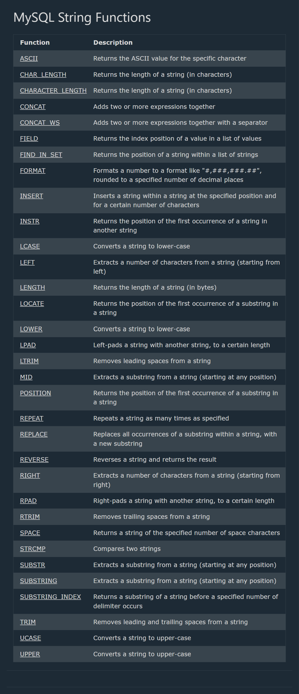
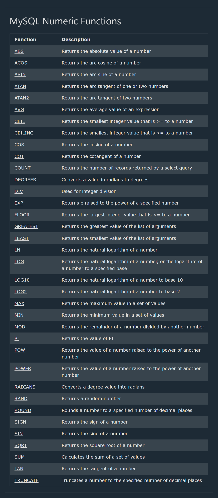
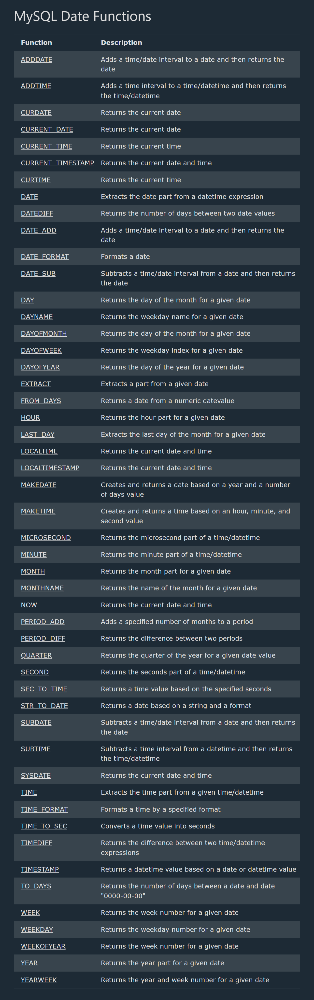
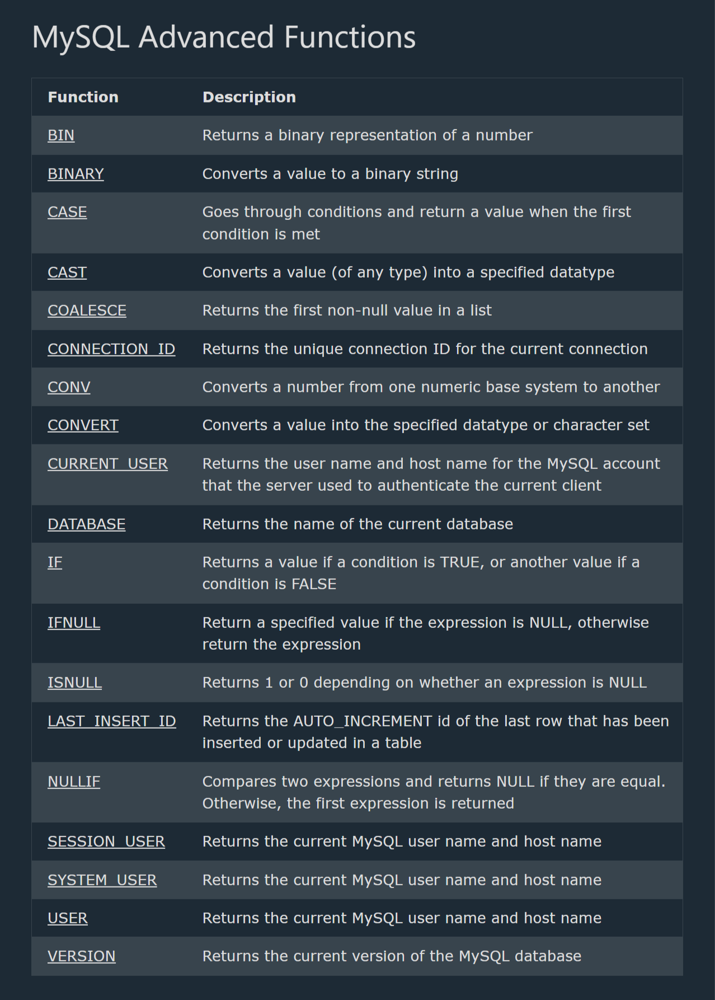
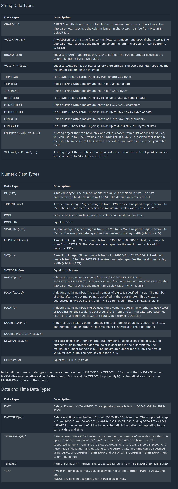
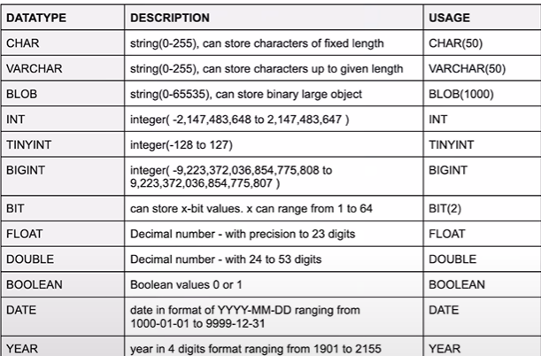

## Database

==> It is collection of data in a format that can be easily accessed(Digital)
==> A software application used to manage our DB is called DBMS(Database Management System)
==> Query --> a question, or the search for a piece of information

# Types of Databases with Use Explanations

==> Relational Databases (RDBMS) - Store structured data in tables with predefined schemas and relationships; ideal for transactional applications with complex queries.

1. MySQL - Popular open-source database for web applications with good read performance.
2. PostgreSQL - Advanced open-source database with robust features and extensibility.
3. Oracle Database - Enterprise-grade database with comprehensive features for large organizations.
4. Microsoft SQL Server - Microsoft's enterprise database solution with strong Windows integration.
5. MariaDB - MySQL fork with enhanced features and performance.
6. SQLite - Lightweight, serverless database that runs within applications.

==> NoSQL Databases - Non-relational databases designed for specific data models and flexible schemas.

1. Document Databases - Store data in flexible, JSON-like documents; ideal for content management and applications with variable data.
2. MongoDB - Popular document database for applications with evolving schemas.
3. CouchDB - Document database with strong synchronization for distributed applications.
4. Firebase Firestore - Google's cloud document database for mobile and web apps.

## SQL

--> Structured Query language
--> Programming language used to interact with relational databases
--> It is used to perform crud operation:
create , read , update , delete

## MySQL

--> MySQL is a widely used relational database management system (RDBMS).
--> MySQL is free and open-source.
--> MySQL is ideal for both small and large applications.
--> MySQL is very fast, reliable, scalable, and easy to use
--> MySQL is cross-platform
--> MySQL is compliant with the ANSI SQL standard
--> MySQL was first released in 1995
--> MySQL is developed, distributed, and supported by Oracle Corporation

==> Show Data On Your Web Site
--> To build a web site that shows data from a database, will need:
--> An RDBMS database program (like MySQL)
--> A server-side scripting language, like PHP
--> To use SQL to get the data you want
--> To use HTML / CSS to style the page

## MySQL RDBMS

--> RDBMS stands for Relational Database Management System.
--> RDBMS is a program used to maintain a relational database.
--> RDBMS is the basis for all modern database systems such as MySQL, Microsoft SQL Server, Oracle, and Microsoft Access.
--> RDBMS uses SQL queries to access the data in the database.

# Database Table

--> A table is a collection of related data entries, and it consists of columns and rows.
--> A column holds specific information about every record in the table.
--> A record (or row) is each individual entry that exists in a table.

# Relational Database

--> A relational database defines database relationships in the form of tables.
--> The tables are related to each other - based on data common to each.

# Create & Delete DataBase

--> It is not case sensitive
--> It is used create database :-
CREATE DATABASE DB_NAME;
CREATE database DB_NAME;
--> Both are same

--> It is used to delete database :-
DROP DATABASE DB_NAME;

use DB_Name;-- command is used to select a specific database to work with in current session

# Create First Table

--> Format
Create table Table_name(
Column_name1 DataType Constraint,
Column_name2 DataType Constraint,
Column_name3 DataType Constraint
)

Eg:-
CREATE TABLE student (
id INT PRIMARY KEY,
name VARCHAR(50),
age INT NOT NULL
);

## DataTypes

==> Signed & Unsigned
TINYINT UNSIGNED (0 to 255)
TINYINT UNSIGNED (0 to 255)

CREATE - to create database objects (tables, views, indexes, etc.)
DROP - to delete/remove database objects
SELECT - to retrieve data from tables
INSERT - to add new records to a table
UPDATE - to modify existing records
DELETE - to remove records from a table
ALTER - to modify database objects
JOIN - to combine rows from different tables
WHERE - to filter records based on conditions
GROUP BY - to group records for aggregate operations
ORDER BY - to sort result sets
HAVING - to filter groups based on conditions
UNION - to combine result sets from multiple SELECT statements
INDEX - to create indexes for faster data retrieval
GRANT - to provide privileges to users
REVOKE - to remove privileges from users
COMMIT - to save transaction changes permanently
ROLLBACK - to undo transaction changes
TRUNCATE - to remove all records from a table (faster than DELETE)
CONSTRAINT - to define rules for data in tables

## Data Definition Language (DDL)

==> Used to define and modify database structures.

1.  CREATE --> Creates database objects like tables, views, indexes, schemas, or databases.--> CREATE TABLE Employees (ID INT, Name VARCHAR(100));
2.  DROP --> Permanently deletes database objects.--> DROP TABLE Employees;
3.  ALTER --> Modifies existing database objects (e.g., add/remove columns).--> ALTER TABLE Employees ADD COLUMN Salary DECIMAL(10,2);
4.  TRUNCATE --> Removes all records from a table ().--> TRUNCATE TABLE Employees;
5.  INDEX --> Creates an index to .--> CREATE INDEX idx_name ON Employees(Name);

## Data Manipulation Language (DML)

==> Used to manage data within database objects.

1. SELECT --> Retrieves data from one or more tables. --> SELECT \* FROM Employees WHERE Salary > 50000;
2. INSERT --> Adds new records to a table. --> INSERT INTO Employees (ID, Name) VALUES (1, 'John Doe');
3. UPDATE --> Modifies existing records. --> UPDATE Employees SET Salary = 60000 WHERE ID = 1;
4. DELETE --> Removes records from a table. --> DELETE FROM Employees WHERE ID = 1;

## Data Control Language (DCL)

==> Used to manage access and permissions.

1. GRANT --> Grants specific privileges to users. --> GRANT SELECT ON Employees TO user1;
2. REVOKE --> Removes previously granted privileges. --> REVOKE SELECT ON Employees FROM user1;

## Transaction Control Language (TCL)

==> Used to manage transactions.'

1. COMMIT --> Saves all changes made during a transaction permanently. --> COMMIT;
2. ROLLBACK --> Undoes all changes made during a transaction. --> ROLLBACK;

## Clauses for Querying and Filtering

1. WHERE --> Filters records based on conditions. --> SELECT \* FROM Employees WHERE Salary > 50000;
2. GROUP BY --> Groups records for aggregate functions (e.g., COUNT, SUM). --> SELECT Department, COUNT(\*) FROM Employees GROUP BY Department;
3. HAVING --> Filters groups based on conditions (). --> SELECT Department, COUNT(_) FROM Employees GROUP BY Department HAVING COUNT(_) > 5;
4. ORDER BY --> Sorts the result set in ascending or descending order. --> SELECT \* FROM Employees ORDER BY Salary DESC;

## Joins

==> Used to combine rows from two or more tables.

1. INNER JOIN --> Returns records with matching values in both tables. --> SELECT Employees.Name, Departments.Name FROM Employees INNER JOIN Departments ON Employees.DeptID = Departments.ID;
2. LEFT JOIN --> Returns all records from the left table, and matched records from the right. --> SELECT Employees.Name, Departments.Name FROM Employees LEFT JOIN Departments ON Employees.DeptID = Departments.ID;
3. RIGHT JOIN --> Returns all records from the right table, and matched records from the left.--> SELECT Employees.Name, Departments.Name FROM Employees RIGHT JOIN Departments ON Employees.DeptID = Departments.ID;
4. FULL JOIN --> Returns all records when there is a match in either table. --> SELECT Employees.Name, Departments.Name FROM Employees FULL JOIN Departments ON Employees.DeptID = Departments.ID;

## Set Operations

UNION --> Combines result sets from multiple SELECT statements ().--> SELECT Name FROM Employees UNION SELECT Name FROM Contractors;

## Constraints

==> Used to define rules for data in tables.

1.  PRIMARY KEY --> Uniquely identifies each record in a table. --> CREATE TABLE Employees (ID INT PRIMARY KEY, Name VARCHAR(100));
2. FOREIGN KEY --> Ensures referential integrity between tables. --> CREATE TABLE Orders (OrderID INT PRIMARY KEY, EmployeeID INT, FOREIGN KEY (EmployeeID) REFERENCES Employees(ID));
3. UNIQUE--> Ensures all values in a column are unique.--> CREATE TABLE Employees (ID INT UNIQUE, Name VARCHAR(100));
4. NOT NULL --> Ensures a column cannot have NULL values. --> CREATE TABLE Employees (ID INT NOT NULL, Name VARCHAR(100));
5. CHECK --> Ensures values in a column meet a specific condition. --> CREATE TABLE Employees (ID INT, Salary DECIMAL(10,2) CHECK (Salary > 0));